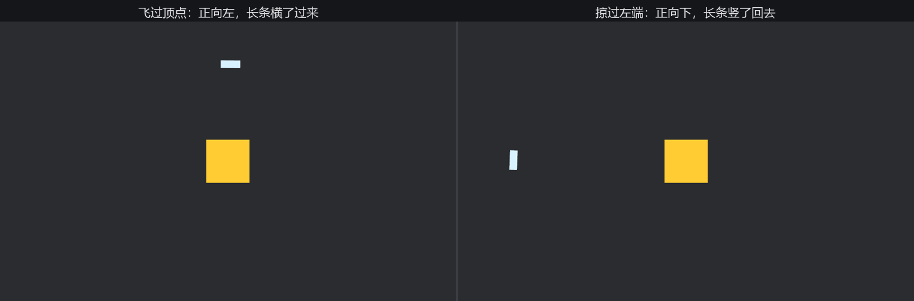

# 朝向：Quat、Rot2 与 Dir

订单上的彗星有个细节要求：彗星是个长条，飞行时**头得朝着飞的方向**——横着漂移的彗星会被小孩子笑话。上一节的旋转都是“匀速拧螺丝”，这次不一样：每一帧都要算出“此刻该朝哪”，再把姿态摆过去。

先想清楚“朝向”的本质。精灵自己没有“脸”的概念，它只有一套随身的局部轴：自己的 +X、+Y、+Z。所谓“让机头朝向运动方向”，就是**选定一根局部轴当机头**（彗星是竖长条，选 +Y），然后构造一个旋转，把这根轴拧到目标方向上。

```rust
{{#include ../../code/ch12-transforms/examples/listing-12-06.rs:setup}}
```

<span class="caption">Listing 12-6（其一）：窄长条彗星——机头是它自己的 +Y（examples/listing-12-06.rs）</span>

```rust
{{#include ../../code/ch12-transforms/examples/listing-12-06.rs:fly}}
```

<span class="caption">Listing 12-6（其二）：每帧定向——差分出方向，把 +Y 拧过去</span>

```console
cargo run -p ch12-transforms --example listing-12-06
```



<span class="caption">Figure 12-6：彗星过弯的两个时刻——姿态每帧重算，长轴始终切着轨道</span>

彗星沿椭圆扫过穹顶，机头始终切着轨道的方向，过弯时自然侧倾。三个零件各管一段：

- **运动方向哪来的**：“下一处落点 − 当前位置”，两个位置一减就是箭头——上上节的老朋友。z 分量是图层号，`truncate()` 截掉它再谈方向；
- **`Dir2::new` 的查验**：方向类型登场。它返回 `Result`——彗星若一帧没动，差分就是零向量，而零向量没有方向。还记得 `normalize()` 遇零给 NaN 的坑吗？`Dir2` 把这个坑变成了编译器强迫你处理的 `Err`：这里的对策是保持旧朝向，跳过这帧；
- **`Quat::from_rotation_arc(from, to)`**：“从方向 `from` 拧到方向 `to` 的最短旋转”。把机头轴 `Vec3::Y` 和目标方向喂给它，得到的正是该写进 `rotation` 的姿态。

反过来想查询“现在朝哪”也有现成的：`transform.up()` 给出此刻局部 +Y 在世界里的指向（对彗星就是机头方向），同族还有 `right()`、`forward()` 等——返回的都是下面要说的 `Dir3`。

## 方向类型的护照制度

`Dir2`/`Dir3`（二维/三维方向——**保证归一化**的单位向量）值得专门一讲。它们解决的问题很朴素：函数签名写 `Vec2` 时，谁也拦不住调用方传进一个零向量或者长度 37.5 的家伙；写 `Dir2`，类型本身就是承诺——凡能构造出来的，长度必为 1。检查只在入境时做一次：

```rust
{{#include ../../code/ch12-transforms/examples/listing-12-07.rs:dir}}
```

<span class="caption">Listing 12-7（其一）：Dir2 的入境查验——拒签零向量，合格者压成单位长度（examples/listing-12-07.rs）</span>

Bevy 自己的 API 大量收发这种“护照”：上文 `transform.up()` 返回 `Dir3`，`looking_to` 收 `impl TryInto<Dir3>`。你自己的函数遇到“这个参数必须是个方向”时，也用它。`Dir2` 能当 `Vec2` 用（解引用即得），乘标量回到普通向量：`heading * 120.0`。

## Quat 与 Rot2

最后把两位旋转选手对齐。`Quat` 用四个分量编码任意 3D 旋转，内部数值不直观，但用法只有三招：构造（`from_rotation_z`、`from_rotation_arc`……）、复合（两个 `Quat` 相乘 = 先转一个再转另一个）、作用（`Quat * Vec3` = 把向量转过去）：

```rust
{{#include ../../code/ch12-transforms/examples/listing-12-07.rs:quat}}
```

<span class="caption">Listing 12-7（其二）：Quat 作用于向量</span>

而 2D 世界只有“绕 z”一种转法，为此 `bevy_math` 备了轻量的 **`Rot2`**（二维旋转）——能用角度直观构造、直接乘 `Vec2`：

```rust
{{#include ../../code/ch12-transforms/examples/listing-12-07.rs:rot2}}
```

<span class="caption">Listing 12-7（其三）：Rot2——2D 专用旋转</span>

```console
cargo run -p ch12-transforms --example listing-12-07
```

```text
Quat 把 +X 转到 [0, 1, 0]
Rot2 把 (1, 0) 转到 [0.707, 0.707]
再把角度读回来：45 度
Dir2 拒签零向量：Zero
(3, 4) 入境后变成 [0.6, 0.8]，长度 1
从正东朝正北摆头三分之一：[0.866, 0.500]（恰好 30°）
```

注意分工：`Rot2` 是给**平面数学**用的（配 `Vec2`、`Dir2`，做输入处理、几何计算）；`Transform::rotation` 的字段类型永远是 `Quat`——哪怕 2D 游戏也是。两边换算不亏：`Quat::from_rotation_z(rot2.as_radians())`。

输出最后一行的 `slerp`（球面插值）按角度匀速“摆头”，是做“炮塔缓缓转向目标”的正确工具——直接 `lerp` 向量再归一化，转动的角速度会不匀。

兵器全齐了：摆放、旋转、缩放、朝向。回头收拾那个躲不掉的难题——月亮。
