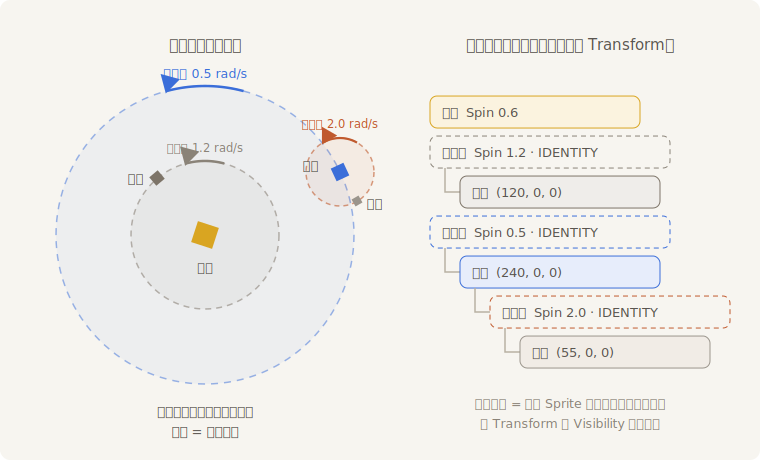
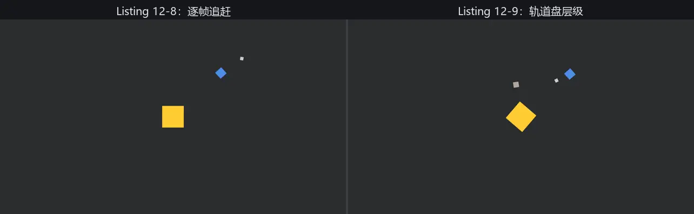

# 月亮的难题：把轨道交给层级

订单最后一行：“月亮绕着地球转。”看着跟行星公转没两样，无非把圆心从太阳换成地球。可地球自己在跑——圆心是活的。先按手上的兵器硬写一版：

```rust
{{#include ../../code/ch12-transforms/examples/listing-12-08.rs:setup}}
```

<span class="caption">Listing 12-8（其一）：太阳、地球、月亮，三个并列的实体（examples/listing-12-08.rs）</span>

```rust
{{#include ../../code/ch12-transforms/examples/listing-12-08.rs:systems}}
```

<span class="caption">Listing 12-8（其二）：月亮追着地球的位置 rotate_around</span>

```console
cargo run -p ch12-transforms --example listing-12-08
```

能跑，月亮也确实在地球身边打转。但这段代码每一行都在硌牙：

- **跨查询打听**：`orbit_moon` 同时要地球的 `&Transform` 和月亮的 `&mut Transform`——同一个组件一读一写，第 4 章的 B0001 冲突警报响起，只好用 `Without<Moon>` 把两个查询掰开；
- **顺序敏感**：注册时必须 `.chain()` 让月亮等地球挪完再动，否则它绕的是上一帧的地球——第 6 章学的排序在这儿成了刚性需求；
- **最阴的一处要盯着看半分钟**：月亮的轨道**不圆**。它一会儿贴到地球脸上，一会儿甩出去老远，像系着根松紧带。

第三条值得解剖。每帧 `rotate_around(地球此刻的位置, 一小步)` 只让月亮**绕**了圆心，可圆心自己这帧还**平移**了——地球挪的那一段，月亮一分都没跟上，全靠下一帧“绕”的时候才被间接拽过去。拽的方向又随月亮的相位变来变去，于是误差不抵消、反而织成花纹。把月亮的公转写对，得自己维护“相对地球的角度”、每帧手算世界坐标——代码只会更长。

## 换个问法

停下来重读需求：“月亮绕着**地球**转。”月亮的轨道天生就是**相对地球**描述的——半径 55，匀速转。是我们非要把它翻译成世界坐标，才欠下这一身账。

“相对谁”的关系，第 9 章已经给了现成的载体：**父子树**。当时就预告过——子实体的 `Transform` 不是世界坐标，而是**相对父亲的局部坐标**；父亲一动，全家跟着动。把“商队启程”的那棵树搬进太阳系：让月亮做地球的后代，它的 `Transform` 就只需要表达“离地球 55”，剩下的翻译工作引擎全包。

实际装配再加一个小零件。直接把月亮挂给地球不行——“绕”还是没人管（挂上只解决“跟着走”）。办法是给每条轨道安一个**转盘**：一个看不见的空实体，钉在轨道圆心，唯一的工作是自转。天体往盘沿一坐，公转就成了盘的自转：

```rust
{{#include ../../code/ch12-transforms/examples/listing-12-09.rs:setup}}
```

<span class="caption">Listing 12-9（其一）：轨道盘层级——盘套盘，children! 一挂到底（examples/listing-12-09.rs）</span>



<span class="caption">Figure 12-7：轨道盘层级——左边是场景里的三块转盘，右边是 children! 搭出的实体树；天体坐在盘沿从不挪窝，公转 = 盘的自转</span>

```rust
{{#include ../../code/ch12-transforms/examples/listing-12-09.rs:spin}}
```

<span class="caption">Listing 12-9（其二）：全部运动逻辑——就这一个系统</span>

```console
cargo run -p ch12-transforms --example listing-12-09
```

水星、地球各按各的速度公转，月亮稳稳贴着地球画小圆——半径不胀不缩。对照 Listing 12-8 清点战果：

- **跨查询打听消失了**。月亮的圆心是月亮盘的原点，写在 `ChildOf` 关系里，没有任何系统需要“打听别人在哪”；
- **顺序敏感消失了**。`spin` 改的全是各实体自己的局部 `Transform`，谁先谁后无所谓——并行调度器随便排；
- **松紧带消失了**。地球的公转由地球盘承担，月亮盘连同月亮整体被带着走，几何关系由坐标的乘法严格保证，没有逐帧追赶的误差。



<span class="caption">Figure 12-8：两版月亮同台对比（动图）——左路逐帧追赶，轨道半径胀缩如松紧带；右路轨道盘层级，小圆纹丝不差</span>

运动逻辑从两个互相牵扯的系统缩成一个不挑实体的 `spin`——这是本章最值得带走的一手：**“相对运动”不要用代码追，要用层级描述**。载具上的乘客、角色手里的武器、炮塔上的炮管，全是同一个配方。

两处装配细节补一句：

- 转盘虽然看不见，`Transform` 和 `Visibility` 一个都不能少。`Transform` 撑的是位置继承链——链条在它那儿断了，孩子的坐标就没了着落；`Visibility` 撑的是可见性继承链（第 9 章预告的“可见性也沿树继承”）。少了会怎样？下一节亲眼看；
- `children![]` 宏在 bundle 元组里可以无限套娃，地球那串“盘 → 地球 → 盘 → 月亮”一气呵成。需要事后认亲时，第 9 章的 `add_child`/`with_children` 照常可用。

月亮的 `Transform.translation` 现在永远是 `(55.0, 0.0, 0.0)`——它在自己的籍册上从没动过。可屏幕上的月亮分明绕着全场跑。渲染器画它的时候，用的显然不是这本籍册……那用的是哪本？
