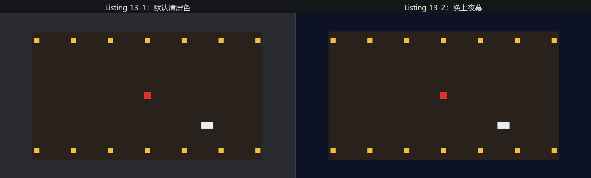

# 拆开那行老咒语：Camera2d

青蝉影视城今天开工。老雷的要求很简单：把片场搭起来，机器架上，先看一眼画面。布景按第 12 章的手艺来——一块深色地毯当戏台，两排灯笼柱立在南北两侧，阿燕和踏雪各就各位。机器嘛，还是那行从第 2 章念到现在的咒语：

```rust
{{#include ../../code/ch13-cameras/examples/listing-13-01.rs:setup}}
```

<span class="caption">Listing 13-1：搭好片场，架起 1 号机（examples/listing-13-01.rs）</span>

```console
cargo run -p ch13-cameras --example listing-13-01
```

窗口里地毯、灯笼柱、两位主演都在，可老雷不满意：

```text
老雷：《侠客行》A 组，开机！
老雷：等等——天幕怎么是一片灰？哪位调的色？
```

地毯之外的那片灰，从第 2 章跟到了现在。要回答“谁调的色”，得先回答一个更基本的问题：`Camera2d` 到底是什么。

## 相机也是实体

`commands.spawn(Camera2d)` 没有任何特殊语法——它就是第 3 章的 `spawn`：创建一个实体，挂上 `Camera2d` 组件。相机不是引擎里某个独立的子系统，而是世界这张大表里普普通通的一行。让它成为“相机”的，是 required components（必需组件）机制替你带上的全家桶。`Camera2d` 本身是个空标记，但它在源码里声明了两位随从：

- **`Camera`**——取景器的总开关与参数面板。视口、绘制顺序、清屏方式、是否启用，全在这个组件的字段里，本章会逐一用到；
- **`Projection`**——投影，世界坐标到取景框的换算规则。`Camera2d` 默认带的是一份正交投影（orthographic projection），第 3 节拆它。

`Camera` 又有自己的随从：`Transform` 与 `Visibility`（所以相机能像任何实体一样摆放、能被隐藏），还有一个 `RenderTarget`（渲染目标——画面输出到哪），默认指向主窗口。一个窗口、一台相机、一幅画面，是迄今为止所有示例的格局；输出到别的窗口或一张图片，留给第 35 章。

`Camera2d` 与 `Camera3d` 的分工也在名字里：前者启用 2D 渲染管线，给 `Sprite` 这类平面元素取景；后者启用 3D 管线，本章末尾见。两者可以同台，但一台相机只能是其中之一。

每帧渲染前，引擎收集所有启用的相机，按各自的取景规则把看得见的实体画到各自的渲染目标上。没有相机，就没有任何画面——前几章那些不开窗口的纯逻辑示例，正是因为没人取景也无须取景。

## 那片灰是谁画的

每帧动笔之前，相机要先把自己负责的画布擦干净，擦布的颜色叫**清屏色**（clear color）——画面上没被任何实体盖住的地方，露出来的就是它。窗口里那片灰不是“没画”，而是认认真真用灰色擦出来的：默认值来自 `ClearColor` 资源，Bevy 给它的出厂设置是 `Color::srgb_u8(43, 44, 47)`——一种深灰。这正是第 5 章说的“全局唯一数据”：全片场的天幕颜色，一份就够，所以它是 Resource 而不是 Component。

换掉它只要覆盖这份资源。今晚拍夜戏，天幕换成深蓝：

```rust
{{#include ../../code/ch13-cameras/examples/listing-13-02.rs:clear_color}}
```

<span class="caption">Listing 13-2：覆盖 ClearColor 资源，给全场换上夜幕（examples/listing-13-02.rs）</span>

```console
cargo run -p ch13-cameras --example listing-13-02
```

```text
老雷：好——夜幕挂上了，今晚拍夜戏。
```

窗口里地毯之外的世界从灰变成深蓝夜空。`insert_resource` 写在 `App::new()` 的链上（第 5 章的旧识），从第一帧起生效。



<span class="caption">Figure 13-1：同一片场换天幕前后——地毯之外露出的就是清屏色</span>

清屏色其实有两级配置。`ClearColor` 资源是全局默认；每台相机还可以在 `Camera` 组件的 `clear_color` 字段上各持己见，它的类型是 `ClearColorConfig`，一共三种态度：

| `ClearColorConfig` | 含义 |
|---|---|
| `Default` | 听全局的：用 `ClearColor` 资源的颜色（默认值） |
| `Custom(Color)` | 自带颜色，无视全局 |
| `None` | 不擦布，直接往现有画面上叠画 |

眼下只有一台相机，资源级的 `Default` 足够。等本章后半段多相机同台，`Custom` 和 `None` 就有了用武之地——小地图要自带底色，画中画叠加要保留底下的画面。

> **`is_active`：休息的机位**。`Camera` 组件还有个 `is_active: bool` 字段，设为 `false` 的相机完全停工，连清屏都不做。多机位轮换时，把不用的机位关掉比销毁重建便宜得多。

下一节让这台机器动起来——阿燕要开始走位了，镜头得跟上。
