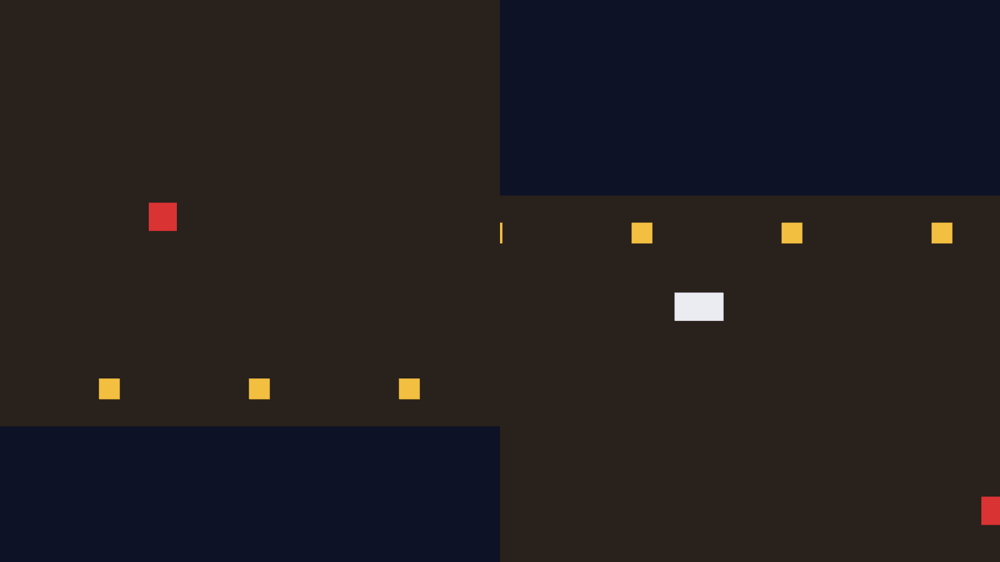

# 导播台：多相机与分屏

《侠客行》是双主角戏。阿燕在东头走“8”字，踏雪在西头绕大圈，老雷在监视器前左右为难——是时候上第二台机器了。相机是实体，多一台就是多 `spawn` 一行的事，先试试最天真的写法：

```rust
{{#include ../../code/ch13-cameras/examples/listing-13-08.rs:two_cameras}}
```

<span class="caption">Listing 13-8：天真的 2 号机——除了位置，什么都没改（examples/listing-13-08.rs）</span>

```console
cargo run -p ch13-cameras --example listing-13-08
```

窗口照常打开，画面看上去也“正常”——但控制台立刻开始抗议，**每帧一条**，几秒钟刷出上百行：

```text
WARN bevy_render::camera: Camera order ambiguities detected for active cameras with
the following priorities: {(0, Some(Window(NormalizedWindowRef(0v0))))}. To fix this,
ensure there is exactly one Camera entity spawned with a given order for a given
RenderTarget. Ambiguities should be resolved because either (1) multiple active
cameras were spawned accidentally, which will result in rendering multiple instances
of the scene or (2) for cases where multiple active cameras is intentional,
ambiguities could result in unpredictable render results.
```

引擎的意思翻译过来：两台启用的相机往**同一个渲染目标**（主窗口）画画，可它们的 `order` 都是默认的 `0`——谁先画谁后画，没有说法。后画的会整幅压住先画的（包括清屏那一下），于是你看到的“正常画面”其实只是其中一台的产出，**至于是哪台，引擎不保证**。这是那种“今天看着对、改天换台机器就闪烁”的隐患，所以警告每帧追着你喊。

两味药对症：

- **`order: isize`**——`Camera` 组件的字段，画画的先后次序：数小的先画，数大的后画、叠在上面。给同一个渲染目标上的每台相机发一个独一无二的 `order`，警告即愈；
- **`Viewport`**——既然各画各的，不如各占一块地盘：视口能把相机的输出限制在渲染目标的一个矩形区域内，这正是分屏的全部原理。

## 给两路机位划地盘

`Viewport` 是个普通结构体，三个字段：`physical_position`（矩形左上角）、`physical_size`（矩形大小）、`depth`（深度范围，走默认即可）。前两个字段的计量单位要瞪大眼睛看——**物理像素**（physical pixels），即显示器上实打实的发光点，而不是前几节一直在用的逻辑像素。在 100% 缩放的屏幕上两者相等；在高分屏上（Windows 的 125%、150% 缩放，macOS 的 Retina），物理尺寸是逻辑尺寸乘上缩放因子。`Window` 上配套的查询方法是 `physical_size()`/`physical_width()`/`physical_height()`。坐标原点照旧是**左上角、y 朝下**——跟视口坐标系一家人。

分屏还有一道必答题：玩家拖动窗口边框，地盘怎么办？视口是写死的数字，不会自己跟着窗口走。好在窗口一变，引擎就广播 `WindowResized`——第 7 章的 Message，用 `MessageReader` 接住，每次重新划一遍地盘。更妙的是**窗口刚创建时也会发一条**，所以这一个系统兼任“开机初始化”和“随窗调整”两份差事，`Startup` 里一行不用写：

```rust
{{#include ../../code/ch13-cameras/examples/listing-13-09.rs:cameras}}
```

<span class="caption">Listing 13-9（节选一）：两路机位，order 各执一号（examples/listing-13-09.rs）</span>

```rust
{{#include ../../code/ch13-cameras/examples/listing-13-09.rs:viewports}}
```

<span class="caption">Listing 13-9（节选二）：WindowResized 一响，重划地盘（examples/listing-13-09.rs）</span>

机位挂上了 `LeftLens`/`RightLens` 标记组件，各自的跟拍系统（`smooth_nudge`，上一节的手艺）分头盯阿燕和踏雪。投影统一锁 `FixedVertical { viewport_height: 600.0 }`——分屏后每路画面只有半个窗口宽，`WindowSize` 模式会让两路各看“半屏宽”的世界，纵向锁死才是分屏想要的效果。

```console
cargo run -p ch13-cameras --example listing-13-09
```

```text
老雷：导播台分屏——左路盯阿燕，右路盯踏雪！
场记：分屏就位，每路 800 × 900 物理像素。
场记：分屏就位，每路 800 × 900 物理像素。
```

窗口从中线一分为二：左路镜头柔柔地跟着阿燕，右路追着踏雪绕场，两路各自清屏、各自取景，互不相扰。拖动窗口边框，分割线始终咬住中线——`WindowResized` 的功劳。



<span class="caption">Figure 13-5：导播台分屏实拍——同一个世界，两路视角；右路边缘还扫到了串场的阿燕</span>

输出里还有两处“现场花絮”值得一看。其一，每路 `800 × 900`：本机窗口逻辑尺寸 1280×720，物理却是 1600×900——Windows 显示缩放 125% 的缘故，物理像素与逻辑像素的差别在这行输出里现了原形；换台 100% 缩放的机器跑，这里就会打出 `640 × 720`。其二，“分屏就位”打了**两次**：本机开窗时 `WindowResized` 发了两条（窗口落地一次、DPI 对表一次）。我们的系统是幂等的——同样的地盘重划一遍，无伤大雅；但它提醒你：**别假设这消息一辈子只来一次**。

> **`sub_camera_view`：更冷门的切法**。`Camera` 上还有个 `sub_camera_view` 字段，能让一台相机只投影“完整画面的一个子块”，配合多窗口拼接超宽画面用得上——知道有这回事即可，本书不展开。

双机位上墙，老雷还不满足：他要一眼看清**全场**的调度——下一节，棚顶的沙盘相机开工，顺便解决一桩“穿帮”悬案。
