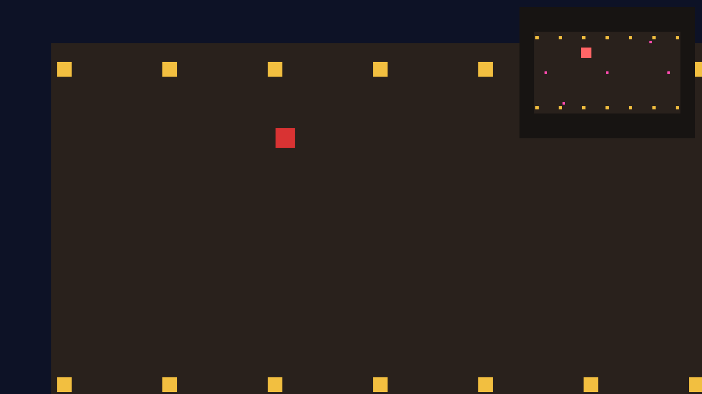

# 沙盘与防穿帮：RenderLayers

导播台开张当天，老雷又添了两个要求。一：墙上挂一块**沙盘**——全片场的鸟瞰小图，谁在哪一目了然；二：地面上贴的粉色马克点（演员的走位记号）必须让监视器看得见、**正片里绝不能穿帮**。

第一个要求不需要任何新知识。沙盘 = 第三台相机：`order` 排最大（叠在所有画面之上），视口缩成右上角一小块，投影锁 `ScalingMode::Fixed` 把整个片场框进取景框——上一节的三样手艺拼一拼就成。

第二个要求卡住了。马克点是 `Sprite`，正片机位和沙盘机位都看第 0 层世界……等等，“层”是什么？到目前为止，**所有相机看见所有实体**是默认事实。要打破它，得请出本章最后一个组件。

## 谁拍得到谁：RenderLayers

`RenderLayers`（渲染层）把“谁能拍到谁”变成一道集合题：实体挂一份层号集合，相机也挂一份，**两边有交集，实体才会出现在这台相机的画面里**。规则只有三条：

- 不挂 `RenderLayers` 的实体（和相机）默认属于**第 0 层**——这就是“所有相机看见所有实体”的真相：大家挤在同一层；
- 挂了组件就以组件为准：`RenderLayers::layer(1)` 只属第 1 层，`RenderLayers::from_layers(&[0, 1])` 横跨两层，还有 `.with(n)`/`.without(n)` 增删层号；
- 空集合 `RenderLayers::none()` 与任何集合都不相交——实体直接隐形，连自己人都拍不到。

它不在 prelude 里，得显式引一行 `use bevy::camera::visibility::RenderLayers;`。

方案于是清晰：马克点搬进**第 1 层**（剧组工作层），正片机位不挂组件（守第 0 层，看不见工作层），沙盘机挂 `from_layers(&[0, 1])`（两层通吃）。顺手再加一样道具：演员在沙盘里只有几个像素大，给阿燕配一个 72×72 的“图例”大色块，也放第 1 层——沙盘上醒目，正片里无踪。

```rust
{{#include ../../code/ch13-cameras/examples/listing-13-10.rs:cameras}}
```

<span class="caption">Listing 13-10（节选一）：主机位守第 0 层，沙盘机两层通吃（examples/listing-13-10.rs）</span>

沙盘机身上少了样东西：它没配自己的 `clear_color`。不是漏了，是配了也没用——上一节两机叠印时见过：**同一个窗口上，只有排最前的那台相机清屏**（用它的 `clear_color` 给整个窗口铺底），排在后面的相机一概不再擦布，直接把自己看见的东西叠画到已有画面上，它们的 `clear_color` 根本不会落地。于是沙盘的取景框里，凡是自己没画东西的地方，露出来的都是主机位先前画好的画面——多数时候正是那块大地毯，小图会整个“融”进正片里。想给沙盘一块专属的底，就得拿真会被画出来的东西当底：一块盖满取景框的深色衬布 `Sprite`，挂进工作层——沙盘看得见它，正片机位看不见：

```rust
{{#include ../../code/ch13-cameras/examples/listing-13-10.rs:crew_props}}
```

<span class="caption">Listing 13-10（节选二）：衬布、马克点与图例住进工作层（examples/listing-13-10.rs）</span>

图例的挂法藏着一个容易栽跟头的细节：它是阿燕的**子实体**（第 9 章的 `children!`，跟着本体走位），但 `RenderLayers` **不沿层级继承**——爹在第 0 层、儿子挂哪层是儿子自己的事，一个实体一份组件，谁也不替谁作主。忘了给子实体单独挂层，它就默默留在第 0 层，正片穿帮没商量。

```rust
{{#include ../../code/ch13-cameras/examples/listing-13-10.rs:dock}}
```

<span class="caption">Listing 13-10（节选三）：沙盘停靠右上角，窗口一变重新量（examples/listing-13-10.rs）</span>

停靠的算术全在视口坐标系里做：原点左上、y 朝下，所以“右上角、留 16 物理像素边距”是 `x = 窗口宽 − 沙盘宽 − 16`、`y = 16`。沙盘宽取窗口的四分之一，高按 4:3 配——和取景框 1200×900 同比例，全场入画不变形。

```console
cargo run -p ch13-cameras --example listing-13-10
```

```text
老雷：右上角挂沙盘。马克点只许监视器看见，正片不许穿帮！
```

跑起来逐项验收：主画面里镜头照常跟拍阿燕——**没有粉色马克点，没有大图例，也没有那块衬布**，正片干干净净；右上角的沙盘小图深色衬布垫底、四周衬出一圈画框，十四根灯笼柱排成两行小黄点，五个粉色马克点原地待命，阿燕顶着醒目的大红图例画着“8”字。同一个世界，两台相机，各拍各的真相。不信衬布那笔账的话，把它那几行注释掉再跑——沙盘的“底”当场消失，小图元素直接浮在正片的地毯上。



<span class="caption">Figure 13-6：同一个世界，两种真相——马克点与图例只存在于沙盘的画面里</span>

> **层号是有限资源**。层号从 0 起步，背后是按位存储的集合——常用范围内（默认 64 层）开销极小。游戏里通常三五层就够用：世界层、HUD 层、小地图专属层、调试层，提前规划比随手乱开有序得多。

分层取景到手，2D 的运镜手艺全齐了。临杀青前还剩一块拼图——老雷下周要拍的特效镜头是**三维**的，下一节去特效棚见见 `Camera3d` 和它的透视投影。
