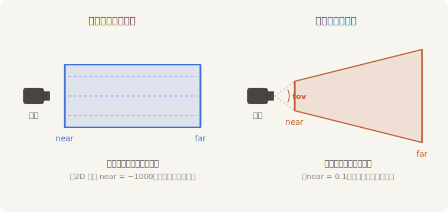
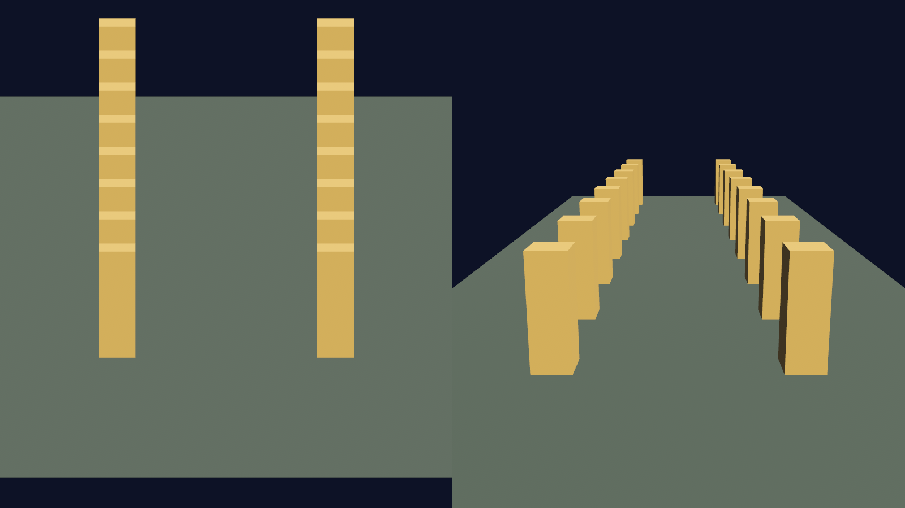

# Camera3d：透视的世界

正交投影“远近一样大”的脾气，在 2D 里是美德——图层本来就不该有近大远小。可一进三维就成了灾难：没有纵深，走廊是一面墙，深渊是一块地板。三维世界的取景器需要另一条换算规则：**透视投影**（perspective projection）——离相机越近的东西占画面越大，平行的街道在远方收束于一点，跟人眼和真实摄影机一个原理。

Bevy 里这条规则就是 `Projection` 的另一个变体 `Perspective(PerspectiveProjection)`，而 `Camera3d` 默认带的正是它。`PerspectiveProjection` 四个字段：

| 字段 | 含义 | 默认 |
|---|---|---|
| `fov` | 纵向视场角（弧度）：取景锥上下张开的角度 | π/4（45°） |
| `aspect_ratio` | 画面宽高比，引擎随视口自动维护 | 1.0 |
| `near` | 近裁剪面：比这更近的不画 | 0.1 |
| `far` | 远裁剪面：比这更远的不画 | 1000.0 |

跟正交的取景“框”不同，透视的取景体是一个**锥台**（frustum，视锥）：从相机出发张开 `fov` 角度、被 `near` 和 `far` 两刀截断的四棱台。`fov` 就是变焦环——调大是广角（视野宽、边缘畸变），调小是长焦（视野窄、画面压缩）；`near = 0.1` 也解释了和 2D 的一个分别：三维相机**身后和贴脸的东西不入镜**，这正是第 4 节 `default_3d()` 把 `near` 设为 0 而 2D 版本设为 −1000 的道理。



<span class="caption">Figure 13-7：两种取景体（侧视）——正交的长方体与透视的锥台</span>

## 特效棚验机

百闻不如一见，而“看”恰好是本章练熟了的本事：同一条走廊，两台机器架在**同一个点、朝同一个方向**，左监正交、右监透视，分屏对比。布景用了几位第 21 章才正式登场的演员——`Mesh3d`（三维网格）、`MeshMaterial3d<StandardMaterial>`（材质）和 `DirectionalLight`（平行光），今天先借来当模特，看个轮廓就好：

```rust
{{#include ../../code/ch13-cameras/examples/listing-13-11.rs:setup}}
```

<span class="caption">Listing 13-11：一条走廊、两种投影，分屏对照（examples/listing-13-11.rs）</span>

几处看点。机位 `Transform` 用了 `looking_at(目标点, Vec3::Y)`——给定立足点和盯住的目标，旋转自动算好，第 12 章手搓 `Quat::from_rotation_arc` 的活它一行包办，三维运镜的标配。正交那台用 `default_3d()` 打底（第 4 节的功课），`FixedVertical { viewport_height: 14.0 }` 锁定纵向看 14 个世界单位；透视那台什么都没配——`Camera3d` 默认就是 45° 透视。分屏系统与第 5 节逐字相同，手艺通用。

```console
cargo run -p ch13-cameras --example listing-13-11
```

```text
老雷：特效棚验机——左监平行机位，右监透视机位，自己看哪边有纵深。
```

两边画面判若两个世界：

- **右监（透视）**：两列灯笼柱近大远小，向画面深处收束，地面是一块收窄的梯形——一条有纵深的走廊；
- **左监（正交）**：八根柱子**前后完全叠成两摞**，看不出哪根近哪根远，两列柱子的间距从近到远分毫不变，地面是一块端端正正的矩形。深度被投影整个抹平了。



<span class="caption">Figure 13-8：同一条走廊、同一个机位——左监正交抹平深度，右监透视给出纵深</span>

左监不是坏画面——它就是工程制图里的“立面图”。战棋、模拟经营那一路的等距视角游戏，用的正是 3D 场景配正交投影：要的就是“格子永远一样大”的秩序感。哪种投影是对的，取决于你要哪种真实。

> **`Projection` 是统一的组件**。注意两台 `Camera3d` 装的是同一个 `Projection` 枚举——投影流派与相机维度是两个独立的开关：`Camera3d` 配正交（等距游戏）、`Camera2d` 的默认正交，都是同一个组件的不同变体。第 3 节学的 `area` 报点对正交永远好使，而 `viewport_to_world_2d` 换成透视后会沿视线“打一道射线”出去——那是第 25 章拾取的开场白。

特效棚验收完毕。三维的光影、材质、模型是第四部分的正餐，本章的任务只是把取景器交到你手上——拿到 `Camera3d` 这张入场券，回头杀青。
