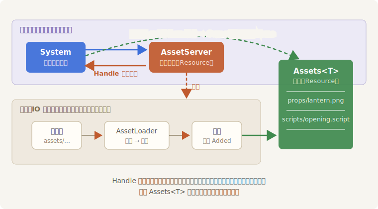

# 第一件道具

《长风渡》的头一件道具是把剑——青霜剑，阿燕的佩剑，美术组画好的一张 PNG。把它画上屏幕，是本章一切话题的起点。

## 货放在哪：assets/ 目录

Bevy 对素材文件的存放位置有个约定：**项目根目录下的 `assets/` 文件夹**。本章 crate 的目录长这样：

```text
ch14-assets
├── Cargo.toml
├── assets
│   ├── backdrops
│   │   └── night-crossing.png …
│   ├── props
│   │   ├── qingshuang-sword.png
│   │   ├── lantern.png
│   │   └── changfeng-banner.png …
│   └── scripts
│       └── opening.script
└── src
    └── main.rs
```

代码里写的资产路径，全部**相对 `assets/` 来写**：`"props/qingshuang-sword.png"`，不带 `assets/` 前缀，也不带盘符。“项目根目录”的认定按以下顺序：环境变量 `BEVY_ASSET_ROOT`；否则环境变量 `CARGO_MANIFEST_DIR`（用 `cargo run` 启动时自动设好，就是 crate 的根目录）；都没有，才落到可执行文件所在目录——发布出去的游戏走的正是最后这条：把 `assets/` 文件夹和 exe 摆在一起。在我们的 workspace 里，`cargo run -p ch14-assets` 时它就是 `code/ch14-assets/`。想换名字或换位置，配 `AssetPlugin` 的 `file_path` 字段即可（手法同第 2 章定制 `WindowPlugin`）。

## 开单、等货、上墙

Listing 14-1 把青霜剑请上片场，顺便回答一个要紧的问题：`load` 调用的那一刻，图片到底进没进内存？

```rust
{{#include ../../code/ch14-assets/examples/listing-14-01.rs:place_order}}
```

<span class="caption">Listing 14-1（节选一）：开单——load 立刻返回，但货架上还没货（examples/listing-14-01.rs）</span>

三个新面孔，正好是 Asset 系统的三大件：

- **`AssetServer`**——库房柜台，一个 Resource（第 5 章的旧识）。`load("路径")` 是开单：它登记需求、派后台任务去读盘，然后**立刻**返回，绝不等磁盘；
- **`Handle<Image>`**——提货单，`load` 的返回值。它不是图片本身，只是一张指向“那件货”的轻量凭证。泛型参数声明货的类型：这张单提的是 `Image`（一张位图——`bevy_image` 提供的图片资产类型）；
- **`Assets<Image>`**——货架，同样是个 Resource。所有**已经到货**的 `Image` 都躺在这里，拿提货单 `get` 一下，有货给你 `Some(&Image)`，没货给你 `None`。

`Sprite::from_image(sword)` 把提货单交给 Sprite 组件——注意，交的是**单子**，不是图。Sprite 拿着一张还没兑现的提货单就敢上墙，这正是 Bevy 资产系统的设计核心。

到货那一刻长什么样？再加一个每帧查货架的系统：

```rust
{{#include ../../code/ch14-assets/examples/listing-14-01.rs:watch_shelf}}
```

<span class="caption">Listing 14-1（节选二）：每帧瞅一眼货架，到货那刻报尺寸（examples/listing-14-01.rs）</span>

```console
cargo run -p ch14-assets --example listing-14-01
```

```text
老顾：《长风渡》头一件道具，青霜剑，单子开出去了。
老顾：（瞅一眼货架）提货单在手，货架上——还空着。
老顾：不碍事，先挂上。到货那一刻它自己会亮出来。
老顾：到货！第 1 帧，128 × 128 像素，已经挂在片场了。
```

窗口中央，青霜剑亮出来了：


<span class="caption">Figure 14-1：第一件道具进门——Sprite 拿着 Handle，到货自动亮相</span>

输出的第二行是本节的题眼：**`load` 返回了，货架上却还空着**。同一个 `Startup` 系统里，单子开出来的下一行代码去取货，取到的是 `None`——加载是**异步**的，读盘、解码都发生在后台线程，World 这边一个指令周期都不等。

第四行是答案的另一半：到第 1 帧（`Update` 第一次跑）时，货已经在架上了。这张 128×128 的小图解码快得很，快到首帧之前就完工——但**再快也不是“立刻”**。从 `load` 返回到货上架，中间永远隔着一段你说了不算的时间：小图是一帧，大图是几十帧，网络资产可能是几秒。所有围绕资产的代码都得按这个事实来组织，这正是接下来几节的主题。

## 为什么非要异步

设想 `load` 是同步的：读盘 5 毫秒、解码 20 毫秒，一帧的预算（60 帧时约 16.7 毫秒）当场爆掉，画面冻住——加载十件就冻半秒。而异步的版本：主循环每帧照常跑，后台线程读盘解码，货到了悄悄上架。画面不卡，加载还能多件并行。代价就是你刚看到的：**拿到提货单不等于拿到货**，于是才需要 Handle、货架、状态查询这一整套提货流程：



<span class="caption">Figure 14-2：开单与到货两条时间线——load 走前台立刻返回，读盘解码走后台，货架是两边唯一的交汇点</span>

顺带说明输出里的另一处细节：`image.size()` 返回 `UVec2`（无符号整数版的 `Vec2`，第 12 章的亲戚）——位图尺寸论像素，没有小数。
