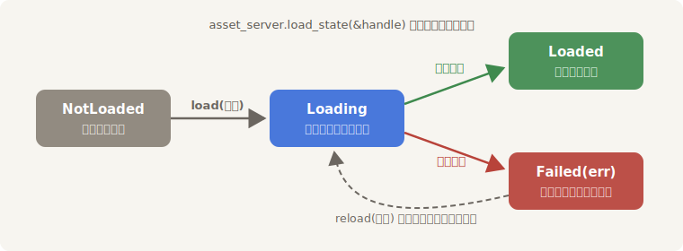

# 到货了吗

“每帧 `get` 一下货架”能应付一件道具，但它只回答“有或没有”。下单的货走到哪一步了？出了岔子怎么知道？这一节给等货这件事配齐三样工具：状态牌、广播，以及一次货真价实的事故。

## 状态牌：轮询 LoadState

`AssetServer` 为每件登记过的货挂着一块状态牌，`load_state(&handle)` 随时可看。牌子一共四面：

| `LoadState` | 含义 |
|---|---|
| `NotLoaded` | 从没人为这件货开过单 |
| `Loading` | 在路上：读盘、解码进行中 |
| `Loaded` | 到货，已上架 |
| `Failed(err)` | 出事了，错误原因附在牌子上 |

这回换件大货——夜渡的全景幕布，一张 8192×8192 的大图，解码要花肉眼可见的工夫：

```rust
{{#include ../../code/ch14-assets/examples/listing-14-03.rs:order}}
```

<span class="caption">Listing 14-3（节选一）：单子存进 Resource——得有人攥着，货才保得住（examples/listing-14-03.rs）</span>

```rust
{{#include ../../code/ch14-assets/examples/listing-14-03.rs:poll}}
```

<span class="caption">Listing 14-3（节选二）：轮询状态牌，翻面才出声；到货即挂、销单收工（examples/listing-14-03.rs）</span>

```console
cargo run -p ch14-assets --example listing-14-03
```

```text
老顾：夜渡的全景幕布，八千里江山一整匹，阿迅你跑一趟。
阿迅：（翻状态牌）第 1 帧，0.00 秒——在路上。
阿迅：（翻状态牌）第 3 帧，0.24 秒——到货。
老顾：挂上！八千里江山，这一匹值回票价。
```

这张图按未压缩像素算有 256 MB，解码花了两帧多——第 1 帧还“在路上”，第 3 帧才翻成“到货”（你机器上的帧数会不同）。上一节的小灯笼首帧就到，这里的幕布要等：**资产什么时候到，取决于它多大多复杂，代码不能赌任何一个时刻**。



<span class="caption">Figure 14-3：一件资产的状态旅程——代码要照顾到每一站</span>

注意 Listing 14-3 的两个小细节，都是上两节规矩的应用：单子存在 `Backdrop` Resource 里（持单保活）；挂上墙之后 `remove_resource` 销单——此后 Sprite 是唯一持单人，幕布的命随实体走。

## 广播：AssetEvent

轮询要自己跑腿；想坐等通知，听广播。库房对每种资产开了一条广播频道——`AssetEvent<A>`，而它是个 **Message**：第 7 章的 `MessageReader` 原样拿来用，双缓冲、隔帧清理，规矩一条不变。频道里五种通告：

| `AssetEvent` | 时机 |
|---|---|
| `Added` | 货上架（首次进 `Assets<A>`） |
| `Modified` | 架上的货被改了——`get_mut` 或热重载（14.6 节） |
| `Removed` | 货被下架 |
| `Unused` | 最后一张强单销毁 |
| `LoadedWithDependencies` | 货连同它依赖的全部资产到齐 |

`LoadedWithDependencies` 值得多一句：有些资产是带“配件”的——第 23 章的 glTF 模型自带纹理、网格、动画，主资产到了配件未必到。对图片这种孤货，它和 `Added` 几乎同时；对带依赖的货，它才是“真齐了”的信号。14.4 节的进度条就认这一声。

Listing 14-4 听完一件道具从进门到回炉的完整一生——顺便兑现上一节的承诺，亲眼看看“没人持单，货被回收”：

```rust
{{#include ../../code/ch14-assets/examples/listing-14-04.rs:setup}}
```

<span class="caption">Listing 14-4（节选一）：只记货号不持单——AssetId 不参与引用计数（examples/listing-14-04.rs）</span>

```rust
{{#include ../../code/ch14-assets/examples/listing-14-04.rs:listen}}
```

<span class="caption">Listing 14-4（节选二）：MessageReader 收听灯笼的专属广播（examples/listing-14-04.rs）</span>

```rust
{{#include ../../code/ch14-assets/examples/listing-14-04.rs:strike}}
```

<span class="caption">Listing 14-4（节选三）：三秒后撤道具，唯一的持单人退场（examples/listing-14-04.rs）</span>

```console
cargo run -p ch14-assets --example listing-14-04
```

```text
老顾：灯笼上场，提货单就一张，在道具自己手里。
广播：（第 1 帧）灯笼连同全部配件到齐。
广播：（第 2 帧）灯笼上架。
场务：这盏灯笼的戏拍完了，撤。
广播：（第 173 帧）最后一张提货单作废。
广播：（第 173 帧）货架清位，灯笼回炉。
```

前两行有个反直觉的细节：“到齐”竟然报在“上架”前面。两条通告来自库房内部两套不同的流程，发布时机各自为政——**同一频道里事件的相对顺序没有承诺**，代码只该认事件本身，别赌先后。这也是第 7 章“消息是数据，不是调用”的又一次印证。

后两行是引用计数的实锤：`despawn` 销毁实体，实体手里那张唯一的强单随之销毁——下一帧（第 173 帧）`Unused` 与 `Removed` 接连广播，灯笼从内存里除名。我们手里的 `AssetId` 编号还在，但它保不了货，也兑不出货。

## 库里没这件货

老雷点了一件库房压根没有的道具。错误处理不是料想出来的，跑一遍看真的：

```rust
{{#include ../../code/ch14-assets/examples/listing-14-05.rs:order}}
```

<span class="caption">Listing 14-5（节选一）：load 一条不存在的路径——开单照样成功（examples/listing-14-05.rs）</span>

`load` 不读盘，所以**开单永远不会失败**；坏消息要等后台跑腿回来才有。听坏消息也有专门的频道——`AssetLoadFailedEvent<A>`，带着路径和失败原因：

```rust
{{#include ../../code/ch14-assets/examples/listing-14-05.rs:bad_news}}
```

<span class="caption">Listing 14-5（节选二）：收听失败广播 + 查 Failed 状态牌，替身道具顶上（examples/listing-14-05.rs）</span>

```console
cargo run -p ch14-assets --example listing-14-05
```

```text
老雷：下一场要一根如意杖。
老顾：……单子先开上。（小声）库里好像没进过这件货。
阿迅：回话——“props/ruyi-staff.png”这件货取不来：Path not found: C:\…\ch14-assets\assets\props/ruyi-staff.png
老顾：状态牌也翻成“出事了”。戏不能停，先拿块灰布顶上！
```

同时，引擎自己也在日志里记了一笔（控制台的红色 ERROR 行）：

```text
ERROR bevy_asset::server: Path not found: C:\…\ch14-assets\assets\props/ruyi-staff.png
```

值得记住的三件事：加载失败**不会崩溃**，游戏照常跑，只是货架上永远等不来这件货；想程序化兜底（换替身资产、提示玩家），靠 `AssetLoadFailedEvent` 或 `LoadState::Failed`，两个口径都附带错误原因；而那个把 `None` 当“还在路上”无限等下去的系统，遇到 `Failed` 就成了死等——给加载流程收尾时，失败分支必须有人管，下一节的进度条会再回到这个问题。
