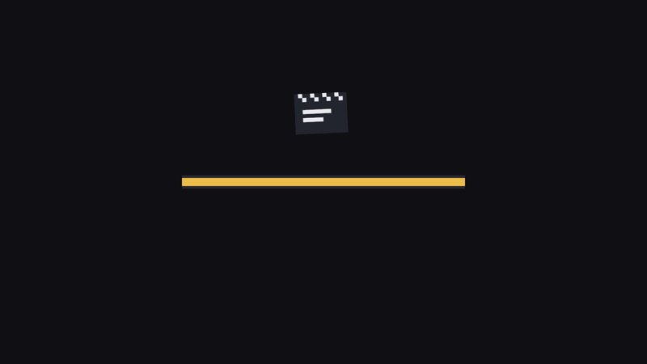

# 开机大吉

全章零件总装。开机日的完整流程：嵌入的场记板撑起加载画面，八件家当（四张幕布、三件道具、一本剧本）整单装货，金条爬满、亮足时辰才开机；开机后装台、按剧本连排；秋白的热重载通道全程待命。

```rust
{{#include ../../code/ch14-assets/src/main.rs}}
```

<span class="caption">Listing 14-11：完整示例——《长风渡》开机日（src/main.rs）</span>

```console
cargo run -p ch14-assets
```

```text
老顾：《长风渡》开机日，家当 8 件，单子全开出去了。
老顾：到货 4/8。
老顾：到货 5/8。
老顾：到货 8/8。
老雷：全齐。装台——开机！
场务：台装好了，各就各位。
老雷：《渡口夜话》，5 句词。对词！
阿燕：二十年了，这把剑还认得回家的路。
梢公：客官，夜里风大，进舱吧。
阿燕：不了。我在等一个人。
梢公：那位贵客，怕是不会来喽。
阿燕：他会来。风往北吹，他就往南走。
老雷：先这样。秋白要改词直接存盘，机器不停。
```

加载画面与开机后的台面：



<span class="caption">Figure 14-6：开机前——场记板是嵌入资产，进度条是两个色块 Sprite</span>


<span class="caption">Figure 14-7：开机后——八件家当各就各位，画面里每一笔都来自 assets/ 或二进制内嵌</span>

四处值得回头多看一眼：

- **资产注册打包成了 Plugin**。`StudioAssetsPlugin` 把 `init_asset`、`init_asset_loader`、`embedded_asset!` 三件登记收进一个插件——第 2 章“App 的能力来自 Plugin”在资产侧的标准用法，你的游戏里每个功能模块都可以这样自带资产；
- **最短亮相时间**。`done == total && time.elapsed_secs() > 1.6`——快机器上八件货三帧装完，不加这道闸，加载画面就是一次黑屏闪烁。真实游戏的加载条几乎都有这道闸，只是玩家从未察觉；
- **混类型清单**。七张图片单与一张剧本单 `.untyped()` 之后睡同一个 `Vec`，`is_loaded_with_dependencies` 对谁都问得出口——进度统计天然不关心货的种类；
- **`load_embedded_asset!`**。main.rs 在 `src/` 下，于是这个宏接管了 14.7 节手拼 `embedded://` 路径的脏活；场记板从注册到取用，路径字符串一次都没出现。

试一把热重载收尾：游戏开着，改 `assets/scripts/opening.script` 的任何一句并存盘——场务立刻递上新稿，从头对词。

## 小结

- **Asset 是住在 World 外面的数据**：图片、音频、模型、自定义格式。三大件分工——`AssetServer` 开单与调度、`Assets<T>` 货架存放到货的资产、`Handle<A>` 是轻量提货单；三者各司其职，靠路径与货号对账
- **加载是异步的**：`load` 立刻返回 Handle，读盘解码在后台任务里跑；`get` 到 `None` 不是错误而是常态，资产驱动的系统拿不到货就安静等下一帧
- **Handle 的规矩**：同路径同单；clone 只加计数不复制货；最后一张强单销毁，资产自动回收——单子要存在活得够久的地方；`AssetId` 是不保活的纯编号
- **三种等货姿势**：轮询 `load_state`（四态：NotLoaded/Loading/Loaded/Failed）、收听 `AssetEvent<A>` 广播（Added/Modified/Removed/Unused/LoadedWithDependencies，同频道不保证顺序）、`AssetLoadFailedEvent` 专报坏消息——失败不崩溃，但得有人管
- **加载进度条 = 清单 + 计数 + States**：`UntypedHandle` 混装各类资产，`is_loaded_with_dependencies` 数到货，全齐切状态；记得给 Failed 留后路、给快机器加最短亮相时间
- **自定义资产两步走**：`#[derive(Asset, TypePath)]` 声明类型，`impl AssetLoader`（async load + extensions）教会解析；`init_asset` + `init_asset_loader` 登记后与内置资产平权；`Assets::add` 则让运行时生成的数据直接上架
- **热重载**：开发期开 `file_watcher` feature，文件一变自动重载、`Modified` 广播随后就到；重载失败保留旧值不崩溃。Handle 指向货架格子，货换内容、单子不换——所有持单人自动看到新货
- **细则**：采样等加载设置走 `load_with_settings`（补丁式）或 `.meta` 档案（全量、跟文件走），同路径只认首次设置；`embedded_asset!` 把素材焊进二进制解决“加载画面自己的素材”；发布期可切 `AssetMode::Processed` 走预加工流水线（第 38 章）

## 练习

1. **进度条的失败分支**：往 Listing 14-6 的 `PROP_LIST` 里加一件不存在的道具（如 `"props/ruyi-staff.png"`），先预测进度条会发生什么，运行验证。然后修复 `track_progress`：用 `load_state` 把 `Failed` 的货也计为“处理完毕”，并在控制台报出缺货清单——戏照开，缺的货用 14.3 节的灰布顶上。
2. **格式升级**：给 `.script` 格式加一条新指令 `停顿：秒数`，表示此处冷场若干秒。改 `ScriptLoader` 的解析（`ScriptLine` 可能需要变成枚举）与 `recite` 的节拍逻辑。改完体会一个问题：剧本文件能热重载，装载器代码为什么必须重新编译？
3. **全局采样**：Listing 14-9 逐件改采样太啰嗦。查 `ImagePlugin::default_nearest()`，用第 2 章的 `.set()` 手法把全局默认采样换成 Nearest，验证三把剑全部锐利——像素风游戏的标准开局配置。
4. **断粮测试**：把 `assets/` 目录整个改名，分别运行 Listing 14-1 与 Listing 14-10，先预测各自的表现再验证。改回来之后，再用 `BEVY_ASSET_ROOT` 环境变量把资产根指到改名后的目录，让 Listing 14-1 不改代码恢复工作。

下一章正式进入 2D 渲染的正题：道具进了门，该学怎么摆弄它们了。`Sprite` 还有一身没亮过的本事——图集与帧动画、九宫格切片、翻转与锚点；顺路把 Bevy 的颜色系统 `bevy_color` 一并讲透。
