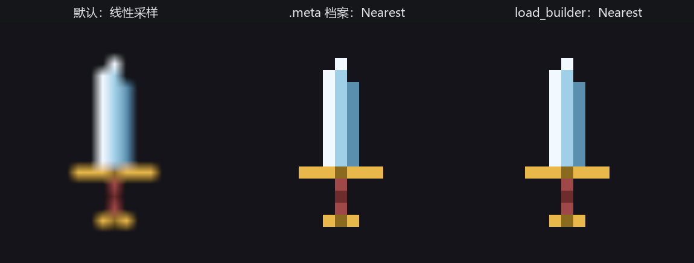

# 库房的细则

道具库的主流程到此跑通了。这一节处理三件迟早会撞上的细务，每件都从一个具体的麻烦开始：海报糊了、加载画面自己也要图、以及发布前该不该把素材“预加工”。

## 像素海报糊了：加载设置与 .meta

宣传组想拿青霜剑的 16×16 像素原稿放大做海报。Listing 14-10 把同一张稿放大十六倍，摆了三份：

```rust
{{#include ../../code/ch14-assets/examples/listing-14-10.rs:posters}}
```

<span class="caption">Listing 14-10：同一张像素稿的三种洗法——默认、.meta 档案、load_builder 现改设置（examples/listing-14-10.rs）</span>

```console
cargo run -p ch14-assets --example listing-14-10
```



<span class="caption">Figure 14-5：左：线性采样把 16 个像素糊成渐变；中、右：Nearest 采样保住像素的棱角</span>

左边那把糊了。罪魁是**采样器**（sampler——GPU 把贴图像素映射到屏幕像素时的取值规则）：默认设置是线性插值，相邻像素取平均，照片类素材放大时显得平滑，像素画放大时直接糊成一摊。解法是按件改设置，两条路：

- **代码路**：走 `load_builder()`。`load(路径)` 其实是 `load_builder().load(路径)` 的省写；订单要带附加条款，就自己下到建造者这一层——挂一个 `with_settings(闭包)` 再 `load`。闭包收到该资产装载器的设置类型——图片是 `ImageLoaderSettings`（14.5 节我们自己的装载器把 `Settings` 定成 `()`，图片装载器则是有选项的范例）——只改要改的字段，这里把 `sampler` 换成 `ImageSampler::nearest()`（取最近的像素，不平均，棱角分明）；
- **档案路**：在素材文件旁边放一个同名加 `.meta` 后缀的文件，逐字段写明加载设置——上一节存盘时自动落地的那份档案，就是这套制度的产物。中间那把剑走的就是这条路，`sword-16-meta.png.meta` 内容如下：

```text
{{#include ../../code/ch14-assets/assets/props/sword-16-meta.png.meta}}
```

<span class="caption">.meta 档案：跟着素材文件走的加载设置，mag/min/mipmap 三处过滤全改成 Nearest（assets/props/sword-16-meta.png.meta）</span>

档案路的好处是不动代码、跟文件走；代价是字段必须**写全**（它是整份设置的存档，不是补丁）。代码路反过来：是补丁、可以只写一处，但散在代码里。团队素材管线通常偏向 `.meta`，一次性的特例用 `with_settings` 顺手。

一个埋得很深的坑，提前替你踩了：**同一路径只认第一次的设置**。资产按路径去重（14.2 节），如果某处先用默认设置 `load` 了 `sword-16.png`，后面再带着 `with_settings` 下单同一路径，设置会被静默忽略——单子还是原来那张。Listing 14-10 给三把剑准备三份文件副本，原因就在这。

> 整目录批量加载，库房也接单：`load_folder("props")` 返回一张 `Handle<LoadedFolder>`，文件夹里的货全算它的依赖——等 `LoadedWithDependencies` 一声广播，整夹到齐。

## 加载画面自己的图：嵌入资产

14.4 节的进度条是纯色块，想配上场记板图标就遇到先有鸡还是先有蛋：加载画面是给“素材还没到”的时间段看的，它自己的素材谁来加载？

答案是不加载——**把文件直接编进可执行文件**。`embedded_asset!` 宏在编译期用 `include_bytes!` 把字节焊进二进制，运行期注册成一件内存里的资产：

```rust
{{#include ../../code/ch14-assets/examples/listing-14-11.rs:plugin}}
```

<span class="caption">Listing 14-11（节选一）：embedded_asset! 把场记板焊进二进制（examples/listing-14-11.rs）</span>

```rust
{{#include ../../code/ch14-assets/examples/listing-14-11.rs:load}}
```

<span class="caption">Listing 14-11（节选二）：从 embedded:// 来源取货——没有磁盘 IO，但流程照旧（examples/listing-14-11.rs）</span>

```console
cargo run -p ch14-assets --example listing-14-11
```

```text
老顾：场记板不走库房——缝在戏服里，走到哪带到哪。
老顾：就算把 assets/ 整个搬空，这块板子照样举得起来。
```

那条路径值得解剖：`embedded://listing_14_11/embedded/clapper.png`。`embedded://` 前缀指明**来源**（asset source——资产从哪类仓库来；默认来源是 `assets/` 文件夹，embedded 是第二个内置来源）；随后是 crate 名（cargo 把每个 example 当独立 crate 编译，所以这里是例子自己的名字）；再后面是文件相对位置。宏默认假设文件住在 `src/` 下，我们的例子住在 `examples/` 下，所以多传了一个参数说明前缀——总装的 main.rs 就不用了，它还能用更顺手的 `load_embedded_asset!` 宏直接取单，14.9 节见。

嵌入资产的取舍很直白：可执行文件变大、改素材要重编译，换来**零文件依赖**——引擎自己的内置资源（默认字体、内置 shader）全是这么发货的。给你的游戏做加载画面、应用图标这类“开机就要、永不缺席”的素材，这是正解。

## 发布前的预加工：asset processing 概述

最后一件细务关乎发布。开发期我们直接加载“原稿”：PNG 要在玩家机器上解码，`.meta` 要逐个检查，谁也没优化过谁。Bevy 还内置另一种工作模式——**asset processing**（资产预加工）：开发机上先跑一道流水线，把原始素材转换、压缩、烘焙成对运行时最友好的形态（比如把 PNG 转成 GPU 能直接吞的压缩纹理格式），写进 `imported_assets/` 目录——流水线的两端你已经全认识：读原稿的是装载器，写成品的正是上一节那种存档器；发布出去的游戏改从加工成品里加载，`AssetPlugin` 的 `mode` 从默认的 `AssetMode::Unprocessed` 换成 `AssetMode::Processed` 即是切换开关。`.meta` 档案在那套流程里身兼二职：既写加载设置，也写加工规则。

对中小项目，默认的 Unprocessed 模式足够走到发布；预加工在素材量大、平台多的项目里才回本。本书第 38 章谈发布时再回到这个话题。同属“知道就好”的还有两件：来源不止本地文件——开 `http`/`https` feature 可以直接 `load("https://…")` 从网络取货；`AssetReader` trait 还允许你自造来源（从 zip 包、从自家服务器读），官方仓库的 `custom_asset_reader` 示例是现成的样板。
