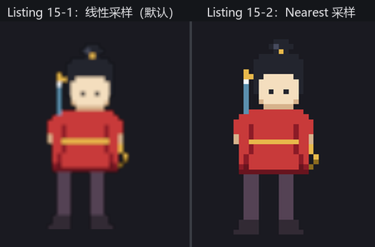
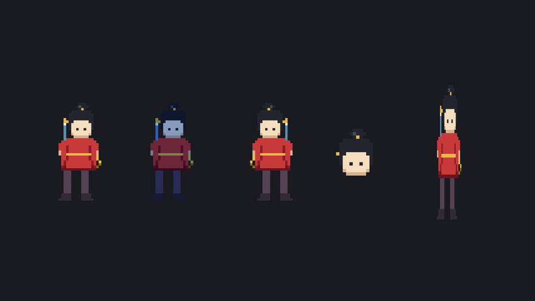

# Sprite 全解剖

小棠的第一张画稿是阿燕的定位照：32×40 像素，剑挎在背后，绦带垂在腰间。画很小——像素美术按惯例只画原始尺寸，上台再放大。那就放大：

```rust
{{#include ../../code/ch15-sprites/examples/listing-15-01.rs:setup}}
```

<span class="caption">Listing 15-1：第一张画上台——`custom_size` 放大八倍（examples/listing-15-01.rs）</span>

`Sprite` 的 `image` 字段装一张 `Handle<Image>`，正是上一章的提货单；`custom_size` 把渲染尺寸定为 256×320，不管原图多大。`cargo run -p ch15-sprites --example listing-15-01` 跑起来——

```text
小棠：画送上台了。咦——怎么糊成这样？
```



<span class="caption">Figure 15-1：同一张 32×40 的画放大上台——左边是默认的线性采样，右边是 Nearest</span>

## 先治糊：像素画要用 Nearest

糊的原因在第 14 章的库房细则里埋过：图片资产带着**采样设置**，默认是线性过滤——放大时按邻近像素插值，照片这么处理很自然，像素画这么处理就是一团浆糊。当时我们在 `load_builder()` 上挂 `with_settings` 逐件改设置救过三把剑；可全游戏的画稿都是像素风时，逐件改太啰嗦。第 14 章练习 3 的答案就是正解，这里转正：

```rust
{{#include ../../code/ch15-sprites/examples/listing-15-02.rs:nearest}}
```

`ImagePlugin` 是 `DefaultPlugins` 的成员，管所有图片资产的默认采样；`default_nearest()` 把全局默认换成 Nearest（取最近的那个像素，不插值），再配上第 2 章的 `.set()` 手法覆盖进插件组。像素风游戏的标准开局就这一行，本章后面凡是带画稿的示例都挂着它。

## 试装台：把字段挨个试一遍

治好了糊，小棠把同一张定位照摆了五份，每份动一个字段——这是 `Sprite` 的全部“可调旋钮”里最常用的几个：

```rust
{{#include ../../code/ch15-sprites/examples/listing-15-02.rs:variants}}
```

<span class="caption">Listing 15-2：试装台——color、flip_x、rect、custom_size 各管一件事（examples/listing-15-02.rs）</span>

```console
cargo run -p ch15-sprites --example listing-15-02
```

```text
小棠：一号位原样放大，这回锐了。
小棠：二号位罩了层月光色，三号位翻了个面。
小棠：四号位裁头像，五号位硬抻——最后这张是反面教材。
```



<span class="caption">Figure 15-2：试装台五个位——一张图，五种摆弄</span>

逐位拆解：

- **`color` 是染色，不是涂色**。这块颜色与图片**逐像素相乘**：白底乘什么得什么，红衣乘上青蓝就压成了暗紫——所以它天生适合做“罩一层光”的效果，月光、火光、中毒发绿都这么来。默认值是白色，乘了等于没乘；
- **`flip_x` / `flip_y` 是免费的镜像**。三号位剑柄换了边——画稿只画朝右的，朝左全靠翻面，这是 2D 游戏的通行省钱术，下一节的走路动画就靠它调头；
- **`rect` 从原图里裁一块**，坐标用原图像素，原点在图的左上角。四号位裁了 `(9,0)` 到 `(23,15)` 的头像区——注意它**先于** `custom_size` 生效：先裁后缩放。文档说它是“一次性的 TextureAtlas 替代品”，下一节你就明白这句话的意思；
- **`custom_size` 决定渲染尺寸，不顾原图比例**。五号位把 32×40 的画硬抻成 110×330，人变成了瘦高个。要按比例放大，要么算好尺寸（一号位是 32×40 的整六倍），要么干脆用第 12 章的 `Transform::scale`——两条路都通，区别在于 `custom_size` 以像素为单位、跟 `Transform` 互不相干，而 `scale` 会连同子实体一起缩放。

`Sprite` 还剩三个字段没动：`image_mode` 管九宫格与平铺（15.4 节）、`texture_atlas` 管图集（下一节），还有个 `anchor`——准确说它不是字段，而是一个独立组件，15.3 节专门讲。

> **像素风的小字**：Nearest 采样解决了“糊”，但只要放大倍数不是整数、或者坐标落在半像素上，像素画仍会出现宽窄不一的格子。本章示例都用整数倍数加整数坐标回避；认真的像素风游戏还会配一台低分辨率相机整体放大，那套做法等第 37 章渲染到纹理时再说。
