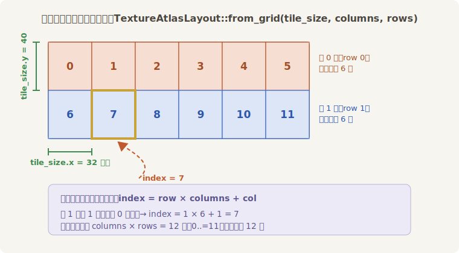
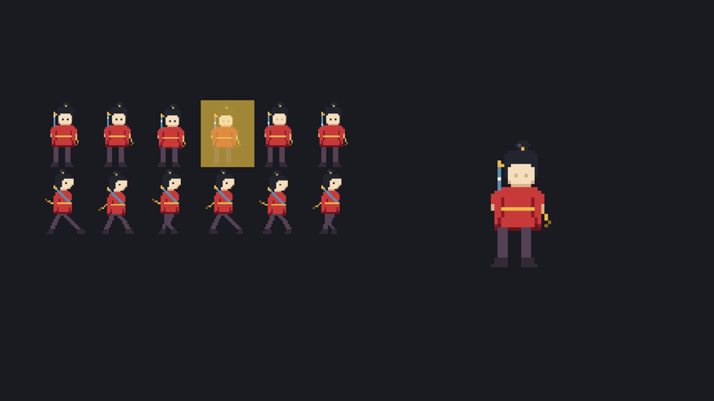
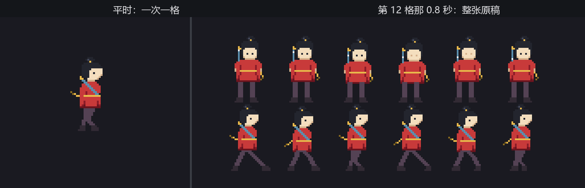

# 图集与帧动画

定位照立住了，可老雷不满意：“一张画是死的。呼吸、眨眼、走路——戏在动上。”

2D 的“动”没有魔法：就是一沓画得略有差异的画稿，按节拍轮流上台——皮影戏、走马灯、连环画，原理一脉相承。小棠交来的第二份稿子是一整张**连环画**：阿燕的十二个瞬间画在同一张 192×80 的图里，6 列 2 行，每格 32×40。第一行是正面原地的六帧（呼吸起伏、眨眼、剑上一点寒光游走），第二行是侧身走路的六帧。

为什么画在同一张图里，而不是十二个文件？两头都省：库房只进一件货、一张提货单管到底（第 14 章的规矩）；渲染时 GPU 也只需装载一张纹理，十二个格子随便切换，不用来回换料——角色帧图、地形块、UI 小图标，2D 游戏的图几乎都这么打包。这种“多张小图拼成的一大张”就叫**纹理图集**（texture atlas），游戏行业也叫它 sprite sheet（精灵表）。

## 切格说明书：TextureAtlasLayout

图集文件本身只是一张普通图片——引擎并不知道里面藏着十二格。格子怎么切，得另配一份说明书：

```rust
{{#include ../../code/ch15-sprites/examples/listing-15-03.rs:atlas}}
```

`TextureAtlasLayout` 记录“这张图上有哪些矩形区域”；`from_grid(tile_size, columns, rows, padding, offset)` 按均匀网格一次切完，后两个参数留给格子间有缝隙或四周有留白的图集，规整的图传 `None`。注意它是个**资产**：要 `layouts.add(...)` 上架（`Assets<TextureAtlasLayout>`，第 14 章的运行时上架），手里留张 `Handle`——多个角色共用同一份切格说明书时，又是只此一份。



<span class="caption">Figure 15-3：`from_grid` 的切格与编号规则——从左到右、自上而下，一共 columns × rows 格</span>

说明书就位，`Sprite` 的 `texture_atlas` 字段挂上一个 `TextureAtlas`——它只有两个成员：`layout`（说明书的提货单）加 `index`（露出第几格）：

```rust
{{#include ../../code/ch15-sprites/examples/listing-15-03.rs:framed}}
```

<span class="caption">Listing 15-3（节选一）：`from_atlas_image`——同一张图，只露出取景框里的一格（examples/listing-15-03.rs）</span>

Listing 15-3 把两种用法摆在一起：左边用普通 `Sprite::from_image` 挂出整张原稿（顺带一层金色高亮罩标出当前格），右边挂图集版。一个 `Timer`（定时器——倒计时工具，0.6 秒一响，第 18 章专讲它）驱动翻页：

```rust
{{#include ../../code/ch15-sprites/examples/listing-15-03.rs:turn}}
```

<span class="caption">Listing 15-3（节选二）：拨 index 翻格，高亮罩同步爬格子（examples/listing-15-03.rs）</span>

翻页的核心只有一行：`atlas.index = (atlas.index + 1) % 12`——改的是 `Sprite` 组件里的一个数字，图片资产从头到尾没动过。跑起来：

```console
cargo run -p ch15-sprites --example listing-15-03
```

```text
小棠：原稿十二格挂左边，右边的取景框一次只放一格。
小棠：第 1 格——正面第 2 帧。
小棠：第 2 格——正面第 3 帧。
小棠：第 3 格——正面第 4 帧。
小棠：第 4 格——正面第 5 帧。
小棠：第 5 格——正面第 6 帧。
小棠：第 6 格——走路第 1 帧。
小棠：第 7 格——走路第 2 帧。
小棠：第 8 格——走路第 3 帧。
小棠：第 9 格——走路第 4 帧。
小棠：第 10 格——走路第 5 帧。
小棠：第 11 格——走路第 6 帧。
小棠：第 0 格——正面第 1 帧。
小棠：十二格翻完一轮，后面不报了。
```



<span class="caption">Figure 15-4：左边是文件的全貌，右边是引擎眼里的一格——高亮罩走到哪，右边换到哪</span>

## 走马灯：帧动画

把节拍调快到每帧 0.1 秒、编号圈定在走路那一行（6 到 11），动画就成了。这回让阿燕真的走起来——位移交给第 12 章的 `Transform`，到台口调头，调头就是翻 `flip_x`：

```rust
{{#include ../../code/ch15-sprites/examples/listing-15-04.rs:components}}
```

<span class="caption">Listing 15-4（节选一）：节拍器与走位各记各的——两个组件，两件事（examples/listing-15-04.rs）</span>

```rust
{{#include ../../code/ch15-sprites/examples/listing-15-04.rs:advance}}
```

<span class="caption">Listing 15-4（节选二）：走马灯的芯子——节拍一到拨下一帧，到尾回头（examples/listing-15-04.rs）</span>

```rust
{{#include ../../code/ch15-sprites/examples/listing-15-04.rs:pace}}
```

<span class="caption">Listing 15-4（节选三）：来回走位，转身即翻面（examples/listing-15-04.rs）</span>

```console
cargo run -p ch15-sprites --example listing-15-04
```

```text
老雷：合上原稿，走两步。
场记：到东头，转身。
场记：到西头，转身。
```


<span class="caption">Figure 15-5：走马灯转起来——帧循环给步态，Transform 给位移，flip_x 给朝向</span>

值得停一拍想想这套分工：`advance_frames` 只管拨格子，`pace_the_stage` 只管挪位置，谁也不知道谁的存在——这是第 4 章“一个系统管一件事”的老规矩。官方的 `sprite_sheet` 示例用的也是同款结构（它管节拍组件叫 `AnimationTimer`、范围叫 `AnimationIndices`，芯子一模一样）。另外注意帧节拍（0.1 秒）与走位速度（每秒 180 像素）是两个独立的旋钮：步子迈多快与人挪多快对不上，画面就会“滑冰”——这是帧动画手感的第一调参现场。

## 多一格的事故

小棠收工前手滑了一下：走路帧明明到 11 号格收尾，他把收尾写成了 12。

```rust
{{#include ../../code/ch15-sprites/examples/listing-15-05.rs:bug}}
```

<span class="caption">Listing 15-5（节选）：差一错误——图集一共 12 格，编号只到 11（examples/listing-15-05.rs）</span>

跑之前先想一想：第 12 格不存在，轮到它的那 0.8 秒会发生什么？崩溃？空白？警告？

```console
cargo run -p ch15-sprites --example listing-15-05
```

```text
小棠：还是那套走路帧，我把收尾格改成了 12——应该没差吧？
现在亮的是第 7 格
现在亮的是第 8 格
现在亮的是第 9 格
现在亮的是第 10 格
现在亮的是第 11 格
现在亮的是第 12 格
小棠：等等——第 12 格是哪来的？！整张原稿都上去了！
现在亮的是第 6 格
现在亮的是第 7 格
```



<span class="caption">Figure 15-6：编号越界的瞬间——不报错、不空白，整张原稿原样上台</span>

不崩溃、控制台一声不吭，但画面出了大事：**整张连环画**替那一帧上了台。原因藏在 `texture_atlas` 的兜底逻辑里：`index` 在说明书里查不到对应格子时，查询落空，渲染器拿不到裁切区域，就退回“没有图集”的画法——把 `image` 整张画出来。动画跑得快时这一帧一闪而过，只觉得“偶尔抽搐一下”，慢放才看得清真相。

所以见到“角色偶尔闪成一整张表”的怪相，先查帧范围的差一错误（off-by-one）。它和第 12 章戒尺打过的 B0004 不同——那次引擎至少给了警告，这次连日志都没有，全凭眼睛。把 `WALK_LAST` 改回 11，事故消失。

> **`rect` 与图集的合作**：上一节说 `rect` 是“一次性的图集替代品”——其实两者还能叠用：挂了 `texture_atlas` 再给 `rect`，后者的坐标就变成**相对当前格**的，可以从一帧里再裁一小块。用得不多，知道有这回事即可。
