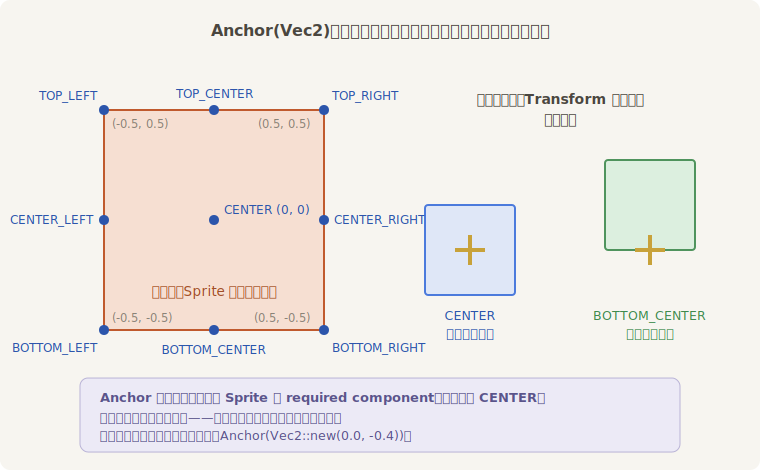
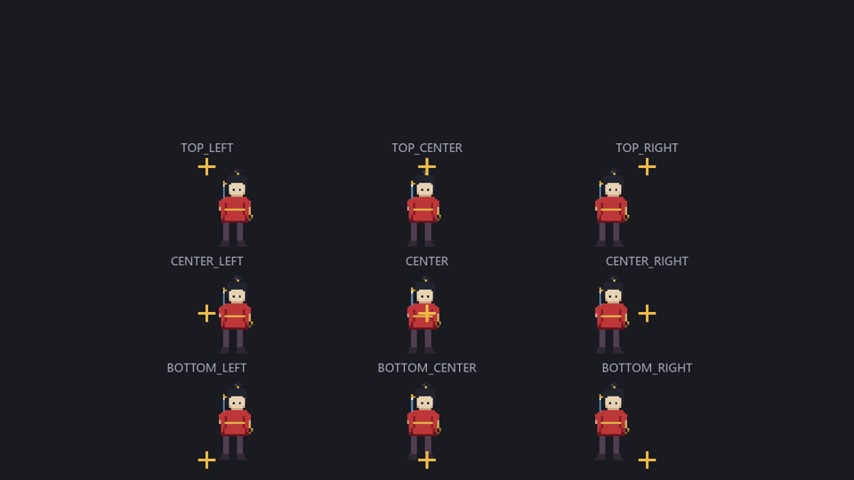
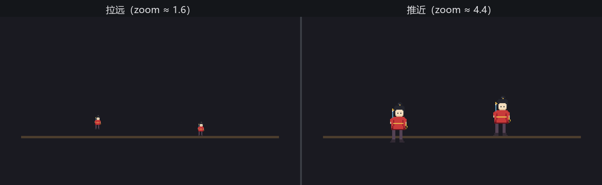

# Anchor：钉子钉在哪

走马灯一搭好，老雷立刻要镜头感：“近景！把阿燕放大。”小棠把 `custom_size` 调大——人是大了，**脚也离地了**。再调小，人缩回去，又浮在半空。台板没动、`Transform` 没动，怎么人就不踩地了？

因为放大缩小是**绕着钉子**进行的。`Transform` 的平移只说“钉子钉在世界的哪一点”，而画的哪个点对准钉子，由 **Anchor**（锚点）说了算——默认是 `CENTER`，腰眼。腰眼钉死了，个子一长，脚自然往下窜；个子一缩，脚就吊起来。

`Anchor` 在 0.18 里是个独立组件，也是 `Sprite` 的 required component（第 3 章的规矩：挂 `Sprite` 时引擎自动补一个默认值）。它内里只是一个 `Vec2`，单位是**自身宽高的比例**：`(0, 0)` 是中心，`(-0.5, -0.5)` 是左下角，九个常用位置都有现成常量：



<span class="caption">Figure 15-7：Anchor 的坐标语义——钉子（Transform）不动，换锚点等于换“画的哪个点对准钉子”</span>

九种钉法一次看全：

```rust
{{#include ../../code/ch15-sprites/examples/listing-15-06.rs:setup}}
```

<span class="caption">Listing 15-6：锚点九宫——九张定位照钉在九枚金十字上（examples/listing-15-06.rs）</span>

```console
cargo run -p ch15-sprites --example listing-15-06
```

```text
小棠：九张定位照，九种钉法，钉子全在金十字上——画各自让开。
```



<span class="caption">Figure 15-8：同一张画、九种锚点——注意每个十字相对画的位置</span>

读这张图的窍门：金十字永远是 `Transform` 给的那一点，**锚点名说的是画身上的点**。`TOP_LEFT` 的意思是“画的左上角对准钉子”，于是画整体垂到钉子的右下方；`BOTTOM_CENTER` 是“鞋底中点对准钉子”，画整体立在钉子上方。

## 脚踩实地

回到老雷的近景问题。正解是给演员换一种钉法——把锚点钉到鞋底：

```rust
{{#include ../../code/ch15-sprites/examples/listing-15-07.rs:setup}}
```

<span class="caption">Listing 15-7（节选一）：左边默认 CENTER 钉腰，右边 BOTTOM_CENTER 钉鞋底、钉子直接给到台板线（examples/listing-15-07.rs）</span>

```rust
{{#include ../../code/ch15-sprites/examples/listing-15-07.rs:zoom}}
```

<span class="caption">Listing 15-7（节选二）：推拉镜头——只改 custom_size，Transform 一动不动（examples/listing-15-07.rs）</span>

```console
cargo run -p ch15-sprites --example listing-15-07
```

```text
老雷：推近景再拉回来，看哪位的脚不老实。
```



<span class="caption">Figure 15-9：尺寸来回变，钉腰的脚一会儿悬空一会儿入地，钉鞋底的纹丝不动</span>

道理一句话：**人物该把“立足点”当原点，而不是几何中心**。同理可推开去——吊灯笼用 `TOP_CENTER`（挂钩在顶上）、贴墙的旗用 `CENTER_LEFT`（旗杆贴墙）、下一章的伤害飘字也要选锚点决定数字从哪儿冒出来。`Anchor` 还接受任意比例：`Anchor(Vec2::new(0.0, -0.4))` 把原点放在鞋底略偏上，适合脚边带几像素阴影的画稿。

两个容易混的边界划清楚：

- **锚点只挪画面，不挪实体本身**。实体的原点永远是 `Transform` 那枚钉子：第 12 章层级里的子实体照旧挂在父实体的钉子上，不会跟着父亲的锚点跑——锚点是纯渲染层面的对齐；
- **锚点以可见矩形为准**，不管像素内容。我们的画稿鞋底正好踩在图的最后一行像素上，`BOTTOM_CENTER` 才严丝合缝；如果画稿四周留了透明边，锚点钉的是透明边的边缘——画稿裁不裁边，是美术与程序要对齐的口径。
