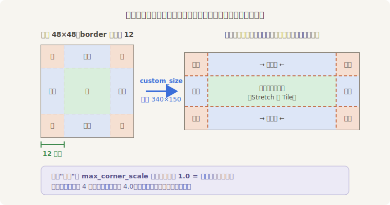
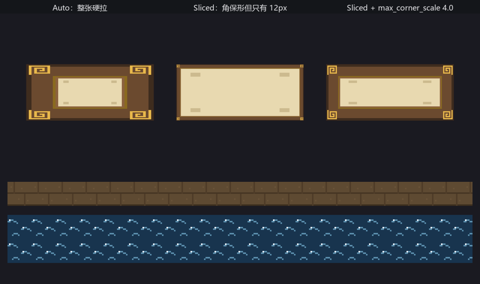

# 九宫格与平铺

下一单活是字幕框。秋白的台词长短不齐，框得跟着伸缩：窄的一行，宽的半个台口。小棠画了一块 48×48 的样板——木框金角、帛心留白——可一上 `custom_size` 拉宽就露了馅：Figure 15-11 左边那个框，回纹角花被抻成了宽扁的麻花。

问题不在画稿在拉法：**框不该跟着内容缩放**。画框这种素材，四角是装饰、四边是包边、中间才是可伸缩的留白——把图按这个思路切成九块、各按各的规矩伸缩，就是 UI 行当沿用了几十年的**九宫格切片**（9-slice）：



<span class="caption">Figure 15-10：四条裁线、九块区域——角不变形，边顺着一个方向走，心两头都走</span>

在 Bevy 里，这套规矩由 `Sprite` 的 `image_mode` 字段承载。它是个 `SpriteImageMode` 枚举，默认值 `Auto` 就是 15.1 节那种“整张跟着 `custom_size` 硬拉”；换成 `Sliced` 并配一份 `TextureSlicer` 说明书，九宫格就生效了：

```rust
{{#include ../../code/ch15-sprites/examples/listing-15-08.rs:sliced}}
```

<span class="caption">Listing 15-8（节选一）：同一块样板三种裱法——Auto、Sliced、Sliced 加放开的角（examples/listing-15-08.rs）</span>

`TextureSlicer` 的四个成员各管一件事：

| 成员 | 管什么 |
|---|---|
| `border` | 四条裁线往里收多少像素（`BorderRect::all(12.0)` 四边各 12；也可逐边给） |
| `center_scale_mode` | 心怎么填：`Stretch` 拉伸（默认）或 `Tile { stretch_value }` 平铺 |
| `sides_scale_mode` | 四边怎么填，选项同上 |
| `max_corner_scale` | 角最多放大到几倍（默认 1.0——原图像素尺寸） |

跑起来对照三个框（Figure 15-11 上排）：一号 `Auto` 角花变形，是反面教材；二号 `Sliced` 角花保形了——但只有原图里的 12 像素，框细得像铅笔描的；三号把 `max_corner_scale` 放开到 4.0，四角跟上了全场像素画的放大倍数，这才是成品。像素风配九宫格，**这个参数几乎必调**，不然角永远是“原图大小”，跟周围放大过的像素格格不入。

## 平铺：一块贴片铺到头

`SpriteImageMode` 的另一个大用途是 `Tiled`——不切九块，整张图当地砖铺：

```rust
{{#include ../../code/ch15-sprites/examples/listing-15-08.rs:tiled}}
```

<span class="caption">Listing 15-8（节选二）：16×16 的水纹与桥板贴片，各铺一条 1240 像素的长带（examples/listing-15-08.rs）</span>

```console
cargo run -p ch15-sprites --example listing-15-08
```

```text
小棠：一号框白送的反面教材，二号框守规矩，三号框才是像素戏该有的裱法。
小棠：水和桥板不用画整条，一块贴片铺到头。
```



<span class="caption">Figure 15-11：上排装裱三连，下排平铺两条——素材都只有指甲盖大</span>

`tile_x` / `tile_y` 决定哪个方向重复；`stretch_value` 决定贴片放大几倍再重复——4.0 表示 16 像素的贴片按 64 屏幕像素一块铺，正好跟全场的 4 倍像素风对齐。水面、地板、城墙、无尽的背景山——凡是“图案重复”的大面积，都该用平铺而不是让美术画整条：素材小、内存省，尺寸还能随时改。

> **同门师兄弟**：`image_mode` 还有第四个变体 `Scale(SpriteScalingMode)`，管“保持比例地填进 `custom_size`”——`FitCenter` 完整放进去、`FillCenter` 铺满裁掉出界的部分，像 CSS 的 `object-fit`。头像框、关卡缩略图用得上，练习里试。另外，第 28 章的 UI 节点有一模一样的九宫格与平铺（`NodeImageMode`），说明书都是同一个 `TextureSlicer`——这儿学会，那儿白送。

## 装裱事故

九宫格也有翻车姿势。小棠想让框更厚实，把 `border` 直接拉到 30：

```rust
{{#include ../../code/ch15-sprites/examples/listing-15-09.rs:setup}}
```

<span class="caption">Listing 15-9：border 越界——30 + 30 = 60，比 48 的原图还宽（examples/listing-15-09.rs）</span>

四条裁线一人往里收 30 像素，左右两条加起来 60，可原图只有 48 宽——裁线相互越过，九块切不出来了。跑：

```console
cargo run -p ch15-sprites --example listing-15-09
```

```text
小棠：边框留宽点总没错吧——咦，框呢？
```

控制台里多了红色的 ERROR——这次引擎开口了：

```text
ERROR bevy_sprite::texture_slice::slicer: TextureSlicer::border has out of bounds values. No slicing will be applied
ERROR bevy_sprite::texture_slice::slicer: TextureSlicer::border has out of bounds values. No slicing will be applied
```

同一句话连报两声不是回音——图片就绪的当帧和资产事件送达的次帧各触发了一轮切片计算，两轮撞上的是同一个越界。跟上一节那场无声的图集事故不同，这次有日志可循：切片器发现 `border` 越界，宣布“不切了”，整张图退回 `Auto` 式硬拉——画面上是一个角花变形的框（跟 Figure 15-11 的一号框同款），控制台里是明白话。**border 的上限是图宽（高）的一半**；想要更厚的框，改画稿尺寸，别硬掰裁线。
