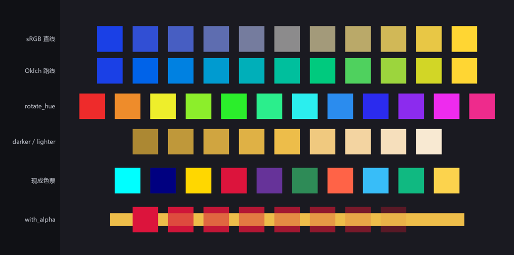

# bevy_color 调色间

颜色这个东西，全书已经用了十四章——`Color::srgb(0.85, 0.2, 0.2)` 这样的三元组写了不下百次，但一直没问过两个要紧的问题：这三个数到底是什么意义？为什么有时候两个好看的颜色混出来一团脏？《渡口夜话》是夜戏，灯光、月色、水面全靠调色撑，是时候把 `bevy_color` 这个 crate 系统过一遍了。

## Color 是十种色彩空间的联盟

`Color` 不是一个“红绿蓝结构体”，而是一个枚举——同一个颜色概念，可以用十种**色彩空间**（color space，描述颜色的坐标系）中的任意一种来记账：

| 变体 | 坐标含义 | 拿手好戏 |
|---|---|---|
| `Srgba` | 红、绿、蓝（显示器伽马） | 直接对接美术给的色号、十六进制 |
| `LinearRgba` | 红、绿、蓝（物理线性） | 渲染器内部运算的口径 |
| `Hsla` / `Hsva` / `Hwba` | 色相、饱和度、亮度/明度/白黑 | “转个色相”“降点饱和”这类直觉调整 |
| `Laba` / `Lcha` | 感知均匀的明度与色度（CIE Lab 系） | 颜色差异的度量 |
| `Oklaba` / `Oklcha` | 更现代的感知均匀空间 | 混色、渐变、明暗调整的首选 |
| `Xyza` | CIE XYZ | 各空间互转的中转站 |

构造函数与变体一一对应：`Color::srgb(r, g, b)`、`Color::hsl(h, s, l)`、`Color::oklch(l, c, h)`……写哪个，账就记在哪个空间里。每个空间也是独立的类型（`Srgba`、`Oklcha`……），实现了互相 `From`/`Into`，随时换算；美术给的色号还能直接解析——`Srgba::hex("#C83A3A")`。

为什么要十种？因为**不同的操作在不同的空间里才自然**。这不是抽象玄学，做个实验立刻见血——同一对颜色（靛蓝与金黄），分别在 `Srgba` 和 `Oklcha` 空间里直线混合十一档：

```rust
{{#include ../../code/ch15-sprites/examples/listing-15-10.rs:mix}}
```

<span class="caption">Listing 15-10（节选一）：同一趟渐变走两条路——Mix trait 在谁身上调用，就在谁的空间里插值（examples/listing-15-10.rs）</span>

```console
cargo run -p ch15-sprites --example listing-15-10
```

```text
小棠：sRGB 直线的中点是 #8C8B8C，又灰又闷。
小棠：Oklch 路线的中点是 #00BF9D，干净多了。
小棠：阿燕戏服的色号 #C83A3A，换算成色相是 0°。
```



<span class="caption">Figure 15-12：色卡墙——第一排（sRGB）中段塌成灰绿，第二排（Oklch）始终干净，这就是空间选错的代价</span>

第一排中点 `#8C8B8C`——纯灰。原因：sRGB 的三个数字是给显示器看的电信号，不是给眼睛看的感知量，在它上面做算术，蓝降黄升的半路恰好撞进低饱和区。`Oklcha` 是**感知均匀**空间——数字上走直线，眼睛看着也是匀速，混色、渐变、过渡动画一律建议先转过去再算。晨昏天色渐变、血条由绿转红，全是这个道理。

操作颜色的工具是四个 trait，`Color` 与所有空间类型都实现了（操作在当前空间没定义时，自动借道 `Oklcha` 算完再转回来）：

- **`Mix`**——`a.mix(&b, 0.5)`，按比例插值，刚才已经领教；
- **`Hue`**——`rotate_hue(度数)` 转色相。色卡墙第三排把一块基色转了十二次，每次 30°，一只调色轮转出来（Listing 15-10 的 `hue` 片段）：

```rust
{{#include ../../code/ch15-sprites/examples/listing-15-10.rs:hue}}
```

- **`Luminance`**——`darker(量)` 与 `lighter(量)`，加减的是绝对亮度。第四排拿灯笼金往两头各打四档。注意亮度是有底的：一个本就深的颜色减不了多少就触底变黑（拿阿燕的戏服红试试就知道——它的相对亮度只有 0.155 左右）；
- **`Alpha`**——`with_alpha(0.3)` 改不透明度。第六排把朱红一路调透，压在金条上看“透”得多均匀。上一节字幕框、月亮光晕的半透明都是它。

```rust
{{#include ../../code/ch15-sprites/examples/listing-15-10.rs:luminance}}
```

<span class="caption">Listing 15-10（节选二）：色相轮与明暗阶梯——Hue 与 Luminance 两个 trait 的手感（examples/listing-15-10.rs）</span>

## 现成色票

不想凑数字时，`bevy::color::palettes` 里有三本印好的色票：`css`（一百多个 CSS 标准命名色：`css::GOLD`、`css::CRIMSON`、`css::REBECCA_PURPLE`……）、`tailwind`（Tailwind 的色阶系统：`tailwind::SKY_400`、`tailwind::EMERALD_500`，数字越大越深）、`basic`（十六个老牌基本色）。它们都是 `Srgba` 常量，凡是收 `impl Into<Color>` 的地方直接塞：

```rust
{{#include ../../code/ch15-sprites/examples/listing-15-10.rs:palettes}}
```

<span class="caption">Listing 15-10（节选三）：三本色票各抽几张——Srgba 常量直接当 Color 用（examples/listing-15-10.rs）</span>

原型期用色票，正式美术定稿后换 `Srgba::hex` 对色号——两步都不用自己凑三元组。

## Srgba 与 LinearRgba：一对容易踩的双胞胎

最后说清那对最容易混淆的变体。`Srgba` 的数值经过了伽马编码——它描述“显示器该发多亮的信号”，数值与人眼感知大致成正比；`LinearRgba` 是物理线性的光强，渲染器做光照、混合、叠加时一律用它（GPU 收到的就是这个，转换由引擎代劳）。日常写游戏逻辑你几乎只碰 `Srgba` 系的构造函数；但有两个场合要留心：

- 见到 API 明确收 `LinearRgba`（自定义着色器、第 36 章的材质字段），用 `color.to_linear()` 换算，别把 sRGB 数值直接塞进去——颜色会整体偏亮或偏暗；
- 反过来，从渲染管线里读出的颜色想给美术对色号，先 `to_srgba()` 再 `to_hex()`。

> **数值大于 1 的颜色**：`Color::srgb(4.0, 4.0, 0.5)` 不报错——HDR（高动态范围）管线里“比白更亮”是合法的，配合 Bloom 泛光会真的发光。这扇门等第 26 章打开。
