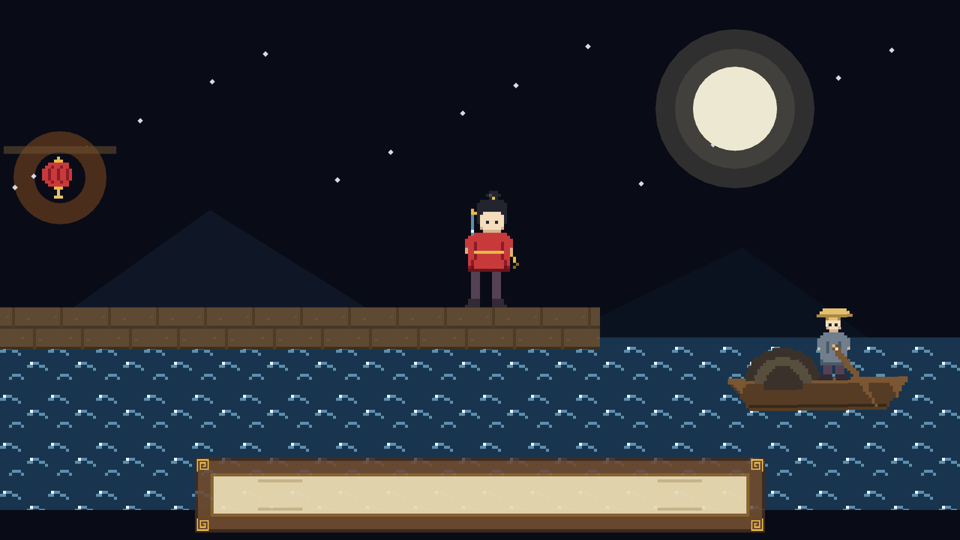

# 带妆彩排

全章零件总装。《渡口夜话》的台面这回是真皮相：Mesh2d 铸的月亮光晕远山、贴片铺的江水栈桥、十二格连环画加身的阿燕在两个站位间走走停停、梢公在船上摇橹、灯笼的光晕按呼吸明灭，台口还裱着一只等词儿的字幕框。

```rust
{{#include ../../code/ch15-sprites/src/main.rs}}
```

<span class="caption">Listing 15-12：完整示例——《渡口夜话》带妆彩排（src/main.rs）</span>

```console
cargo run -p ch15-sprites
```

```text
老雷：《渡口夜话》带妆彩排——月亮、江水、灯笼、船，各就各位。
小棠：阿燕的十二格连环画都在身上，梢公的橹也上了弦。
老雷：阿燕，走到东头去。
老雷：阿燕，走到西头去。
场记：到位。后台收声，戏自己走。
```



<span class="caption">Figure 15-14：带妆彩排——画面里没有一张整幅的背景图，全是本章的零件拼出来的</span>

几处接线值得回头看：

- **`StageDirection` 把行为做成了枚举组件**：养神到点换走路帧、到站换正面帧——切动作就是改 `FrameClock` 的范围加归位 `index`，再按去向翻 `flip_x`。这是帧动画角色的标准骨架，第 30 章的动画状态机是它的豪华版；
- **阿燕钉的是 `BOTTOM_CENTER`**：走位只改 `translation.x`，y 恒等于桥面高度，脚永远贴板——15.3 节的功课直接换来“不用算身高”的省心；
- **梢公是船的子实体**：船一沉浮带着人一起晃（第 12 章的层级传播），摇橹的帧动画在子实体上各转各的——两套节奏互不打架；
- **灯笼的呼吸**改的是材质资产本身（`materials.get_mut`），不是组件——所有持这张提货单的实体都会一起亮暗，这儿恰好只有一个光晕，效果就是它的呼吸。两档颜色之间用 `mix` 插值，上一节调色间的手艺。

试两把：把 `FrameClock::new(0.11, 6, 11)` 的 0.11 改成 0.25——步子立刻“滑冰”，因为腿的节拍跟不上位移了；把阿燕的 `Anchor::BOTTOM_CENTER` 删掉，required component 会补回默认的 `CENTER`，她整个人沉进桥板半截——15.3 节那张图活过来了。

## 小结

- **`Sprite` 是 2D 的基本画**：`image` 装提货单，`color` 逐像素染色，`flip_x`/`flip_y` 镜像，`rect` 裁切（原图像素坐标），`custom_size` 定渲染尺寸；像素画记得 `ImagePlugin::default_nearest()`，否则放大即糊
- **图集 = 一张图 + 一份切格说明书**：`TextureAtlasLayout::from_grid` 切格、上架成资产；`Sprite` 的 `texture_atlas` 字段挂 `TextureAtlas { layout, index }`，露出第几格全看 `index`。帧动画就是 Timer 节拍 + 拨 `index` + 到尾回头；`index` 越界**不报错**，整张原稿原样上台——动画抽搐先查差一错误
- **`Anchor` 是独立组件**（Sprite 的 required component，默认 `CENTER`）：决定画的哪个点对准 `Transform` 那枚钉子，单位是自身宽高的比例；立足型角色用 `BOTTOM_CENTER`，悬挂物用 `TOP_*`，它只挪画面、不挪实体原点
- **`SpriteImageMode` 管拉伸的规矩**：`Auto` 硬拉；`Sliced(TextureSlicer)` 九宫格——角保形、边单向、心双向，像素风记得放开 `max_corner_scale`，`border` 超过图宽一半会触发 ERROR 并退回硬拉；`Tiled` 平铺，`stretch_value` 定贴片放大倍数；`Scale` 保比例适配
- **`Color` 是十种色彩空间的枚举**：构造函数定空间，类型间随意互转，`Srgba::hex` 解析色号；混色、渐变先转 `Oklcha`（感知均匀），sRGB 上做算术会混出脏色；四个操作 trait——`Mix`、`Hue`、`Luminance`、`Alpha`；`palettes` 里有 css/tailwind/basic 三本现成色票；渲染内部用 `LinearRgba`，对接着色器记得 `to_linear()`
- **几何形状用 `Mesh2d` + `MeshMaterial2d<ColorMaterial>`**：图元 `meshes.add` 即铸形，材质管皮相（颜色/贴图/alpha_mode）；**缺材质静默不画**，洋红色 = 默认材质 = 缺料警告；带图矩形用 Sprite，异形与特效用 Mesh
- **素材该共享就共享**：同一份图集说明书、同一份星星网格与材质，多发提货单即可——clone 不复制货

## 练习

1. **第三行动作**：给 `make_ch15_assets.py` 的阿燕加第三行“拔剑”三帧（照着 `AYAN_SIDE_TOP` 改几笔即可，或干脆复用走路帧调换顺序），重新生成图集后把 `from_grid` 改成 6×3，在 Listing 15-12 里让她到东头时拔一次剑再折返。体会改图集行数时哪些代码必须跟着动、哪些纹丝不动。
2. **滑冰诊所**：Listing 15-4 里步速 180、帧距 0.1 秒手感正常。固定步速不动，分别把帧距改成 0.05 与 0.3，观察“原地刨地”与“脚下抹油”两种病；再试着推算一个公式——一帧该走多少像素，步幅才与画稿里的迈腿幅度（约 10 像素 × 4 倍）对得上。
3. **头像框**：用 `SpriteImageMode::Scale(SpriteScalingMode::FitCenter)` 和 `FillCenter` 各做一个 96×96 的头像位，把整张连环画原稿塞进去，对比两种适配的取舍；再用 `rect` 裁出 0 号格做第三个头像位，说说三种做法各适合什么场合。
4. **色温滑杆**：写一个系统，让月亮的 `ColorMaterial` 颜色随时间在冷月白 `#E8E4D0` 与暖灯黄 `#F0C75E` 之间来回 `mix`。先在 `Srgba` 上插值，再改成 `Oklcha`——盯着半路的颜色，找出两条路线的差别（提示：盯灰度）。
5. **裸网格侦探**：把 Listing 15-12 里梢公的 `Sprite` 换成等大的 `Mesh2d`（`Rectangle::new(32.0, 40.0)`）配 `ColorMaterial`，贴上他的图集原图。跑起来看看出了什么状况，再想想为什么——`ColorMaterial` 的 `texture` 字段认不认识 `texture_atlas`？这个实验会让你真正记住两套管线的分工。

下一章给字幕框里填上字：`Text2d` 把文字带进 2D 世界——字体也是资产，文字也有锚点，伤害飘字、对话气泡都从那里来。
