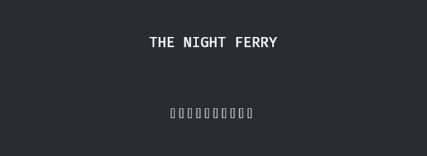

# 第一行字与满屏豆腐

字幕这活儿，戏班子先拿洋文试机——新设备的说明书都这么建议。在 2D 世界里放一行字，全部家当是一个组件：

```rust
{{#include ../../code/ch16-text/examples/listing-16-01.rs:setup}}
```

<span class="caption">Listing 16-1：第一行字——`Text2d` 把字符串放进世界坐标（examples/listing-16-01.rs）</span>

```console
cargo run -p ch16-text --example listing-16-01
```


<span class="caption">Figure 16-1：一行 `Text2d`，没有指定任何样式——白字、20 号、居中在世界原点</span>

**`Text2d`**（2D 世界文本）是个普通组件，里面就装着一个 `String`。它的全部排场来自 required components（第 3 章的规矩）——挂上它，引擎自动补齐一整套：

- `TextFont`——用哪副字模、刻多大字（这一节先用默认值）；
- `TextColor`——字色，默认白；
- `TextLayout`——对齐与换行的规矩（16.4 节）；
- `TextBounds`——文字的地界，默认无界（16.4 节）；
- `Anchor`——整块字钉在 `Transform` 的哪个点上，**与 Sprite 共用同一个锚点组件**（第 15 章），默认 `CENTER`；
- 还有 `Transform`、`Visibility` 这些 2D 实体的标配。

所以 `Text2d` 的世界观和 `Sprite` 完全一致：它就是一张“画着字的图”，能摆放、能旋转、能缩放、能配锚点，跟着第 12 章的变换体系走。机器试通了，老雷把秋白的手稿递过来。词换上去：

```rust
{{#include ../../code/ch16-text/examples/listing-16-02.rs:setup}}
```

<span class="caption">Listing 16-2：洋文行与中文行同台——上屏之后呢？（examples/listing-16-02.rs）</span>

```console
cargo run -p ch16-text --example listing-16-02
```

```text
秋白：第二幕头一句，就这十个字。
```



<span class="caption">Figure 16-2：十个字，十块豆腐——连逗号和句号也没能幸免</span>

英文行好好的，秋白的十个字上台变成了十个**空心方框**。控制台一声不吭：没有报错，没有警告，连一行日志都没有。这种方框在字体行业的诨名叫“豆腐块”（tofu）——Google 的 Noto 字体家族，名字就是“**No** more **to**fu”的缩写。

豆腐块的来历：字体文件里每个字符对应一个**字形**（glyph，字的轮廓数据）；文本引擎排版时拿着字符去字体里查字形，查不到就用 0 号字形顶替——字体设计师管它叫 `.notdef`（not defined），通常画成一个空框。也就是说，**豆腐块是字体在喊“我没有这个字”**。

为什么默认字体没有中文？Bevy 内置的默认字体是 Fira Mono 的一个子集，总共只有 **95 个字形**——ASCII 可打印区，从空格到 `~`，一个不多。这不是疏忽：一副像样的中文字体动辄一两千万字节，内置进引擎谁都得背着。更要紧的是第二件事：

> **Bevy 不会替你找系统字体。** 桌面程序里“缺字回退到系统字体”是操作系统的服务；Bevy 0.18 的文本引擎只在**已加载的字体资产**里找字形，不会扫描 Windows 的字体目录。所以“我电脑上装着微软雅黑”帮不上忙——引擎压根不看。字体得像图片一样，由你亲手交给它。

两条线索拼起来，路只有一条：把一副有中文字形的字体当成**资产**交进库房。这正是下一节的事。
