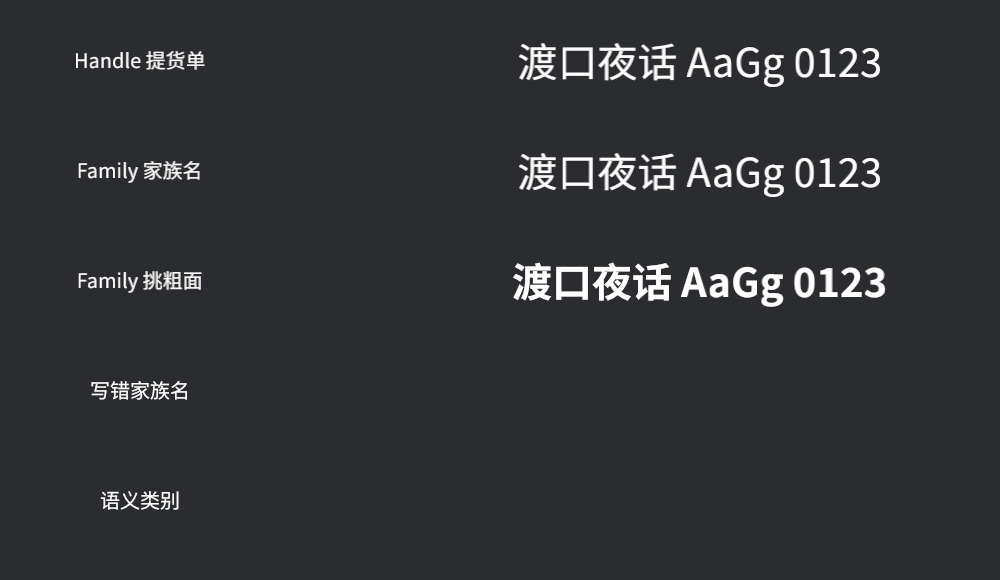

# 一副字模的三种叫法

先清上一节的账。`TextFont` 的 `font` 字段，类型不是 `Handle<Font>`，而是 **`FontSource`**（字体来源）——一个枚举，装着“用哪副字模”的三种说法：

- **按提货单**：`FontSource::Handle(Handle<Font>)`——点名要某个字体资产。`zh_font.into()` 就是把提货单包进这个变体，一直以来我们都在用它；
- **按家族名**：`FontSource::Family("Book Sans SC".into())`——报字体名册上的名字。上一节说过，字体上架时内部的家族名会登记在册，这里就是报那个名字的地方；
- **按语义类别**：`FontSource::Monospace`、`Serif`、`SansSerif`、`Cursive`、`Fantasy`……不点名，只说“给我一副等宽的／衬线的”。还有 `SystemUi`、`Emoji`、`Math`，甚至专为公文体准备的 `FangSong`（仿宋）。

三种说法各有用武之地，也各有一个坑。五行字全试一遍：

```rust
{{#include ../../code/ch16-text/examples/listing-16-04.rs:setup}}
```

<span class="caption">Listing 16-4：Handle、家族名、家族名挑字重、写错的名字、语义类别——五行字五种下单方式（examples/listing-16-04.rs）</span>

```console
cargo run -p ch16-text --example listing-16-04
```

```text
ERROR bevy_text::pipeline: A generic FontSource (Monospace) was used, but the
`system_font_discovery` feature is not enabled. Text may not render. Enable the
feature to allow Bevy to discover system fonts.
```



<span class="caption">Figure 16-4：前三行如约上台，第三行是引擎自己挑出的粗面；后两行连影子都没有</span>

逐行看：

- **行一（Handle）**：钉死。提货单指向哪副面，这段字就用哪副面，别无二话。这是游戏发行时最稳妥的形态——字模随游戏打包，在谁的机器上都长一个样。
- **行二（Family）**：`"Book Sans SC".into()` 报家族名（`&str` 同样有 `From<&str> for FontSource` 的转换）。渲染结果和行一相同——名册上这个名字就登记在 Regular 那副面上。留意代码开头的 `FontStash`：`Family` 报的名字指向**库房里**的字体，而字体资产没有任何提货单拿着就会清库（第 14 章的规矩）——行一把 handle 塞进了组件，算“有人拿着”；按名字下单的行二、行三没有，两张提货单就得自己找地方存好，否则 Bold 还没上台就退了货。
- **行三（Family + `FontWeight::BOLD`）**：家族名真正的本事。`book-sans-sc-regular.otf` 和 `book-sans-sc-bold.otf` 是**同一家族的两副面**（一副 400、一副 700——`FontWeight` 是 1 到 1000 的数字，`NORMAL`、`BOLD` 这些常量只是老名字），报家族名等于把“选哪副面”交给引擎：`weight` 拨到 `BOLD`，引擎就在家族里挑出粗面上台。注意这套“挑面”只在引擎**有得挑**的时候起作用——用 Handle 钉死了面，`weight` 就没有用武之地（除非那副面自己会变，16.5 节）。
- **行四（写错的家族名）**：整行**静默消失**。没有豆腐块，没有报错，没有日志——豆腐块起码还占着位置喊“缺字”，这个连位置都不占。家族名是运行时字符串，编译器帮不上忙，拼错一个字母就是一段凭空蒸发的文字。用 Family 就要接受这层风险。
- **行五（语义类别）**：也消失了，但控制台这次说了实话——`system_font_discovery` 这个 feature 没开。语义类别说的是“给我一副**这类**的”，可库房里只有我们亲手上架的两副中文字模，引擎既不知道哪副算“等宽”，也无处去找一副来。它需要的是一整个字体世界的目录——玩家操作系统里装的那几百副字体。

那扇门就叫 `system_font_discovery`。下一节把它打开。
