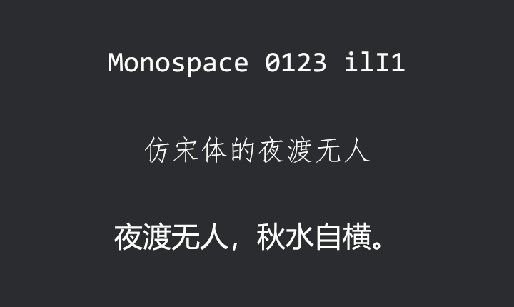

# 向系统借字模

玩家的操作系统里躺着几百副字体。让引擎看见它们，只差一个 feature——`system_font_discovery`（系统字体发现）。它是 crate 级的总开关：一开，程序启动时就把系统字体目录清点入册。本章的 crate 这样接线：

```toml
{{#include ../../code/ch16-text/Cargo.toml:features}}
```

<span class="caption">Listing 16-5（其一）：转发 feature + `required-features`——把全局开关关进一扇门（Cargo.toml）</span>

为什么不直接写在 `bevy = { ... }` 的 features 里？因为这个开关改变的不只是新写的代码——**全程序每一段缺字的文本**都会跟着变脸（一会儿见）。自己的游戏里要用，直接给 bevy 依赖加上这个 feature 就是；本章 crate 里新旧示例同住，就用 Cargo 的惯用手法把它关进门：转发 feature 配 `required-features`，只有点名要它的示例才带着它编译。

门后是什么样：

```rust
{{#include ../../code/ch16-text/examples/listing-16-05.rs:setup}}
```

<span class="caption">Listing 16-5（其二）：清点库房、问语义类别的着落、三段不带字体文件的文字（examples/listing-16-05.rs）</span>

```console
cargo run -p ch16-text --example listing-16-05 --features system_font_discovery
```

```text
场记：清点库房——字体家族共 237 个（因机而异）。
  SansSerif -> Arial
  Serif -> Times New Roman
  Monospace -> Consolas
  FangSong -> FangSong
  SystemUi -> Segoe UI
```



<span class="caption">Figure 16-5：一个字体文件都没带的三行字——等宽、仿宋、外加一行本不该显示出来的中文</span>

**`FontCx`** 就是排版引擎那本字体名册（一个 Resource）：`family_names()` 数得出这台机器交来了多少家族，`get_family()` 能问出每个语义类别落到了哪副真字体上。上面的输出来自本书作者的 Windows——**换一台机器，数字和名字都会不同**，这正是本节要反复敲打的事实。真有需要，还可以用 `set_generic_family` 一族方法把语义类别改指到自己加载的字体上。

窗口里的三行字，每行都是一桩新闻：

- **`FontSource::Monospace` 有了着落**——上一节的 ERROR 消失了，Consolas 上台；
- **`FontSource::FangSong` 直接给出一副仿宋**——中文 Windows 的仿宋体是系统标配，一行公文腔的“夜渡无人”；
- 第三行最值得多看一眼：**默认字体 + 中文，16.1 节豆腐块的原班配置**——现在它渲染出来了。开了系统字体发现，缺字回退一并接通：指定字体里查不到的字形，引擎会去系统字体里找替身。豆腐块在这台机器上几乎绝迹。

上一节的两种“静默消失”也跟着变了脸：写错的家族名、无着落的语义类别，如今都由系统字体兜底——静默消失变成了**静默替换**。坑没有填平，只是换了个更隐蔽的长相：字还在，但已经不是你指定的那副字模了。

> **这是发行决策，不是免费午餐。** 玩家机器上装着什么字体，你说了不算：同一行字在中文 Windows 上是仿宋，在英文 Windows 上可能查无此体，在 Linux 上又是另一套；缺字回退挑中哪副替身同样因机而异。游戏正文该长什么样，不该交给运气——**游戏字体照旧自带**（16.2 节的子集化工序就是为此），系统字体发现留给工具类程序、关卡编辑器，或者“就该长得像系统界面”的场合。官方对这个 feature 的定位也是如此。

系统的字模是借来的，样子听天由命。下一节回到自己带的字模上——让**一个**字体文件，长出千百种粗细。
