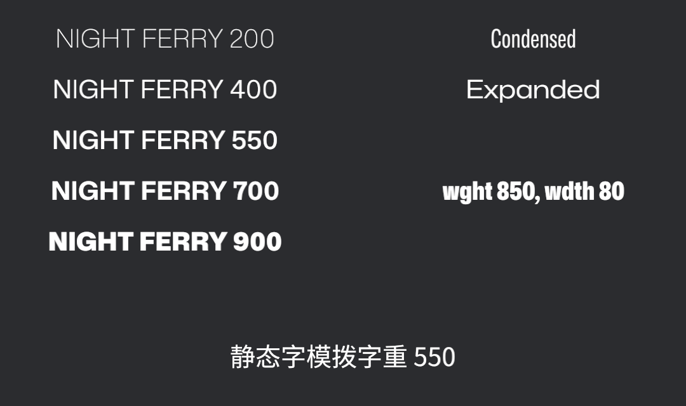

# 可变字体：一副字模，千般字重

片头字幕定稿了：`THE NIGHT FERRY`，老雷要“主标题黑得像碑刻，副标题细得像签名”。按 16.3 节的路子，这得让美术导出一族文件——Thin、Light、Regular、Medium、Bold、Black……每种粗细一副面。Book Sans SC 家族只备了两副面，就已经是两个近 2 MB 的文件。

**可变字体**（variable font）是字体行业对这个问题的回答：一份文件里存的不是某一种粗细的轮廓，而是轮廓随参数变形的规则——一根连续的**轴**。本节的教具是 `MonaSans-VariableFont.ttf`（Bevy 官方示例同款，OFL 许可证，约 340 KB），它带两根轴：字重 `wght`（200~900）和字宽 `wdth`（75~125）。一个文件，顶过去十几个：

```rust
{{#include ../../code/ch16-text/examples/listing-16-06.rs:setup}}
```

<span class="caption">Listing 16-6：字重阶梯、字宽两档、直接拨轴，外加一行拨不动的静态字模（examples/listing-16-06.rs）</span>

```console
cargo run -p ch16-text --example listing-16-06
```



<span class="caption">Figure 16-6：左列是同一个字体文件拨出的五档字重——不是五个文件，是一根轴上的五个点</span>

拆开看这份规格单：

- **`weight: FontWeight(550)`**——`FontWeight` 装的是 1 到 1000 的连续值，550 这种“介于 Medium 和 SemiBold 之间”的粗细也真能拨出来。这和 16.3 节的“挑面”是两种机制：挑面是在家族里**选现成的**，拨轴是让同一副面**当场变形**。所以这里用 Handle 钉死也无妨——这副面自己会变；
- **`width: FontWidth(...)`**——字宽轴，`CONDENSED`（0.75）压扁、`EXPANDED`（1.25）撑开，值是相对正常宽度的比例。窄字体在 UI 排长串数字时格外好使；
- **`font_variations`**——绕开字段、直接报 OpenType 轴名调参的后门：`FontVariationTag::WEIGHT` 就是 `wght` 轴，`WIDTH` 就是 `wdth`。事实上 `weight`／`width` 字段就是这两根轴的省写。两头同时给时，**`font_variations` 说了算**——实测 `weight: FontWeight(200)` 配 `wght 900` 的 variations，上台的是 900。有些字体还带自定义轴（圆角、光学尺寸、填充度……），那就只有 variations 报得动了；
- **最后一行是对照组**：静态的 Book Sans SC 拨字重 550——纹丝不动。没有轴的字体，`weight` 无处使力；它既不会变形，引擎也不会伪造一个粗体出来。斜体同理：`style: FontStyle::Italic` 挑的是家族里现成的斜体面，Mona Sans 这份文件没带斜面也没有斜轴，拨了照样直立——**引擎不无中生有**，这条原则贯穿整个字体系统。

中文的可变字体同样存在——思源黑体就有官方可变版，一根 `wght` 轴从 ExtraLight 铺到 Heavy——只是文件更大，子集化工序也得跟上；道理与拉丁字体完全相通。

一句提醒按下不表：字重轴这么顺手，能不能拿它做动画，让标题“呼吸”起来？能，但每一档轴值都有一笔隐藏开销——这笔账和字号的账是同一本，翻过这页就算。
