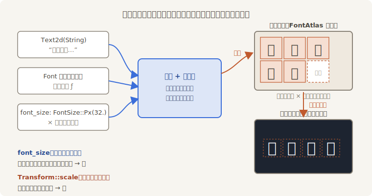
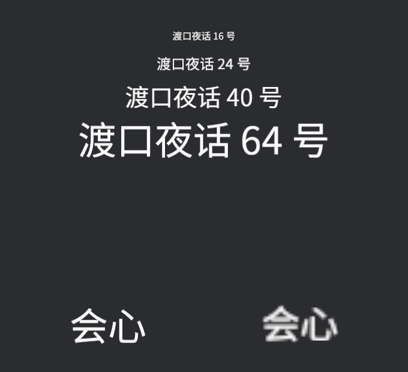
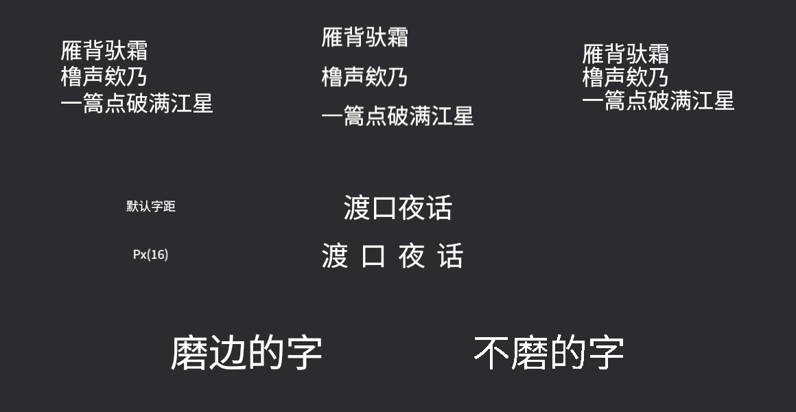

# 字号的真相：字模与光栅化

把字“弄大一点”，手边有两个旋钮：`TextFont` 的 `font_size`，和第 12 章就认识的 `Transform::scale`。直觉上它们该是一回事——都让字变大。实际差得远，差距的根源在文字的渲染方式上。

字体文件里存的是**矢量轮廓**（数学曲线），GPU 不直接画曲线。每次排版，文本引擎把用到的字符按指定字号**光栅化**（rasterize，把轮廓画成像素图），存进一张专门的纹理图集——**字形图集**（font atlas），结构和第 15 章的精灵图集同源：一张大图，每个字形占一格。屏幕上的每个字，就是从图集里取出对应格子贴上去的小四边形。



<span class="caption">Figure 16-7：从字符串到画面——字模提供轮廓，font_size 决定光栅化的精度，图集缓存成品字形</span>

看清这条流水线，两个旋钮的分工就明白了：

- **`font_size` 在光栅化之前起作用**——“按 64 号字刻字模”，刻出来的像素就是 64 号字的精度；
- **`Transform::scale` 在光栅化之后起作用**——字已经刻成 16 号的像素图了，缩放只是把这张小图拉大，和把小照片放大成海报一样，糊。

```rust
{{#include ../../code/ch16-text/examples/listing-16-07.rs:setup}}
```

<span class="caption">Listing 16-7：字号阶梯，外加一组“64 号字模 vs 16 号字模放大四倍”的对照（examples/listing-16-07.rs）</span>

```console
cargo run -p ch16-text --example listing-16-07
```

```text
小棠：左边是 64 号字模，右边是 16 号字模放大四倍——凑近看。
```



<span class="caption">Figure 16-8：同样的视觉大小——左边 `FontSize::Px(64.0)` 笔画锐利，右边 16 号放大四倍边缘发糊</span>

所以正字法只有一条：**要多大的字，就用多大的 `font_size`**。`scale` 留给确实想要“拉伸一张字的图”的场合——比如飘字出场瞬间的弹跳挤压。官方 `text2d` 示例的注释也是这句话：缩放 Text2d 缩放的是渲染出的四边形，会带来像素化。

> **HiDPI 不用你操心**：光栅化字号其实是 `font_size × 窗口缩放系数`（再取整到整像素）。125% 缩放的屏幕上，64 号字实际按 80 号刻——这正是源码注释里写明的行为，也是高分屏下文字不糊的原因。但它**不**乘 `Transform` 的缩放与相机投影——镜头推近字会糊，道理同上。

这套缓存有一个性能账：**每一种“字体 × 光栅化字号”的组合都要新开一张字形图集**——可变字体还要再乘上轴组合，wght 550 和 wght 700 各占各的图集。十行字用同一个字号，图集只有一张；要是给伤害飘字按伤害值线性插值出 30.0、30.7、31.4……每个数字一个字号，图集就一张张地堆——源码注释专门警告过这会有可观的性能开销。字号要用**档位**（小／中／大／会心），别用连续值。上一节按下不表的问题也在此结案：拿字重轴做“呼吸”动画，等于每帧新开一张图集，同罪。

## 行高、字距与磨边

`TextFont` 之外，还有几个独立组件管文字的“质感”。**`LineHeight`**（行高）管多行文本一行占多高，默认 `RelativeToFont(1.2)`——1.2 倍字号，也可以 `Px(...)` 写死像素。**`LetterSpacing`**（字距）管字与字之间加多少空隙，默认 `Px(0.0)`——匾额、标题把字距拉开，气派立现。两个都是挂在文本实体上的组件，不进 `TextFont`：

```rust
{{#include ../../code/ch16-text/examples/listing-16-08.rs:setup}}
```

<span class="caption">Listing 16-8：三种行高排同一首词、一块匾额拉开字距，外加磨边对照组（examples/listing-16-08.rs）</span>

```console
cargo run -p ch16-text --example listing-16-08
```



<span class="caption">Figure 16-9：行高是排版的呼吸感，字距是匾额的气派；右下 `FontSmoothing::None` 的字形边缘是生硬的像素阶梯</span>

`LetterSpacing` 还有个 `Rem` 变体——不按像素、按全局基准尺的倍数给字距，那把“基准尺”是下一节的主角。要留意的是：**`Rem` 乘的是基准尺，不是这段文字自己的字号**——40 号大字配 `LetterSpacing::Rem(1.0)`，字距是基准尺的 20 像素，不是 40。

**`FontSmoothing`**（磨边——抗锯齿）是 `TextFont` 的字段，默认 `AntiAliased` 灰度抗锯齿，矢量字体小字号也平滑。`None` 关掉抗锯齿，字形边缘出现硬像素阶梯——配像素风游戏用。源码注释提醒：想要彻底的像素观感，要配合专门设计的像素字体（点阵风格的 ttf），普通矢量字体关掉磨边后小字号会显得破碎；本书的 Noto 子集就属于后者，Figure 16-9 里看得出毛边。

字号的真相讲完了一半——`FontSize::Px` 之外，这个枚举里还躺着几个会**自己变**的单位。
