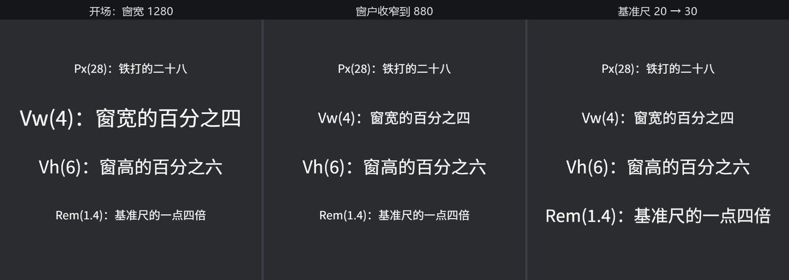

# 会自己变的字号

《渡口夜话》在老雷的笔记本上排练，字幕 28 号正合适；搬到戏院门口那块竖屏大告示牌上，同一行字小得像蚊子腿。字号写死成像素，就得跟着每种屏幕改一遍。`FontSize` 为此备了不止一种单位：

- **`Px(f32)`**——逻辑像素，写多少是多少，前两节用的都是它；
- **`Vw(f32)`／`Vh(f32)`**——窗口宽度／高度的百分比：`Vw(4.0)` 表示“窗宽的 4%”，窗口多宽字多大；
- **`VMin(f32)`／`VMax(f32)`**——窗口窄边／宽边的百分比，横竖屏两头都不吃亏；
- **`Rem(f32)`**——全局基准尺的倍数。基准尺是资源 **`RemSize`**（默认 20.0）：`Rem(1.4)` 就是基准尺的 1.4 倍。

对世界内的文本，百分比单位量的是**主窗口的逻辑尺寸**。空口无凭，让检场的当场演示——三秒收窄窗户，六秒拨大基准尺：

```rust
{{#include ../../code/ch16-text/examples/listing-16-09.rs:setup}}
```

<span class="caption">Listing 16-9（节选一）：四行字四种单位——一行铁打的 Px，三行会自己变的（examples/listing-16-09.rs）</span>

```rust
{{#include ../../code/ch16-text/examples/listing-16-09.rs:stage_hands}}
```

<span class="caption">Listing 16-9（节选二）：检场系统——改窗口分辨率、改 `RemSize`，都是普通的资源与组件操作（examples/listing-16-09.rs）</span>

```console
cargo run -p ch16-text --example listing-16-09
```

```text
检场：窗户收窄到 880——看 Vw 那行。
检场：基准尺 20 拨到 30——看 Rem 那行。
```



<span class="caption">Figure 16-10：同四行字的三个时刻——窗宽变，只有 Vw 跟着变；基准尺变，只有 Rem 跟着变</span>

两个瞬间各讲一件事：

- **窗户收窄到 880**：`Vw(4.0)` 那行从 51 号缩到 35 号，`Px(28)` 纹丝不动。注意这不是把字压扁——是按新字号**重新光栅化**（16.6 节的流水线整个重走一遍），所以字再小也锐利。手动拖窗边框同样触发，一帧不落；
- **基准尺 20 拨到 30**：全场只有 `Rem(1.4)` 那行应声变大。`RemSize` 是个普普通通的资源，`ResMut` 一改，所有用 `Rem` 的文字齐步跟上——设置菜单里的“大字模式”，就是这一个资源加一套 `Rem` 字号的事。上一节 `LetterSpacing::Rem` 用的也是这把尺，字距能一起放大。

这些单位在 UI 文本（第 28 章）里同样通行——事实上响应式排版在界面里才是主战场，世界内文本更多时候还是 `Px` 配档位。最后记一笔 16.6 节的账：`Vw` 字号在拖窗时每过一个整数像素就是一档新字号、一张新图集——短暂拖动无伤大雅，但别再给它叠上连续字号动画。

字号至此全部交代。下一节解决字幕框积压已久的需求：词太长，怎么换行？
