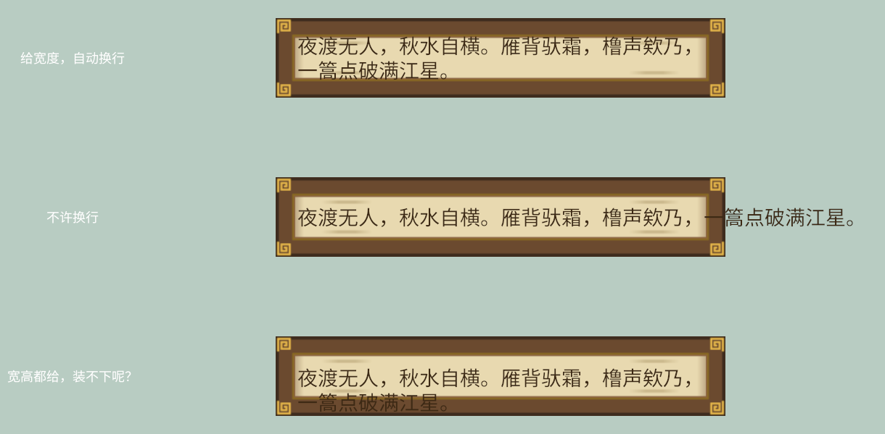

# 把词排进框：换行、出框与溢出

秋白的词一句比一句长，字幕框只有那么宽。文字的“地界”由 **`TextBounds`** 组件划定——`Text2d` 的 required component，默认 `UNBOUNDED` 无界：一行字想多长就多长，遇到 `\n` 才折行。给了界，排版引擎就开始打理换行；换行的规矩则归 `TextLayout` 的 `linebreak` 字段——**`LineBreak`** 枚举管。三只一模一样的字幕框，三种规矩：

```rust
{{#include ../../code/ch16-text/examples/listing-16-10.rs:setup}}
```

<span class="caption">Listing 16-10：同一句词、三种地界——自动换行、不许换行、装不下会怎样（examples/listing-16-10.rs）</span>

```console
cargo run -p ch16-text --example listing-16-10
```



<span class="caption">Figure 16-11：`TextBounds` 三态——`new_horizontal` 只管宽、`NoWrap` 出框、宽高都给时装不下的行淌出下缘</span>

逐框看：

- **框一：`TextBounds::new_horizontal(560.0)`**，只给宽度。词到 560 逻辑像素就折行，高度随行数自己长。这是字幕、对话框最常用的形态。注意中文的换行毫不费力——`LineBreak::WordBoundary`（默认值）按 Unicode 断行规则走，而汉字之间天然处处可断，所以中文文本用默认值就对了（16.1 节那两行分词器抱怨与此无关——断行不用分词）。`WordBoundary` 真正的用武之地是英文：它不拆单词。如果文本里混着超长英文单词或 URL，一个“单词”比框还宽时整行憋住不折，那才轮到 `AnyCharacter`（哪个字符越界就从哪断，不惜拆词）或 `WordOrCharacter`（先按词，词太长再按字符）出场。
- **框二：`LineBreak::NoWrap`**，不许软换行（`\n` 硬换行仍有效）。词成了一条长龙——而且注意它**从框内左端起笔、溢出全堆在右边**，不是两头均匀出界。这不是巧合：文字块的 `Anchor` 对齐的是 `TextBounds` 那个“框”（给了宽度时），`Justify::Left` 让每行从框的左边起笔，装不下的部分自然全甩到右侧。出框的词照画不误——画到了字幕框图片的外面，落在浅青灰清屏色上，所以这次能清楚看到它从框右侧伸出去。
- **框三：`TextBounds::new(560.0, 30.0)`**，宽高都给。30 像素只够一行（28 号字 × 1.2 行高 ≈ 34），折行后的第二行装不下——但它**没有消失，也没被裁掉**：整行原样画了出去，压着字幕框的下边框淌到框外。宽度这一维实打实地管着折行，高度这一维却拦不住画笔。要记牢的正是这件事：**`TextBounds` 划的是排版的地界，不是裁切的剪刀**——源码文档说得很直白，别拿它当严格的裁切框；真要把文字硬关进一个矩形（出界就剪），等第 28 章 UI 的 overflow。

> **词是框的子实体**：Listing 16-10 里 `Text2d` 挂在字幕框 Sprite 的 `children!` 里——框挪词跟着挪（第 9 章的层级），`Transform::from_translation(Vec3::Z)` 让词画在框上面一层（第 13 章的 z 排序）。2D 的“对话框”就是这么一对父子。

## Justify 与 Anchor 的分工

`TextLayout` 的另一个字段 `justify` 管**对齐**。它和 `Anchor` 的关系容易缠成一团，拆开看其实泾渭分明：

- **`Justify` 管块内**：多行文字之间，行与行怎么对齐——左齐、居中、右齐、两端撑满（`Justified`），另有 `Start`／`End` 两个跟着书写方向走的变体（拉丁文里 `Start` 即左齐，阿拉伯文这类从右往左的文字里则是右齐）。它**不挪整块字的位置**。
- **`Anchor` 管块外**：整块字作为一个矩形，钉在 `Transform` 坐标的哪个点上——和第 15 章 Sprite 的锚点一字不差。

```rust
{{#include ../../code/ch16-text/examples/listing-16-11.rs:setup}}
```

<span class="caption">Listing 16-11：上排同一块两行字换三种 Justify，下排同一行字换三种 Anchor，金色图钉标出 Transform 的位置（examples/listing-16-11.rs）</span>


<span class="caption">Figure 16-12：Justify 挪的是行与行的相对位置（金钉不动），Anchor 挪的是整块字相对金钉的位置</span>

一个常见的“为什么不生效”：给单行文字设 `Justify::Center` 毫无反应。道理在源码文档里写明了——`Justify` 对齐的参照物是文本块自己的宽度，单行文字块宽就是行宽，没有可对齐的余地；除非配上带明确宽度的 `TextBounds`，行才有“框”可以参照。单行文字想居中，用的是 `Anchor`（默认 `CENTER` 已经是居中）。

框、行、块都安排明白了。但字幕真正的灵魂是**会变**——下一节让词一个字一个字地长出来。
