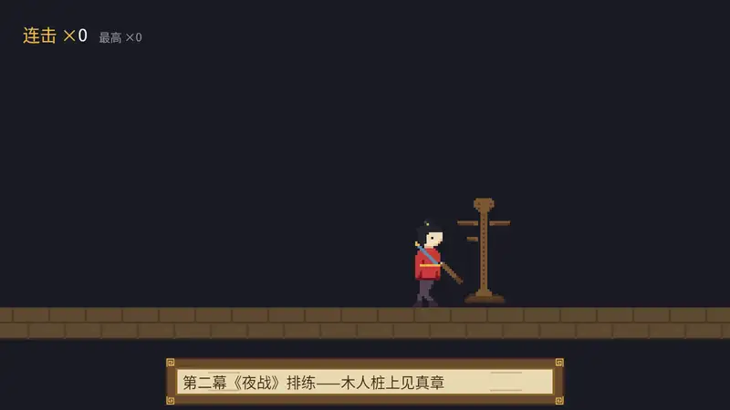

# 夜战：伤害飘字

第二幕《夜战》里阿燕有一场单挑水匪的武戏。老雷的要求朴素：“看客得看清每一招的分量。”——也就是游戏里人见人爱的**伤害飘字**：一击命中，数字从落点蹦出来，往上飘，淡出，消失；会心一击换大字、换金色、带个“会心！”的小签。

这是本章的总装战，零件却大半是旧的：挨打的事件走第 8 章的 `Event` + Observer，节拍走第 15 章的状态机套路，飘字本身是 `Text2d` + `TextFont` + `TextColor` + `Text2dShadow`，连击牌是 `TextSpan` + `Text2dWriter`，淡出是 `Alpha` trait（第 15 章调色间）。完整代码：

```rust
{{#include ../../code/ch16-text/src/main.rs}}
```

<span class="caption">Listing 16-11：完整示例——《夜战》练功房（src/main.rs）</span>

```console
cargo run -p ch16-text
```

```text
老雷：《夜战》排练。小棠的木人桩，秋白的飘字——都上。
场记：连击牌挂好，看招吧。
场记：会心！双倍，记上。
阿燕：喘口气，连击重头数。
```



<span class="caption">Figure 16-12：《夜战》练功房——飘字上浮淡出，会心换装，连击牌实时改数</span>

几处接线值得回头看：

- **打与飘是解耦的**。`drill` 节拍机只负责“劈中了，伤害 17，会心”这件事实，`commands.trigger(StrikeLanded { .. })` 一喊就收工；飘字怎么铸、连击牌怎么改，全在 Observer `on_strike` 里。明天想加打击音效、屏幕震动，再挂两个 Observer 就是——第 8 章承诺过的扩展方式，这里兑现。
- **飘字是“铸完就不管”的实体**。出生时配齐 `Text2d` 全家与 `FloatingText`（飞行参数 + 寿命 Timer），此后归 `float_and_fade` 统一调度：上飘、淡出、到点 `despawn`。会心飘字的“会心！”小签是个 `TextSpan` 子实体——销毁根时子实体随之级联销毁（第 9 章），不用单独收尸。
- **淡出要淡两样东西**。字色经 `Text2dWriter::for_each_color` 整块扫一遍——根的数字和小签一起变透明；但 `Text2dShadow` 的影子色是独立组件，不在 writer 的管辖里，得单独拿 `&mut Text2dShadow` 调。第一版漏了影子，飘字后半生成了一团上浮的黑影——比缺字形还瘆人。
- **连击牌的两个 span 按序号直改**：`writer.text(*board, 1)` 是数字、`(*board, 2)` 是最高纪录——0 号是根“连击 ×”，后面按树序排队。比起爬 `Children` 再逐个 `get_mut`，writer 省去了全部中间环节。
- **会心字号是档位不是滑杆**：普通 30、会心 46，全场只有这两档（加上字幕 26、连击牌 30/20），字形图集数量恒定——16.3 节的性能账，这里是实践。

试两把：把 `on_strike` 里会心分支的 `font_size: 46.0` 连同 `TextColor` 一起删掉，会心瞬间泯然众“字”——飘字的打击感几乎全部来自字号与颜色的反差，动画反而是配角。再把 `float_and_fade` 里的 `shadow.color.set_alpha(...)` 注释掉，亲眼看一回“黑影飘”的事故现场。

## 小结

- **`Text2d` 把字当 2D 道具**：一个装着 `String` 的组件，required components 自动补齐 `TextFont`／`TextColor`／`TextLayout`／`TextBounds`／`Anchor`／`Transform` 全家；和 Sprite 同一套世界观，能摆能转能钉锚点
- **默认字模只有 95 个 ASCII 字形**，缺字形渲染成豆腐块（`.notdef`），**全程零报错零警告**；Bevy 不读系统字体——中文必须自带字体资产，`load` 进来挂上 `TextFont::font`。字体只认 `.ttf`／`.otf`（`.ttc` 不行）；发布游戏用 OFL 等开源字体并按惯例子集化，子集漏字会静默空格
- **`font_size` 是光栅化精度，`Transform::scale` 是放大照片**——前者锐后者糊；每种“字体 × 字号”组合各占一张字形图集，字号用档位别用连续值；行高 `LineHeight` 默认 1.2 倍字号；`FontSmoothing::None` 出像素阶梯
- **排版三件套**：`TextBounds` 划地界（默认无界；只裁完全出界的字形，别当严格裁切框用）、`LineBreak` 定换行规矩（中文用默认 `WordBoundary` 即可，长英文词才需要 `AnyCharacter` 系）、`Justify` 管行间对齐（单行无界时不生效）；`Anchor` 钉整块，给了宽度时对齐的是 bounds 的框
- **改组件就是改字幕**：`Text2d` 可 `DerefMut` 成 `String`，变更检测自动触发重排——但每改一次重排一块，大段高频文本三思
- **富文本是一棵树**：根 `Text2d` + 子 `TextSpan`，排版按块、妆容按段；**每个 span 自己配 `TextFont`**（不继承，忘配中文段单独变豆腐）；装饰有 `Underline`／`Strikethrough`（±配色组件）、`TextBackgroundColor`、整块的 `Text2dShadow`；按序号读写用 `Text2dReader`／`Text2dWriter`
- **场景字 `Text2d`，界面字 `Text`**：同一台排版引擎、同一套样式组件，定位一个靠 `Transform`+`Anchor`、一个靠 `Node`（第 28 章）

## 练习

1. **找豆腐**：把提词器（Listing 16-8）的台词末尾加上“——玥儿记”。“玥”字不在 GB2312 里，跑起来看看缺字形长什么样；然后重跑 `py -3.11 scripts/make_ch16_assets.py`——脚本会扫描本章源码的用字，自动把“玥”收进子集。体会一遍“子集漏字—发现—补字”的完整工序。
2. **省料的飘字**：把 `main.rs` 会心飘字改成 `font_size: 30.0` 配 `Transform::from_translation(spot).with_scale(Vec3::splat(1.5))`。画质糊了多少？再想想这么改省下了什么（提示：30 号字形图集本来就有），什么场合值得用画质换图集。
3. **给 Justify 一个框**：16.4 节说单行字的 `Justify` 不生效。给 Listing 16-7 上排的每块文本加一个 `TextBounds::new_horizontal(220.0)`，再把三种 `Justify` 各跑一遍——行有了参照的框，单行也开始听话。对照 Figure 16-8 找不同。
4. **木桩的委屈**：给木人桩头顶挂一个九宫格小气泡（`scroll-panel.png` 裁小一点），里面一行 `Text2d` 写“今日挨打：0 下”，在 `on_strike` 里用 `Text2dWriter` 每击加一——综合字幕框、富文本与 writer 三节的手艺。
5. **会转的影子**：`Text2dShadow` 的 `offset` 暗示光从哪边来。写一个系统让字幕框那行字的影子 offset 绕着字转圈（`Vec2::from_angle(t).rotate(Vec2::new(4.0, 0.0))` 一类），看“光源”绕场一周的效果——顺带记住影子是独立组件，不归 writer 管。

下一章，玩家终于要摸到手柄了——键盘、鼠标、触摸、Gamepad，输入这件事在 Bevy 里同样是几个资源和事件的组合拳。阿燕的剑，该交到你手上了。
