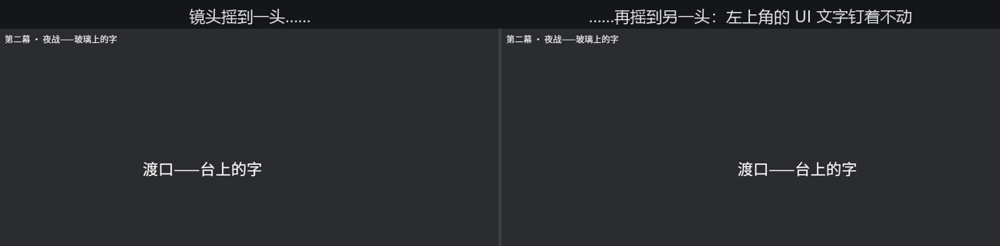

# 台上的字与玻璃上的字

本章到现在，所有的字都是**台上的道具**：`Text2d` 活在世界坐标里，有 `Transform`、有锚点，镜头一推一摇，字和布景一起移动。伤害飘字、角色头顶的名字、立在场景里的路牌——都该是这种字。

但还有一类字不属于舞台：血条边的数值、左上角的任务提示、暂停菜单。它们像写在**镜头前的玻璃**上——无论镜头怎么动，字钉在屏幕的老位置。这类字归 UI 系统管，组件叫 **`Text`**（bevy_ui 的 UI 文本）。两边摆在一起：

```rust
{{#include ../../code/ch16-text/examples/listing-16-14.rs:setup}}
```

<span class="caption">Listing 16-14：同一副字模、同一套 TextFont——一行在台上，一行在玻璃上（examples/listing-16-14.rs）</span>

```console
cargo run -p ch16-text --example listing-16-14
```

跑起来镜头会缓缓左右摇。台上的字跟着画面漂，玻璃上的字纹丝不动：



<span class="caption">Figure 16-15：镜头摇到两个位置的同一场景——台上的字随景走，玻璃上的字钉死在屏幕左上角</span>

读 Listing 16-14 最该注意的是**没换的东西**：`TextFont`、`TextColor`、`TextLayout`、`LineHeight`、`LetterSpacing`、spans 那一套（UI 文本同样用 `TextSpan` 做富文本）——样式组件原封不动，两边通用。bevy_text 是同一台排版引擎，`Text2d` 和 `Text` 只是它的两个出口。换的只有**定位方式**：

| | 台上：`Text2d` | 玻璃上：`Text` |
|---|---|---|
| 住在哪 | 世界坐标 | 屏幕（UI 布局） |
| 定位靠 | `Transform` + `Anchor` | `Node`（Flexbox/Grid 布局） |
| 跟镜头动吗 | 跟 | 不跟 |
| 地界 | `TextBounds` 手动给 | 布局系统自动算 |
| 阴影 | `Text2dShadow` | `TextShadow` |

`Node` 是 UI 布局的核心组件——这里只用了它最朴素的本事（绝对定位钉在左上角），整套 Flexbox/Grid 布局体系是第 28 章的正题。眼下记住选择题的答案就够：**字属于场景就 `Text2d`，字属于界面就 `Text`**。拿不准时问一句“镜头拉远，这行字该不该跟着变小？”——该，台上；不该，玻璃上。

> 严格说还有第三类：把字渲染进纹理再贴到 3D 物体上（告示牌、屏幕里的屏幕），那是渲染目标的玩法，第 26 章后有能力自己拼。

戏排到这儿，零件全齐。最后一幕，让它们在《夜战》里同台。
