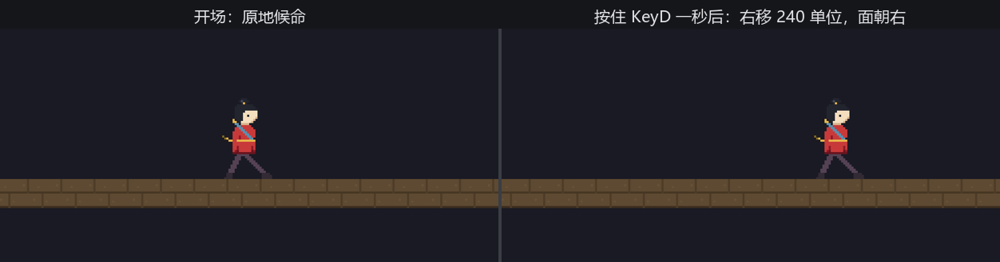

# 键盘上手

体验场开张第一桩：把阿燕的脚接到键盘上。规矩定得朴素——A 往西、D 往东，按住就走、松手就停。

到目前为止我们的系统从 `Time`、从组件、从资产里取数据，没有一样来自玩家的手。输入在 Bevy 里同样不搞特殊：键盘的当前状态就是一个**资源**。**`ButtonInput<KeyCode>`**（按键快照——记录一组“可按之物”此刻的按下/松开状态的泛型资源）由 `DefaultPlugins` 里的 `InputPlugin` 自动注册，键盘版的泛型参数是 **`KeyCode`**（键码——标识键盘上一个具体的键）。问它要状态，跟第 5 章读任何资源一个写法：

```rust
{{#include ../../code/ch17-input/examples/listing-17-01.rs:walk}}
```

<span class="caption">Listing 17-1：每帧问键盘——`pressed` 在按住期间持续为真（examples/listing-17-01.rs）</span>

```console
cargo run -p ch17-input --example listing-17-01
```

```text
老雷：体验场开张。键盘看客先请——A、D 走人，箭头键也认。
阿燕：来了？我脚下听你的。
```



<span class="caption">Figure 17-1：按住 D 一秒——每帧 240 × delta 个单位，松手即停</span>

几个零件挨个看：

- **`pressed` 是“此刻按着吗”**。按住期间每帧都答真，所以走路这种持续动作用它——每帧都加一段位移。`any_pressed` 收一组键，一组里有任何一个按着就算数：A 与左箭头在这儿完全等价，左撇子看客不用迁就；
- **位移乘 `time.delta_secs()`**。这是从第 2 章用到现在的老规矩：速度按“单位每秒”定义，乘上本帧时长，高刷屏和老笔记本上走得一样快。第 18 章拆时间时再正面讲它；
- **两头按住会怎样**？A 和 D 一起按，`direction` 一减一加归零，阿燕站桩——这不是引擎的裁决，是我们自己的加法。两个键的状态各自独立地躺在快照里，怎么合成一个方向是游戏逻辑的事；
- **`flip_x` 翻面**是第 15 章的手艺：画稿朝右，往西走就照镜子。

`Single` 取阿燕、`Local` 记“打过招呼没有”，都是第 4 章的旧识。真正的新面孔只有那个资源——以及它的泛型参数里藏着的一个坑。

## 旧帖里的键名

假设你想给阿燕加一记出剑，随手搜了一篇 Bevy 教程，里面写着 `KeyCode::A`。照抄：

```rust
{{#include ../../code/ch17-input/no-compile/listing-17-02.rs:old_name}}
```

<span class="caption">Listing 17-2：行不通——照旧教程写的键名（no-compile/listing-17-02.rs）</span>

```text
error[E0599]: no variant or associated item named `A` found for enum `bevy::prelude::KeyCode` in the current scope
  --> ch17-input\no-compile\listing-17-02.rs:13:34
   |
13 |     if keyboard.pressed(KeyCode::A) {
   |                                  ^ variant or associated item not found in `bevy::prelude::KeyCode`
```

第 1 章交过底：网上搜到的 Bevy 代码多半对应旧版本。`KeyCode::A` 正是化石——0.12 之前确实这么写，后来整个枚举照着 W3C 的键码规范重命名：字母键是 `KeyA`～`KeyZ`，数字排是 `Digit0`～`Digit9`，方向键是 `ArrowLeft` 一家。编译器一拦一个准，顺着报错改成 `KeyCode::KeyA` 就好。

改名不是折腾，是把语义钉死：**`KeyCode` 标识键的物理位置，不管键帽上刻着什么**。`KeyCode::KeyW` 的意思是“QWERTY 键盘上刻 W 的那个位置”——在法国的 AZERTY 键盘上，同一位置刻的是 Z，按下去报的仍是 `KeyCode::KeyW`。这正是游戏要的：WASD 操控认的是左手自然搭上去的那四个位置，换什么布局的键盘都不用改键。

反过来，如果你关心的是键帽上刻的字——比如“按 ? 打开帮助”——那要问**逻辑键**：快照资源 `ButtonInput<Key>` 与 `KeyCode` 版并存，`Key` 按当前键盘布局解释按键。两份快照同一套问法，按需取用；游戏操控用 `KeyCode`，这是默认选择。

走路有了。但“出剑”和“走路”对按键的要求不一样——按住 D 该一直走，按住空格总不能一直出剑。下一节把“按”这个字拆成三问。
