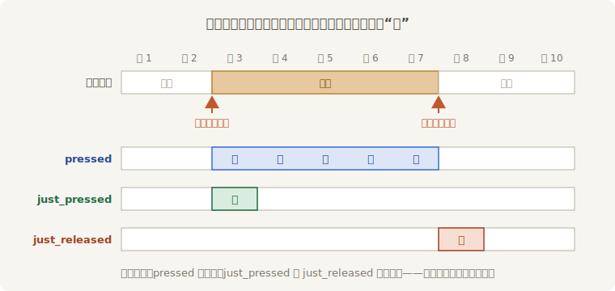
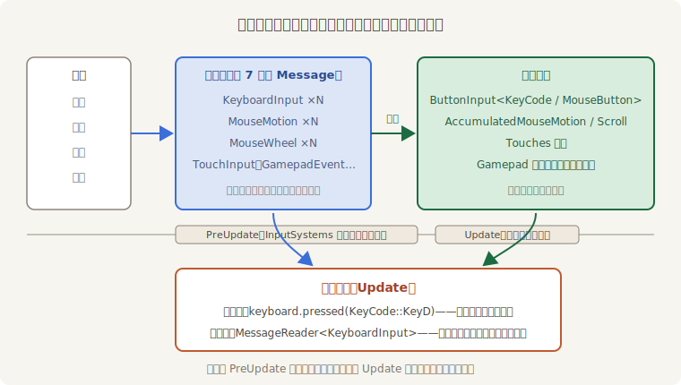

# 一下、按住与松手

老雷给试招台排了三个动作：空格**出剑**，左 Shift 按住**运劲**，松手**收势**。三个动作对“按”的理解各不相同——出剑认“按下的那一下”，运劲认“按住的每一刻”，收势认“松开的那一瞬”。`ButtonInput` 正好备了三种问法：

```rust
{{#include ../../code/ch17-input/examples/listing-17-03.rs:moves}}
```

<span class="caption">Listing 17-3（其一）：三问三招——`just_pressed`、`pressed`、`just_released`（examples/listing-17-03.rs）</span>

`just_pressed` 只在按下的**那一帧**为真，`just_released` 只在松开的那一帧为真，`pressed` 则从按下到松开全程为真。一次完整的按键在快照里的一生，画在时间线上是这样：



<span class="caption">Figure 17-2：一次按键的一生——三种问法各在哪几帧答“真”</span>

跑起来试：

```console
cargo run -p ch17-input --example listing-17-03
```

点按空格三下、按住左 Shift 一秒再松手，台账如下（场记的“速记”行先按下不表，马上解释）：

```text
阿燕：青霜剑——拨云！（第 1 剑）
阿燕：青霜剑——断浪！（第 2 剑）
阿燕：青霜剑——归鞘！（第 3 剑）
场记：收势。这口劲运了 1.0 秒。
```

每点一下出一剑，运劲期间阿燕的戏服随 `charge` 渐渐染金（`Mix` 是第 15 章调色间的手艺），松手一笔结清。都符合直觉。

现在做个实验：**按住空格两秒不放**。文本编辑器里这么干会打出一串空格——操作系统的自动重复在替你连按。阿燕呢？

只出**一剑**。

## 流水账与快照

“一剑”是 `ButtonInput` 替我们挡掉了什么的结果。想看清挡掉了什么，得绕到快照背后，看输入的原始形态。键盘事件进入 Bevy 时首先是**消息**——第 7 章的 `Message`，类型叫 `KeyboardInput`，按下、松开、自动重复，每个事件一条。给场记开一本流水账，逐条速记：

```rust
{{#include ../../code/ch17-input/examples/listing-17-03.rs:transcript}}
```

<span class="caption">Listing 17-3（其二）：流水账——逐条读 `KeyboardInput` 消息</span>

两个系统同台跑。这回按住空格不放，再看输出：

```text
阿燕：青霜剑——拨云！（第 1 剑）
场记速记：Space 按下，逻辑键 Space，落字 " "
场记速记：Space 按下（系统重复），逻辑键 Space，落字 " "
场记速记：Space 按下（系统重复），逻辑键 Space，落字 " "
场记速记：Space 松开，逻辑键 Space
```

真相摆在台面上：操作系统确实在连发“按下”事件（`repeat: true` 的那些行），**流水账一条不落地记了**；而出剑只触发一次——快照在折叠流水时把重复滤掉了，已经在“按住”集合里的键再收到按下事件不会再进 `just_pressed`。自动重复是给文本编辑准备的服务，对游戏是噪声，`ButtonInput` 替你消了音。

一条 `KeyboardInput` 消息里有这几样：`key_code`（物理键）、`logical_key`（逻辑键）、`state`（按下/松开）、`repeat`（是不是系统重复）、`text`（这一按产出的文本，空格键落字 `" "`）、`window`（哪个窗口收的）。做聊天框、起名输入框时就读这条流水里的 `text`——不过中文输入法的组字另有一条 `Ime` 消息通道，那是第 35 章窗口细节的事。

流水与快照的全景是这样接起来的：



<span class="caption">Figure 17-3：同一份输入的两种读法——绝大多数玩法问快照，要逐条细节才读流水</span>

第 6 章那张调度表说过“键盘输入由 `bevy_input` 的系统在 `PreUpdate` 写进资源”，现在这句话有了完整的画面：`InputPlugin` 在 `PreUpdate` 跑一组折叠系统（系统集 `InputSystems`），把本帧攒下的消息汇成各路快照。于是有一条很值钱的保证：**快照每帧只刷新一次，同一帧里所有 `Update` 系统看到的输入完全一致**——不存在“前一个系统看到按着、后一个系统看到松开”的撕裂。

> **失焦不卡键。** 按住 D 走着，Alt+Tab 切去回微信，再切回来——阿燕没有原地狂奔。窗口失焦时 winit 发一条 `KeyboardFocusLost` 消息，折叠系统收到后把所有按着的键统一登记成“松开”（它们会触发一次 `just_released`）。这类脏活引擎都包了。
>
> 顺带埋一句：快照的 `just_pressed` 以**帧**为粒度，而 `FixedUpdate` 调度和帧不是一对一的——在那里面读 `just_pressed` 会丢拍或重拍。这个坑连同它的解法，留给第 18 章。

三问在手，键盘这台设备算是吃透了。下一台换鼠标——它的难点不在“按没按”，在“指着哪”。
