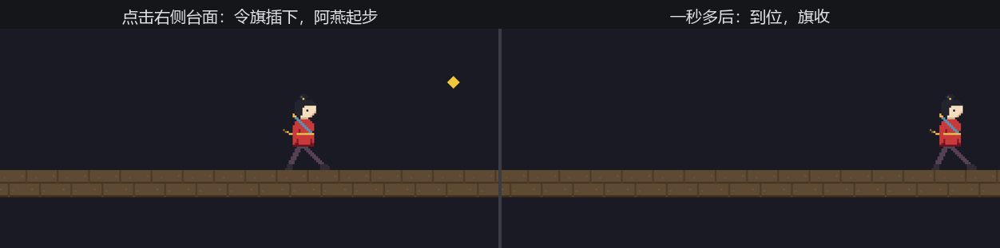

# 指哪打哪：鼠标按键与光标

鼠标看客上桌，老雷的要求升了级：“点哪儿，阿燕去哪儿。”这比键盘多出一个维度——键盘问“按没按”，鼠标还得问“**指着哪**”。两件事分开解决。

按没按是老熟人：快照资源 `ButtonInput<MouseButton>`，三问与键盘一字不差。**`MouseButton`**（鼠标按键枚举）一共六种：`Left`、`Right`、`Middle`、侧键 `Back`／`Forward`，再加兜底的 `Other(u16)`——电竞鼠标侧面那排编号键都从这儿报上来。

指着哪要走三步。光标位置挂在 `Window` 组件上：`window.cursor_position()` 给出**窗口坐标**——原点在左上角、y 朝下、单位是逻辑像素，第 12 章讲过的屏幕坐标系。而阿燕活在世界坐标里——原点居中、y 朝上。两套坐标的换算，第 13 章已经备好了工具：`viewport_to_world_2d`，当时用它反算取景框的四角，现在兑现承诺，反算光标：

```rust
{{#include ../../code/ch17-input/examples/listing-17-04.rs:point}}
```

<span class="caption">Listing 17-4（其一）：左键安旗——窗口坐标反算世界坐标（examples/listing-17-04.rs）</span>

```rust
{{#include ../../code/ch17-input/examples/listing-17-04.rs:dash}}
```

<span class="caption">Listing 17-4（其二）：朝旗跑——到站收旗</span>

```console
cargo run -p ch17-input --example listing-17-04
```

```text
老雷：换鼠标看客。左键把令旗插在台上，阿燕跑过去；右键叫停。
场记：令旗插在 (448, 0)。
阿燕：到位。下一处？
场记：令旗插在 (-512, 0)。
阿燕：叫停就停。
场记：看客的手出了台口，光标没影了。
```



<span class="caption">Figure 17-4：点哪儿走哪儿——窗口坐标到世界坐标的一条龙</span>

值得停一停的有三处：

- **`cursor_position()` 返回 `Option<Vec2>`**。光标滑出窗口，它就是 `None`——上面的输出最后一行就是把鼠标甩出窗外的现场。`let-else` 早退是标准姿势；别 `unwrap`，看客的手什么时候出台口你管不着。窗口还有一条 `CursorMoved` 消息流报告光标移动，带 `position` 与 `delta`，适合“光标划过之处留痕”这类需求；
- **反算要相机和它的 `GlobalTransform` 一起上**。`viewport_to_world_2d` 的几何意义是“把视口上的一个点投回世界”，所以镜头摆哪、推拉到什么档位都会影响结果（第 13 章的账）。它返回 `Result`，相机这帧还没就绪之类的角况会给 `Err`，照例早退；
- **意图与执行分开**。点击系统只负责把目标写进 `DashTarget` 资源、把旗插上；真正挪人的是另一个系统 `dash`。这个拆分眼下像是讲究，到 17.7 节它会长成本章的主角。

把 `(448, 0)` 这行输出和点击位置对一对：1280 宽的窗口，点在约 85% 处——窗口坐标 x ≈ 1088，减去半宽 640，正是世界坐标 448。三步走没有魔法，就是一次坐标平移加 y 翻转。

> **试一把**：把令旗插到台口外——往天上点。旗会忠实地插在半空（它用的是完整的 `point`），阿燕却只跑到旗的正下方就停（dash 只认 `point.x`，还被 `clamp` 拦在台板上）。一次点击，两种用法，看清“反算出的世界点”和“游戏怎么用它”是两层事。

鼠标的“指哪”解决了。但有一类需求恰恰**不该**用光标位置——转镜头、调准星这种“手上的动作”。光标会撞上屏幕边缘，到了边上就再也读不出变化。下一节给导播配一条不受边框限制的摇臂。
