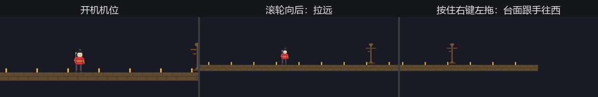

# 导播摇臂：位移、滚轮与抓光标

体验场添新节目：让看客自己当导播——按住右键拖动台面找机位，滚轮推拉远近。先试最顺手的思路：用上一节的 `cursor_position` 每帧做差分，光标挪多少、镜头跟多少。

试了就知道毛病：拖着拖着，光标顶到屏幕边上，差分归零，镜头卡死——**光标是有墙的**。更糟的是，光标坐标经过操作系统加工（指针加速、灵敏度曲线），`CursorMoved` 的文档直说了它不适合拿来转镜头。导播要的不是“光标在哪”，是“**手往哪边挪了多少**”——这叫原始位移，走的是另一条路。

**`MouseMotion`**（鼠标位移消息）逐条报告设备的物理位移，没有墙、不掺加速。逐条读嫌啰嗦的话，引擎已经替你折叠好了：资源 **`AccumulatedMouseMotion`** 是本帧全部位移的总和，每帧清零重攒——正是 Figure 17-3 那套“流水折叠成快照”的鼠标版。滚轮同理：消息 `MouseWheel`，折叠版资源 **`AccumulatedMouseScroll`**。摇臂全套：

```rust
{{#include ../../code/ch17-input/examples/listing-17-05.rs:crane}}
```

<span class="caption">Listing 17-5（其一）：摇臂本体——滚轮推拉、拖动平移（examples/listing-17-05.rs）</span>

两处细节有讲究：

- **滚轮的计量单位不止一种**。`AccumulatedMouseScroll` 带一个 `unit` 字段：真滚轮按**行**报数（滚一格 ±1），触控板双指滑动按**像素**报数（一帧可能 ±60）。不折算就会出现“鼠标用户慢悠悠、触控板用户一甩飞出银河系”。源码里备了换算常数 `SCROLL_UNIT_CONVERSION_FACTOR`（约 100 像素折一行），拿来除一下就齐了。缩放本身还是第 13 章的旋钮——拧投影的 `scale`；
- **一减一加不是笔误**。位移用的是窗口坐标系的方向约定——y 朝下；世界坐标 y 朝上。想要“台面跟着手走”的拖拽手感，x 取反、y 不取反，正好。哪天你拖反了方向，先查这两个符号。

## 抓光标

还剩一个体验问题：拖到兴头上，光标滑出窗口，一松右键点到了别的程序。专业的做法是把光标**抓**起来。光标的去留归窗口实体上的 `CursorOptions` 组件管，两个旋钮：`grab_mode` 与 `visible`。**`CursorGrabMode`** 三档——`None` 放行、`Confined` 圈在窗口内、`Locked` 锁死在原地。摇臂模式用 `Locked` 配隐藏：

```rust
{{#include ../../code/ch17-input/examples/listing-17-05.rs:grab}}
```

<span class="caption">Listing 17-5（其二）：上摇臂锁光标，下摇臂放行</span>

挂载它们的方式也值得一看——本章头一回用上第 6 章的 `run_if` 配输入条件：

```rust
{{#include ../../code/ch17-input/examples/listing-17-05.rs:run_if}}
```

<span class="caption">Listing 17-5（其三）：`input_just_pressed`——快照三问的运行条件版</span>

`bevy::input::common_conditions` 模块住着一组现成条件：`input_pressed`、`input_just_pressed`、`input_just_released`，还有自带记性的开关 `input_toggle_active`。“按 G 干一件事”用一行 `run_if` 写完，系统本体干干净净。

```console
cargo run -p ch17-input --example listing-17-05
```

```text
老雷：摇臂就位。右键拖台面，滚轮推拉；按 G 上摇臂，Esc 下来。
场记：上摇臂。光标锁住藏起，手上的位移直接进镜头。
场记：下摇臂，光标放行。
```



<span class="caption">Figure 17-5：摇臂三连——开机、滚轮拉远、右键拖动</span>

按 G 之后留意一个现象：光标钉在原地不见了，`cursor_position` 从此读到一个不变的值——但镜头照样跟手。这正是本节开头那道分界线的实证：**`MouseMotion` 流的是设备位移，不依赖光标存在**。第一人称射击的视角控制就是这一套——锁住光标、隐藏、读原始位移，三件套一个不少。

> **平台脾气**：抓光标不是处处灵。macOS 不支持 `Confined`，X11 不支持 `Locked`——Bevy 会先按你要的来，不行就退而求其次换另一档（源码 `CursorGrabMode` 文档原话）；Windows 两档都支持。发布跨平台游戏时别把体验押在某一档上。

键鼠两台设备到此齐活。下一位看客抱着手柄进场——它不归窗口管、不走光标，连“在不在场”都是个动态问题。Bevy 给它的安排很有 ECS 风味：手柄，是实体。
