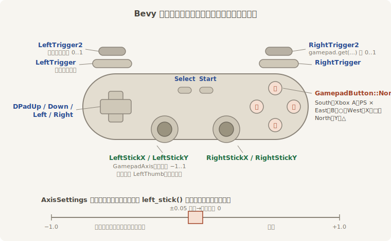

# 手柄进场：Gamepad 是实体

手柄和前两台设备气质不同：键盘鼠标焦点在哪就归哪个窗口，手柄直连整台机器，窗口失没失焦它都照报（`ButtonInput` 的文档特意写明：键盘快照随焦点清空，手柄快照不随）；而且它**有数量**——可能没有，可能仨，可能玩到一半拔了线。一个数量不定、来去自由的东西，放在 Bevy 里该怎么表示？

这正是实体的长项。**每只接入的手柄是一个实体**，身上挂着 `Gamepad` 组件（全部按键与摇杆的状态快照）、`Name`（操作系统报的型号名）和 `GamepadSettings`（滤波参数，一会儿讲）。底层由 `bevy_gilrs` 插件对接硬件（`DefaultPlugins` 自带），插上自动 spawn 组件、拔掉自动摘除——你不用管理任何手柄列表，一个 `Query` 全包：

```rust
{{#include ../../code/ch17-input/examples/listing-17-06.rs:drive}}
```

<span class="caption">Listing 17-6（其一）：查询在场的手柄——零只就空转，三只就都听（examples/listing-17-06.rs）</span>

这套写法把前几章的肌肉记忆全用上了：没有手柄时查询为空，循环一次不跑，**程序不需要任何“有没有手柄”的判断**；来了三只，每只都能使唤阿燕。对比键盘那个全局唯一的资源，ECS 的表达力高下立见。

新东西是**模拟量**。键盘的一个键非按即抬，摇杆却是连续的：`left_stick()` 给一个 `Vec2`，每根轴在 −1.0 到 1.0 之间连续取值——轻推三分劲、推满全速，代码里只是把 `push` 原样乘进速度。这是手柄不可替代的地方，赛车的油门、潜行游戏的踱步全靠它。十字键没有模拟量，`dpad()` 把四个数字键拼成一个只有 −1、0、1 的 `Vec2`，跟摇杆相加便是“两套都听”。按键侧的三问（`pressed`／`just_pressed`／`just_released`）与键盘同款，连两记扳机都是模拟的——`gamepad.get(GamepadButton::RightTrigger2)` 拿 0.0 到 1.0 的扣下深度。

按键与轴的名字按**方位**取，不认厂商字母——Xbox 的 A 在索尼叫 ×，搬方位才不吵架：



<span class="caption">Figure 17-6：Bevy 的手柄词汇表——South 就是 Xbox 的 A、PS 的 ×；下方是 `AxisSettings` 给事件值的出厂滤波</span>

图底下那条刻度是 **死区**（deadzone——摇杆回中时不算数的一小段行程）。用过几年的摇杆松了弹簧，放手归位常停在 0.02 这种位置；不滤掉它，角色就会永远朝一边漂。这件事在 0.18 里分两层（以源码为准，别按旧版本的记忆来）：

- **轮询拿到的是原始读数**。`left_stick()`、`gamepad.get(…)` 只把值夹紧在量程内，**不削死区**——所以 Listing 17-6 自留了一道 `STICK_DEADZONE`，比阈值小就当零。轮询摇杆，这道闸自己设，这是惯例；
- **滤好的成品走事件**。每只手柄实体身上的 `GamepadSettings` 组件存着滤波参数：`AxisSettings` 出厂值是 ±0.05 以内的事件值报 0、死区外的活区线性放大到满程，变化不到 0.01 干脆不发事件——`GamepadAxisChangedEvent` 里的 `value` 是这套加工后的结果。模拟键的“按没按”判定也归它：`ButtonSettings` 默认扣到 0.75 算按下、回到 0.65 算松开，扳机那样的模拟键就这样折算成 `pressed` 的数字答案。

漂移严重的旧手柄，按实体改它的 `GamepadSettings`（或调大你自留的死区）就治住了——每只手柄可以各有各的脾气。

进出场则走消息。`GamepadConnectionEvent` 在连接与断开时各发一条，连接的那条带着型号名：

```rust
{{#include ../../code/ch17-input/examples/listing-17-06.rs:door}}
```

<span class="caption">Listing 17-6（其二）：门房——插上就认，拔线知会</span>

还有一条**反向通道**：手柄是本章唯一会“说话”的设备。写一条 `GamepadRumbleRequest::Add` 消息（指名哪只手柄、多强、多久），gilrs 后端就驱动马达震一阵——Listing 17-6 在出剑时回敬了 0.4 秒的强马达。强弱两颗马达（`strong_motor`／`weak_motor`）可以分开调，重击用强、环境氛围用弱。

```console
cargo run -p ch17-input --example listing-17-06
```

```text
老雷：手柄口开着，插上就认。摇杆走人，南键出剑。
```

这就是本书写作机器上的全部输出——它没插手柄，查询常年为空，门房一声不吭，而程序好好地跑着：这本身就是本节那套“零配置容错”的演示。如果你接上一只，会看到门房报出型号（比如“Xbox Wireless Controller”）、摇杆半推半速地牵动阿燕、南键出剑外加掌心一阵震动；拔线再插，两条通报一条不少。断开时引擎只摘 `Gamepad` 组件、留着实体不销毁——你为它调过的死区设置，重连后原样还在（`gamepad_connection_system` 源码里的注释写得明白）。

四路看客到了三路。最后一位不带任何外设——伸出手指头，直接戳屏幕。
