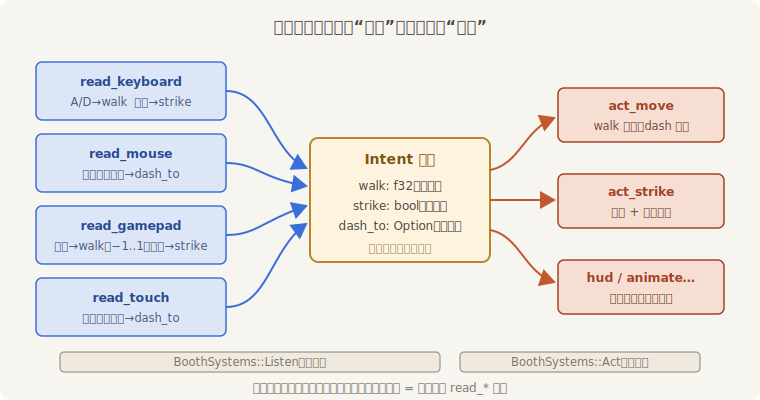
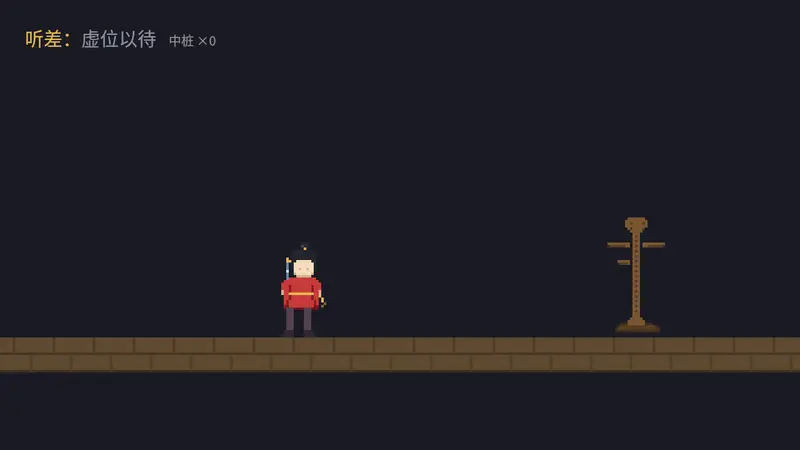

# 三合一：输入映射

开张前夜，老雷验收，四个示例各开各的窗口。他只问了一句：“看客换设备还得换场子？一台戏，全都接。”

把前四节的系统原样堆进一个 App 当然能跑，但堆出来的东西没法养：walk 的逻辑写了三遍（键盘一遍、摇杆一遍、将来再来一遍），“出剑”散落在键盘系统和手柄系统里各管各的；哪天要做键位重绑定、要录像回放、要给阿燕配个 AI 陪练，会发现**玩法代码和设备代码长在了一起**，撕都撕不开。

工程上的答案叫**输入映射**（input mapping）：在设备与玩法之间立一层“**意图**”。设备系统只做翻译——把各自的方言译成“想往哪走”“想不想出剑”；动作系统只认意图，不认识任何设备。本章压轴的体验场《来者不拒》就按这个骨架搭：

```rust
{{#include ../../code/ch17-input/src/main.rs:intent}}
```

<span class="caption">Listing 17-8（其一）：意图层——设备往里写，动作从里读（src/main.rs）</span>

意图分两种寿命，是这层设计里最容易踩的坑：`walk` 与 `strike` 是**瞬时**的——“此刻手上的状态”，每帧由 `begin` 系统清空、各设备重新填写，谁也不会残留；`dash_to` 是**持续**的——“点过的目的地”，跨帧活着，到站才销，亲手走位也能把它夺回来。分错寿命的症状很典型：瞬时项忘清空，松手了角色还在走；持续项每帧清空，点了令旗角色只挪一帧。

先听后动的次序用第 6 章的 SystemSet 钉死：

```rust
{{#include ../../code/ch17-input/src/main.rs:sets}}
```

<span class="caption">Listing 17-8（其二）：Listen 先于 Act——所有设备读完，动作才开工</span>

四个翻译官里挑两个对照着看——键盘把按键译成 ±1 的数字量，手柄把摇杆的模拟量原样递交，**写的是同一个字段**：

```rust
{{#include ../../code/ch17-input/src/main.rs:read_keyboard}}
```

```rust
{{#include ../../code/ch17-input/src/main.rs:read_gamepad}}
```

<span class="caption">Listing 17-8（其三）：两个翻译官——数字量与模拟量殊途同归</span>

动作侧从此眼里只有 `Intent`：

```rust
{{#include ../../code/ch17-input/src/main.rs:act_move}}
```

<span class="caption">Listing 17-8（其四）：走位只认意图——walk 优先，令旗其次，谁写的它不问</span>

整个结构画出来是一只漏斗：



<span class="caption">Figure 17-7：意图层——改键位只动左列，改玩法只动右列，加设备就是多一个 read_* 系统</span>

这层间接带来的好处值得一一点名：**改键**只动 `read_keyboard` 一处；**加设备**是纯增量（方向盘、体感、网络遥控，各写一个 `read_*`）；**回放与 AI** 不过是又一个往 `Intent` 里写字的系统——录下每帧意图重放一遍，阿燕就把当晚的戏重演一遍；第 29 章做**键位重绑定界面**时，改的也只是翻译表。冲突的裁决也集中在了一处：体验场的规矩是“链上靠后的设备说话算数、手动走位抢过令旗”，全写在 `act_move` 的十几行里，要换仲裁规则不用翻四个文件。生态里把这层做成通用库的代表是 leafwing-input-manager（附录 D 的候选名单成员），思路与这里同源，规模更大。

## 开张

全部零件就位，完整代码如下——HUD 用第 16 章的 `Text2d` 富文本报“正在听谁的”，剑光与木桩的判定在 `act_strike`，帧动画沿用第 15 章的图集拨号：

```rust
{{#include ../../code/ch17-input/src/main.rs}}
```

<span class="caption">Listing 17-9：完整示例——体验场《来者不拒》（src/main.rs）</span>

```console
cargo run -p ch17-input
```

```text
老雷：体验场《来者不拒》开张——键盘鼠标手柄触屏，哪路看客都接。
场记：A/D 走，空格出剑；点台面插旗；摇杆南键同理。Esc 散场。
场记：键盘看客上手了。
阿燕：头一记，开张。
场记：鼠标看客上手了。
老雷：散场。今儿的看客都伺候好了。
```



<span class="caption">Figure 17-8：《来者不拒》——键盘走位出剑，鼠标点地插旗，HUD 实时换“听差”</span>

几处接线值得回头看：

- **`begin` 站在 Listen 链头**：瞬时意图清零、持续意图留着——意图层的寿命规矩落实成一个三行系统；
- **HUD 只在变化时动笔**：`Local` 缓存上一次显示的（设备, 计数），没变就早退——第 16 章警告过“改字就重排版”，这里是惯用的省料法。换听差、记中桩用 `Text2dWriter` 按序号直改两个 `TextSpan`；
- **手柄的震动写在翻译官里**是个有意的妥协：震动要指名实体，而 `Intent` 故意不记设备细节。让“回敬”跟着“听见”走，动作侧保持干净；
- **Esc 散场**走第 7 章的 `AppExit` 消息，挂载用的还是 `input_just_pressed`——首尾两章的零件在同一行里碰头。

> **试一把**：键盘按住 D 不放，同时用鼠标在西头点一面旗——阿燕理都不理，继续向东（`act_move` 里 walk 优先，且顺手把 `dash_to` 销了）。再试松开键盘后点旗、半路推一下摇杆：令旗作废，摇杆接管。所有这些“谁说了算”，都发生在同一个函数里——这就是意图层的价值。

## 小结

- **输入两种读法**：原始事件是 `Message` 流水（`KeyboardInput`、`MouseMotion`、`MouseWheel`、`TouchInput`、`GamepadEvent`……），`InputPlugin` 在 `PreUpdate` 把流水折叠成快照；同一帧里所有 `Update` 系统读到的快照完全一致。玩法问快照，要逐条细节（文本、系统重复、窗口归属）才读流水
- **快照三问**：`pressed` 按住期间帧帧为真，`just_pressed`／`just_released` 只在按下/松开那一帧为真；操作系统的自动重复进不了快照。三问的运行条件版在 `bevy::input::common_conditions`（`input_just_pressed` 等）
- **`KeyCode` 是物理位置**（W3C 命名：`KeyA`、`Digit1`、`ArrowLeft`……），换键盘布局不用改键；键帽刻字问逻辑键 `ButtonInput<Key>`。旧教程的 `KeyCode::A` 是 0.12 之前的化石，编译器会拦
- **鼠标两套数据**：按键走 `ButtonInput<MouseButton>`；位置走 `window.cursor_position()`（`Option`，出窗为 `None`）+ `viewport_to_world_2d` 反算世界坐标。转镜头用原始位移 `AccumulatedMouseMotion`，别用光标差分；滚轮 `AccumulatedMouseScroll` 记得折算 Line/Pixel 两种单位；锁光标拧窗口实体的 `CursorOptions`（`Locked` 后光标冻结、位移照流；平台支持有差异）
- **手柄是实体**：挂 `Gamepad`（按键 + 摇杆快照，三问同款，摇杆与扳机是 −1..1／0..1 的模拟量）、`Name`、`GamepadSettings`；轮询 `left_stick()` 是原始读数，**死区自己留**；事件值才走 `AxisSettings` 滤波（死区默认 ±0.05），模拟键判“按没按”走 `ButtonSettings`（0.75/0.65）。插拔走 `GamepadConnectionEvent`，断开只摘组件、设置保留；震动反向写 `GamepadRumbleRequest` 消息。键盘快照随窗口焦点清空（`KeyboardFocusLost`），手柄不随
- **触摸按手指记账**：`Touches` 资源，三个迭代器对应三问，每根手指有稳定 id 与位置/位移；坐标与光标同体系，同一条反算路。`Canceled` 相位要当“松手”处理；Pinch 等手势消息目前仅 macOS/iOS
- **输入映射**：设备系统翻译成意图，动作系统只认意图；瞬时意图每帧清空、持续意图到站才销；改键、加设备、回放、重绑定界面都只动翻译层

## 练习

1. **疾走**：给 `Intent` 加一个 `sprint: bool`，左 Shift 或手柄西键按住时为真，`act_move` 里把步速乘 1.6。体会“加一种玩法”在意图层架构下各动哪几个文件。
2. **侧键闪现**：用 `MouseButton::Back`／`Forward` 让阿燕直接闪现到台口两端（写 `dash_to` 即可）。没有侧键的鼠标，就换成滚轮按下 `Middle`。
3. **滚轮上膛**：把 Listing 17-5 的滚轮缩放搬进体验场，让看客边玩边调远近。注意 `crane` 要查相机的 `Projection` 而动作系统在查阿燕——借用规则会提醒你该把它放进哪个系统集。
4. **蓄力斩**：手柄的 `RightTrigger2` 是 0..1 的模拟量。扣住蓄力、松开出剑，伤害随扣下深度走——把 17.2 节“运劲”的玩法用模拟量重做一遍，对比键盘版“按住时长”与扳机版“扣下深度”的手感差异。
5. **场记的速记屏**：把 17.2 节的 `transcript` 系统接进体验场，但别打印——用一行 `Text2d` 把最近一条 `KeyboardInput` 消息显示在台口（第 16 章的提词器手艺）。按住一个键，亲眼看“系统重复”刷新那行字、而阿燕纹丝不动。

体验场能开夜场了，但有桩账还没算：阿燕的步速、剑光的寿命、木桩的摇晃，全都乘着一个 `time.delta_secs()` 在走——这个从第 2 章就在用的数到底是什么？快门快慢不一的机器上它怎么保证公平？“每秒恰好跳一下”的定时器、暂停时该停的和不该停的，还有 17.2 节欠下的“`FixedUpdate` 里读输入会丢拍”——时间的全部账目，下一章一并清算。
