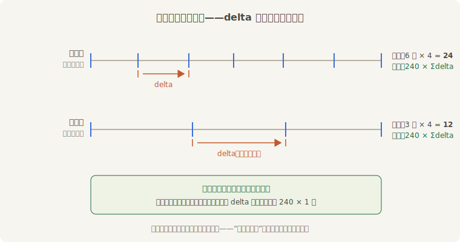

# 一帧多长：delta

先把最老的账翻出来。从第 2 章那只会动的 Sprite 起，本书所有移动代码都长一个样：速度乘 `time.delta_secs()`。规矩用了十六章，理由一直赊着。

要还这笔账，得先承认一个事实：**帧与帧的间隔从来不是均匀的**。垂直同步把帧锁在屏幕刷新上，60 Hz 的屏一帧约 16.7 毫秒，144 Hz 的屏只有 6.9 毫秒；同一台机器上，场景一复杂帧就变慢，后台一抢资源帧就抖动。你的系统每帧跑一次，可“一次”代表多长的现实时间，完全看机器的脸色。

Bevy 的应对是把这件事量出来交给你。**`Time`**（时钟资源——记录上一帧到这一帧流逝了多久、开播以来累计多久的资源）由 `TimePlugin` 注册（`MinimalPlugins` 与 `DefaultPlugins` 都含），每帧开头在 `First` 调度里刷新一次——回看第 6 章那张调度表，`First` 的注释“刷新时间等最早的内务”说的就是它。于是和第 17 章的输入快照一样，这里也有一条值钱的保证：**同一帧里所有系统读到的 `Time` 完全一致**。常用的读数就两个：

- **`delta()`**——上一帧到这一帧流逝的时长，`Duration` 类型；`delta_secs()` 是它的 `f32` 秒数版，乘速度最顺手；
- **`elapsed()`／`elapsed_secs()`**——时钟启动以来的累计时长。第 12 章太阳系的公转、第 16 章飘字的相位，用的都是它。



<span class="caption">Figure 18-1：同一秒的两种切法——帧多缝窄、帧少缝宽，但缝加起来都是一秒</span>

## 两台机器，一段台步

“不乘 delta 会怎样”光说不练没有说服力。老雷请来一位**替身**，跟阿燕各走一段台步：替身的走法是“跑一帧迈一步，每步 4 个单位”，阿燕的走法是“每秒 240 个单位，乘 delta”——在每秒 60 帧的机器上，两人的速度恰好相同。场记搭了个对照实验台：同一段逻辑，分别在“每秒 60 帧的新戏台”和“每秒 30 帧的老戏台”上各走一秒。

两人的台步系统只有这点东西：

```rust
{{#include ../../code/ch18-time/examples/listing-18-01.rs:strides}}
```

<span class="caption">Listing 18-1（其一）：两种走法——替身数帧，阿燕乘 delta（examples/listing-18-01.rs）</span>

实验台用第 6 章的旧旋钮 `TimeUpdateStrategy::ManualDuration` 把“每帧流逝多长”拧成定值，好让输出一字不差地可复现——真实游戏不要碰它：

```rust
{{#include ../../code/ch18-time/examples/listing-18-01.rs:rehearse}}
```

<span class="caption">Listing 18-1（其二）：排练一秒——先空跑一帧对表，再跑满一秒应有的帧数</span>

两个细节：第一帧时钟刚起步、delta 按 0 计（第 6 章交过底），所以先空跑一帧“对表”，再插入 `Action` 资源放行台步系统——`resource_exists` 这个运行条件是第 6 章的旧识。运行：

```console
cargo run -p ch18-time --example listing-18-01
```

```text
—— 新戏台（每秒 60 帧）走一秒 ——
  替身走到 240.0（60 帧 × 4 单位）
  阿燕走到 240.0（240 单位/秒 × 实际时长）
—— 老戏台（每秒 30 帧）走一秒 ——
  替身走到 120.0（30 帧 × 4 单位）
  阿燕走到 240.0（240 单位/秒 × 实际时长）
老雷：替身换台慢一半，阿燕走哪儿都是 240——往后谁的步子不乘 delta，谁加练。
```

新戏台上两人并肩；换到老戏台，帧数砍半，替身的步数跟着砍半，一秒只走了 120——**他的速度被帧率绑架了**。阿燕不受影响：帧少了，每帧的 delta 就宽了，“步数 × 步幅”一收一放正好抵消。这就是“帧率无关”（frame-rate independence）四个字的全部内容：**把速度定义在时间上（每秒多少单位），把帧当成采样点**。老游戏在新机器上快进般地疯跑，犯的正是替身的毛病。

> **`f32` 的远虑**：`elapsed_secs()` 返回 `f32`，开播几小时后精度会逐渐磨损（浮点数越大，能表示的小数位越少）。做长跑服务器或挂机游戏时，改用 `elapsed_secs_f64()`，或用按周期回绕的 `elapsed_secs_wrapped()`（默认一小时绕回零，喂三角函数这类周期公式正合适）。普通单局游戏不必操心。

不过 delta 也不是万灵药。想象一帧卡了半秒，`delta_secs()` 忠实地报 0.5——阿燕一步迈出 120 个单位，穿过木桩都不带打招呼的。“大 delta 大步”在数学上没错，对物理却是灾难，这个隐患记在账上，18.5 节由鼓师来收拾。

下一个问题更日常：中场休息怎么办？让 delta 变成零？这就引出了一个事实——`Time` 不止一只。
