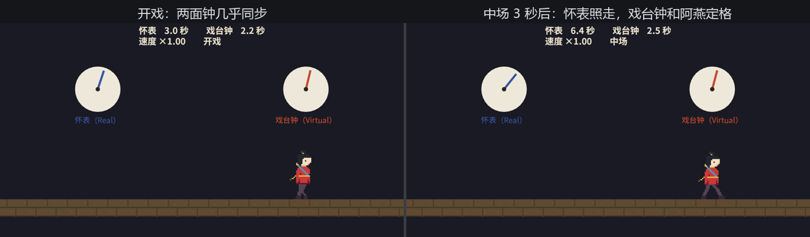

# 两面钟：Real 与 Virtual

体验场要加中场休息。需求老雷一句话就讲完了：按下空格，台上的一切原地定住；再按一下，接着演。

他的第一反应顺理成章：时间是 `Time`，那暂停想必就是 `time.pause()`：

```rust
{{#include ../../code/ch18-time/no-compile/listing-18-02.rs:intermission}}
```

<span class="caption">Listing 18-2：行不通——给通用时钟按暂停（no-compile/listing-18-02.rs）</span>

```text
error[E0599]: no method named `pause` found for struct `bevy::prelude::ResMut<'_, bevy::prelude::Time>` in the current scope
  --> ch18-time\no-compile\listing-18-02.rs:10:14
   |
10 |         time.pause();
   |              ^^^^^ method not found in `bevy::prelude::ResMut<'_, bevy::prelude::Time>`
```

编译器一口回绝：`Time` 身上没有 `pause` 这个方法。这不是疏漏，是设计在说话——你每天读的 `Res<Time>` 是只**通用钟**，它身上一个旋钮都没有。旋钮长在别的钟上。

## 一族时钟

`TimePlugin` 注册的其实是一族资源，各管各的：

- **`Time<Real>`**（真实时钟）——场记的怀表，忠实跟随操作系统的真实时间。没有任何旋钮：不能暂停、不能变速，谁也拧不动它；
- **`Time<Virtual>`**（虚拟时钟）——戏台钟，**戏里的时间**。它以怀表为底本，但接受三个旋钮：`pause()`／`unpause()` 暂停恢复，`set_relative_speed()` 变速，`set_max_delta()` 限制单帧最大补时（稍后细说）；
- **`Time<Fixed>`**（固定时钟）——鼓师的鼓，跟着戏台钟按整拍走，18.5 节的主角，这里先记个名字；
- **通用 `Time`**——不带泛型参数的那只，也就是全书一直在用的 `Res<Time>`。它不是第四只钟，而是一面**镜子**：在 `Update` 里照出 `Time<Virtual>` 的读数，在 `FixedUpdate` 里照出 `Time<Fixed>` 的读数。镜子上自然没有旋钮——要拧旋钮，得指名道姓地找具体的钟：`ResMut<Time<Virtual>>`。

所以中场休息的正确写法只差一个泛型参数。这也回答了一个更深的问题：**暂停游戏时，时间去哪了**？答案是分了家——戏台钟停了，怀表照走。凡是读 `Res<Time>` 的系统（全书的移动、动画、计时逻辑）自动拿到 delta 为 0 的“戏里时间”，整台戏应声定格；而读 `Time<Real>` 的系统照常工作，UI 动画、菜单呼吸灯、网络心跳这些“戏外的事”不受牵连。

## 排练厅挂钟

实验把两面钟做成实物。台口两只表盘（第 15 章的 `Mesh2d` 圆面），各插一根一分钟转一圈的指针：左边的针听怀表的，右边的针听戏台钟的；台上阿燕照常走台步。指挥席只有一个系统，三个旋钮全在 `Time<Virtual>` 上：

```rust
{{#include ../../code/ch18-time/examples/listing-18-03.rs:conduct}}
```

<span class="caption">Listing 18-3（其一）：指挥席——暂停与换挡都拧在 `Time<Virtual>` 上（examples/listing-18-03.rs）</span>

两根指针各问各的钟，谁也不掺和谁：

```rust
{{#include ../../code/ch18-time/examples/listing-18-03.rs:hands}}
```

<span class="caption">Listing 18-3（其二）：转表针——`Real` 与 `Virtual` 各自的 `elapsed_secs()`</span>

阿燕的台步**一个字都不用改**——还是那句 `Res<Time>`，在 `Update` 里它照出来的就是戏台钟：

```rust
{{#include ../../code/ch18-time/examples/listing-18-03.rs:walk}}
```

<span class="caption">Listing 18-3（其三）：台步照旧问 `Res<Time>`——中场时 elapsed 停涨，阿燕定格</span>

```console
cargo run -p ch18-time --example listing-18-03
```

空格按两轮，再把挡位推上去又拉下来：

```text
老雷：排练厅挂两面钟——怀表走人间，戏台钟走戏里。
场记：空格中场/开戏，↑↓ 给戏台钟换挡。
老雷：中场——台上歇住，怀表不歇。
老雷：开戏——戏台钟接着走。
鼓师：换挡——戏台钟 ×2。
鼓师：换挡——戏台钟 ×4。
鼓师：换挡——戏台钟 ×0.25。
```

中场那几秒最有看头：阿燕走路的帧动画停在半步上（它的节拍器喂的是 `Res<Time>` 的 delta，中场时 delta 为 0，下一节细看），右边的戏台钟纹丝不动，左边的怀表自顾自往前赶——两面钟的读数从此岔开。×4 时阿燕疾走如飞、戏台钟狂转；×0.25 就是慢动作回放，所有乘着 delta 的逻辑自动跟着慢，一行游戏代码都不用动。



<span class="caption">Figure 18-2：中场——怀表照走，戏台钟和台上的一切定格</span>

> **第 10 章的暂停，第 18 章的暂停**。街机厅那章用 `IsPaused` 子状态把“暂停场面”工程化：哪些系统停跑（`run_if`）、“PAUSED”字样何时进退场（`OnEnter`/`OnExit`）。那套机制管的是**调度**——谁该跑谁不该跑；`Time<Virtual>` 管的是**时间本身**——就算系统照跑，delta 也是零。实战里两者搭配：`OnEnter(IsPaused::Paused)` 里调一句 `time.pause()`，状态机管换幕，时钟管光阴。配套的运行条件 `bevy::time::common_conditions::paused` 可以直接当 `run_if` 用。

## max_delta：补课的上限

戏台钟还有第三个旋钮 `set_max_delta()`，默认值 250 毫秒，管的是一种边角时刻：这一帧距上一帧过去了**太久**——窗口被拖动卡住了、笔记本合盖又掀开、断点调试停了五分钟。怀表忠实地记下这一切，但戏台钟若照单全收，逻辑就要一步“补”完五分钟：阿燕一帧瞬移出台口，18.1 节末尾警告过的“大 delta 大步”全面爆发。`max_delta` 是闸门：单帧补时超过上限就拦腰截断，**宁可丢时间，不让逻辑撑死**。它还有第二重身份——机器太慢、一帧的计算追不上真实流逝时，封顶的 delta 让游戏“慢而不崩”，不会陷进越补越欠、越欠越补的死亡螺旋。

这个闸门平时隐形，但抓它现行不难：冷启动（渲染管线还没编译缓存）的示例窗口，头几秒里怀表常比戏台钟多出几百毫秒——开机卡掉的那几个超长帧被 `max_delta` 拦腰截断，时间丢在了戏外。两面钟的读数从此差着一小截，谁也不补。

钟的家务讲完了。但“每 2.5 秒补一支箭”这种话，拿 `elapsed_secs()` 写起来很别扭——你需要的不是钟，是表。下一节请出 `Timer`。
