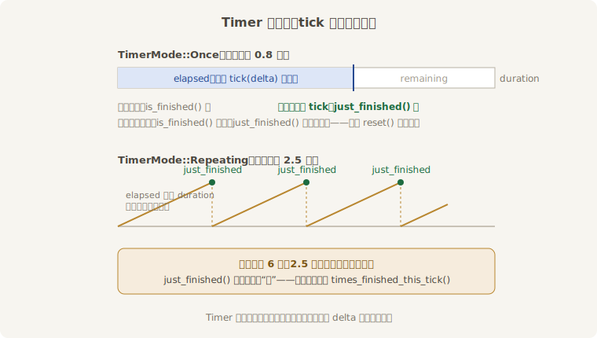
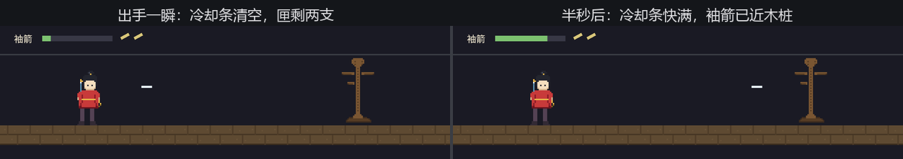

# Timer 与 Stopwatch：冷却、补给与掐表

新戏码《连珠箭》排上日程：空格一按，阿燕甩手一支袖箭。老雷提了两条规矩——出手之后**手上要缓 0.8 秒**才能再出（玩过游戏的都认识它：冷却）；箭匣容量三支，**每 2.5 秒自动补一支**。

两条规矩都是“跟一段时长较劲”。拿上一节的钟硬写不是不行：出手时抄下 `elapsed_secs()`，每帧用减法看够不够 0.8——能跑，但状态散落、重置别扭，补箭那条还得自己处理“一帧跨过两个 2.5 秒”的边角。Bevy 把这套活计做成了现成的家什：**`Timer`**（定时器——朝着设定时长走、走完报“到点”的值类型）。它有两个关键脾气：

1. **它不挂在任何调度上**。`Timer` 只是个普通的值（拿来做组件字段、资源字段都行），自己不会走——每帧得用 `tick(delta)` 喂它时间。不喂不走，喂谁的时间就过谁的日子；
2. **走法分两种**，构造时用 **`TimerMode`** 指定：`Once` 只走一程，到头就停在终点，等你 `reset()` 从头再来——冷却、延时一次性事件用它；`Repeating` 走到头自动回绕重走——心跳、补给、刷怪节拍用它。



<span class="caption">Figure 18-3：Timer 的一生——Once 停在终点等 reset，Repeating 回绕不停表</span>

## 箭匣账本

冷却和补箭一只手数得过来，装进一个资源：

```rust
{{#include ../../code/ch18-time/examples/listing-18-04.rs:quiver}}
```

<span class="caption">Listing 18-4（其一）：两只定时器——冷却只走一程，补箭循环走（examples/listing-18-04.rs）</span>

留意 `Default` 里那句 `cooldown.finish()`：新建的 `Timer` 从零起步，照规矩要等 0.8 秒才能出第一箭——开场就让玩家干等是糟糕的手感，`finish()` 把表直接拨到终点，开场手就是稳的。

喂表集中在一个系统里，每帧各喂一口 `delta()`（注意是 `Duration` 版——`tick` 吃的是精确时长，不是 `f32`）：

```rust
{{#include ../../code/ch18-time/examples/listing-18-04.rs:tick}}
```

<span class="caption">Listing 18-4（其二）：拨表——`tick` 返回 `&Self`，链一句 `just_finished()` 正好</span>

补箭那行是 `Repeating` 的标准用法：**`just_finished()`** 只在“这次 tick 恰好走完一轮”时答真——每 2.5 秒恰好一次，循环表自动回绕，不用任何手工归零。出手侧则是 `Once` 的标准三问：

```rust
{{#include ../../code/ch18-time/examples/listing-18-04.rs:throw}}
```

<span class="caption">Listing 18-4（其三）：出手三问——按了吗、缓过劲了吗（`is_finished`）、匣里还有吗</span>

**`is_finished()`** 答的是状态（“到点了吗”），适合冷却这种“到点之后一直可用”的判断；拒绝时顺手用 **`remaining_secs()`** 报出还差多少，台词都是现成的。出手成功就 `reset()`，冷却从头再走一程。还剩一个 HUD：把冷却进度画成一根条，**`fraction()`**（已走完的比例，0 到 1）直接当横向缩放用：

```rust
{{#include ../../code/ch18-time/examples/listing-18-04.rs:hud}}
```

<span class="caption">Listing 18-4（其四）：冷却条——`fraction()` 出手瞬间归零，0.8 秒长回满格</span>

```console
cargo run -p ch18-time --example listing-18-04
```

每隔 0.4 秒点一下空格——快于冷却、慢于补箭，两本账一起转起来：

```text
老雷：练《连珠箭》——空格出手。手上要缓劲，匣里要等补。
阿燕：看箭。
阿燕：手上还没缓过劲——还差 0.4 秒。
阿燕：手上还没缓过劲——还差 0.4 秒。
阿燕：手上还没缓过劲——还差 0.4 秒。
场记：补一支——匣 1/3。
场记：补一支——匣 2/3。
```

每两下里总有一下撞在冷却上吃闭门羹；三支射空、住手之后，补箭的循环表每 2.5 秒准时喊一声。点得再急一点，等冷却缓过来而匣子还空着，吃的就是场记那句“匣空了——等补箭”。



<span class="caption">Figure 18-4：冷却条直播 `fraction()`——出手归零，0.8 秒长回满格</span>

三个值得记下的边角：

- **一帧跨多轮怎么办**？`Repeating` 表在一次 `tick` 里跨过两轮，`just_finished()` 仍只答一次真——该补两支箭就会漏一支。精确计数问 **`times_finished_this_tick()`**：这次 tick 走完了几轮，答几（Figure 18-3 底部那条警示）。本例 2.5 秒的节拍对 16 毫秒的帧绰绰有余，不用管；写“每 0.05 秒结算一次”的密集节拍时就得换它；
- **喂哪只钟的 delta，是个设计决定**。本例喂 `Res<Time>`（戏台钟），于是中场暂停时冷却、补箭全体冻结——对玩法计时这正是想要的：没人愿意见到“暂停回蓝”的赖招。反过来，“跳过开场动画前的强制三秒”这类戏外计时就该喂 `Time<Real>` 的 delta；
- **`run_if` 里的定时器**。翻开上一节 listing-18-03.rs 的注册行，读数牌挂着 `run_if(on_real_timer(Duration::from_millis(100)))`——每秒只刷十次的节流阀，内脏就是一只循环 `Timer` 加 `just_finished()`，`bevy::time::common_conditions` 替你包好了。`on_timer` 是戏台钟版（会被暂停冻住），`on_real_timer` 是怀表版。低频轮询、节流打印，一句条件搞定，不必每次都手搓系统。

## Stopwatch：正着数的表

`Timer` 朝着终点倒着数，还有一种需求是**正着数、没有终点**：这一招蓄了多久的力、这一局打了多长时间。家什叫 **`Stopwatch`**（秒表——只会累计你喂给它的时间的值类型），不在 prelude 里，要 `use bevy::time::Stopwatch` 显式请进来。

拿它重做第 17 章的桩功：左 Shift 运劲、松手收势——当时“这口劲运了几秒”是场记口头估的，这回上表：

```rust
{{#include ../../code/ch18-time/examples/listing-18-05.rs:charge}}
```

<span class="caption">Listing 18-5：掐表——按住才喂时间，松手报数归零（examples/listing-18-05.rs）</span>

```console
cargo run -p ch18-time --example listing-18-05
```

```text
老雷：今儿练桩功——左 Shift 运劲，松手收势，场记掐表。
场记：收势——这口劲运了 1.0 秒。
场记：收势——这口劲运了 2.3 秒。
```

精髓在第一行判断：**表走不走，全看你喂不喂**。按住时每帧喂一口 delta，松手就断粮——“只统计按住的时长”这个需求没有写任何状态机，喂表的条件就是状态本身。`Stopwatch` 还有 `pause()`／`unpause()`（喂了也不走，适合“表在别人手里 tick、你想临时冻结”的场合）和 `reset()`，方法表和 `Timer` 一脉相承——事实上 `Timer` 内部就揣着一只 `Stopwatch`。

三件家什都会使了，场记的账本上却还剩一类没着落的活：“过 0.6 秒把字样撤了”“三秒之后才开演”——到点办一次就完，不要进度、不要循环，专门为它养一只表、配一个系统，未免小题大做。下一节把这类单子交给驿站。
