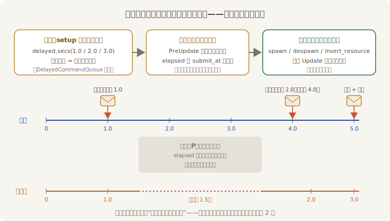

# 过一会儿再办：延迟命令

《连珠箭》练熟了，老雷要给收官场加两样彩头：开演前来个“三息定场”——第一秒喊“一息”、第二秒喊“两息”、第三秒喊完才许出手；袖箭中桩要弹出一个“中！”的字样，挂 0.6 秒自己撤下去。

拿上一节的家什当然写得出来：给字样挂个装着 `Timer` 的组件，再配一个每帧喂表、表走完就 `despawn` 的清扫系统；三息定场再来一只表加一个计数器。能跑，但场记先嘀咕了：这些活和冷却、补箭不一样——**到点办一次就完，不要进度，不要循环**。为一句“过 0.6 秒撤了它”专门养一个组件、写一个系统，账本越记越厚。

这类“一锤子买卖”，Bevy 备了条更省事的路：**延迟命令**（delayed commands）——把一批普通的命令排给引擎，指明“过多久再办”，剩下的事引擎全包。入口就长在天天用的 `Commands` 上：

```rust
{{#include ../../code/ch18-time/examples/listing-18-06.rs:curtain}}
```

<span class="caption">Listing 18-6（其一）：三息定场——牌子、后事、放行令，全在 setup 里一次排完（examples/listing-18-06.rs）</span>

`commands.delayed()` 返回一个派单台，向它要一只“慢递版” `Commands`：`.secs(1.0)` 按秒给延迟，`.duration(d)` 按 `Duration` 给。拿到手的那只 `Commands` 和平常的一模一样——`spawn`、`despawn`、`insert_resource`，第 3 章会的它全会，只是所有命令都要等时辰到了才落地。三个细节值得盯住：

- **同一个派单台可以排任意多档延迟**。循环里每块牌排了两单（第几秒落牌、几秒后撤牌），循环外又给 3 秒档补了一单 `insert_resource`——同一档的命令归进同一张单子，一起送达；
- **实体的号当场就领**。`delayed.secs(at).spawn(...)` 里的牌子要等一秒后才出生，但 `.id()` 立刻拿到 `Entity`——所以下一行能对着一个还没出生的实体预约 `despawn`。第 9 章讲过命令下单与结算分离、`Entity` 预分配，这里是同一套机制在时间轴上的延伸；
- **排单之后没有后续**。`setup` 跑完就退场，没有任何系统盯着这些牌子——撤牌、放行全是驿站的事。

“三息”落地时谁来喊话？牌子是延迟 `spawn` 出来的普通实体，第 4 章的 `Added` 过滤器正好逮它；“开演”的令牌是延迟 `insert_resource` 进来的资源，运行条件 `resource_added` 只在它进门那一帧放行：

```rust
{{#include ../../code/ch18-time/examples/listing-18-06.rs:announce}}
```

<span class="caption">Listing 18-6（其二）：落牌喊话、进门喊开演——顺带给两只钟对表（examples/listing-18-06.rs）</span>

`announce` 每次喊话都把 `Time<Real>` 与 `Res<Time>` 的读数一并报出来。这不是凑热闹——马上就要用它审一桩案子：**驿站的表，究竟是怀表还是戏台钟？**

## 驿站听谁的钟

```console
cargo run -p ch18-time --example listing-18-06
```

开场第一息落地后立刻按 P 中场，歇两秒再开戏，然后照常出手：

```text
老雷：《连珠箭》收官加彩——三息定场，中桩报「中」。空格出手，P 中场。
场记：一息——（怀表 1.0 秒，戏台钟 1.0 秒）
老雷：中场——驿站也归戏台钟管，在途的件全冻住。
老雷：开戏。
场记：两息——（怀表 4.0 秒，戏台钟 2.0 秒）
场记：三息——（怀表 5.0 秒，戏台钟 3.0 秒）
老雷：开演——手都亮出来！
阿燕：看箭。
阿燕：手上还没缓过劲——还差 0.4 秒。
场记：中桩头一记——「中」字挂 0.6 秒，到点自己撤。
```

判词全在“两息”那一行：它比“一息”晚到了**三秒的人间**（怀表 1.0 → 4.0），报出的戏台钟读数却端端正正是 **2.0**——排单时说的“第 2 秒”，指的是戏台钟的第 2 秒。中场那两秒里怀表照走，三张单子原地冻着；慢放同理，×0.25 挡下“一秒后”的单子要等四秒人间才送到。**延迟命令过的是戏里的日子**：驿站对表用的是通用 `Res<Time>`——18.2 节说过它是面镜子，在主调度里照出的正是戏台钟。开场动画、玩法特效这些“戏里的事”因此天生合拍：中场一按，彩头和台上的一切一起定住，不会有字样在暂停画面里凭空消失。



<span class="caption">Figure 18-5：一单慢递的一生——排单时折算成“戏台钟走到几分几秒”，中场把整条驿路按住</span>

驿站的内部构造也值得掀开一角：`delayed()` 排出的每档单子，本身就是一枚带 `DelayedCommandQueue` 组件的**实体**——命令队列装在信封里躺进 World。`TimePlugin` 在 `PreUpdate` 里安了一个对表系统，每帧核一遍所有信封：钟点到了，就把里面的命令倒进主队列执行、信封回收。两条推论跟着来：投递的粒度是**帧**——单子在到点后的第一个 `PreUpdate` 送达，本帧的 `Update` 就能看见效果；延迟再短也要**下一帧**才可能落地，“secs(0.0)”不等于当场办。

## 中桩的字样：一单了事

三息是“开演前排好的单”，中桩的“中！”则是**边打边排**——每次命中当场下两笔：spawn 字样，顺手预约 0.6 秒后的后事：

```rust
{{#include ../../code/ch18-time/examples/listing-18-06.rs:hit}}
```

<span class="caption">Listing 18-6（其三）：字样不养组件、不配系统——spawn 与后事同处一行排定（examples/listing-18-06.rs）</span>

对比上一节的木桩：桩挨了打要**晃一阵**，晃劲每帧按 `fraction()` 衰减——那是“要过程”的活，`Timer` 字段跑不掉；字样只有“挂上”与“撤下”两个瞬间，中间不需要任何一帧的过问——这才是驿站的活。同一次命中里两件家什各干各的，边界一目了然。

## Timer 还是 delayed？

出手的冷却照旧是一只 `Timer`（`is_finished` 把门、`reset` 重走、`remaining_secs` 报数），没有换成延迟命令——不是不能，是不该。分工口诀：

- **要过程的，找 `Timer`**。进度条要 `fraction()`，蓄力要边走边看，晃劲要逐帧衰减——凡是“中间每一帧都有话说”的计时，只有握在自己手里的表办得到；
- **要反复的，找 `Timer`**。冷却 `reset` 一轮又一轮，补箭循环回绕——表就攥在组件或资源字段里，随用随拨；
- **一锤子买卖，交给驿站**。特效撤场、延迟出场、三秒后开锣——到点办一次、办完两讫的事，一行 `delayed` 省下一个字段加一个系统。

还有一条边界要记牢：**单子排出去就收不回**——延迟命令没有撤单机制。冷却这种“出手瞬间要重新计时”的逻辑若用它来写，旧单还在路上、新单又排出去，账立刻糊掉；`Timer` 一句 `reset()` 就干净利落。真有“预约了又想反悔”的场合，两条路：要么回到 `Timer`（表随实体走，实体没了表也没了）；要么让命令自己长眼睛——把目标 `Entity` 存进命令，到点发现人已不在就悄悄作罢。顺带一提，本例给字样预约的 `despawn` 若在送达前发现实体已被旁人撤走，会在日志里刷一条警告；这种“到点时对象可能已不在”属于预期内的场合，换 `try_despawn` 就能安静收场。

彩头的账清了，该会鼓师了。他那面鼓从第 6 章起就在敲——`FixedUpdate` 每秒 64 拍，但拍子和帧到底怎么对上，账本一直没掀开。
