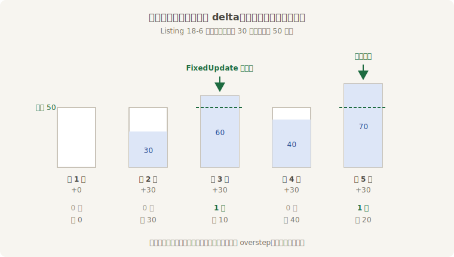
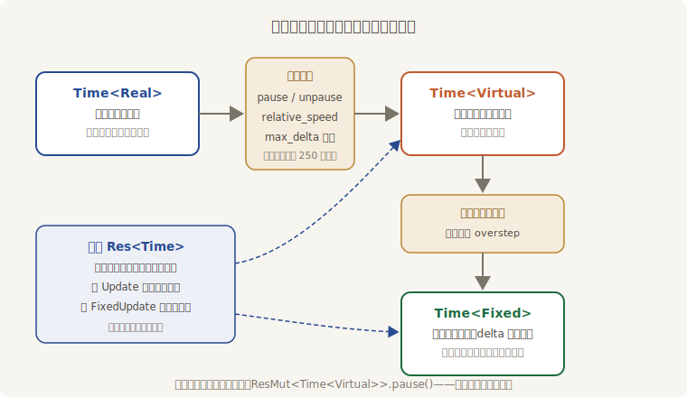

# 鼓师的账本：FixedUpdate

第 6 章给 `FixedUpdate` 画过像：不跟帧走，跟一台固定步长的时钟走；引擎攒着流逝的时间，攒够一个步长跑一轮，攒够两个连跑两轮，不够就歇着。当时的实验只看了它**何时跑**，这一节把鼓师的账本整本掀开：钱从哪来、怎么花、零头记在哪。

实验台还是第 6 章那套（每帧定额流逝 30 毫秒、步长 50 毫秒），但这回在鼓点上和帧上各安一个探针，三只钟同时对表：

```rust
{{#include ../../code/ch18-time/examples/listing-18-06.rs:probes}}
```

<span class="caption">Listing 18-6（其一）：两个探针——同一句 `Res<Time>`，两个调度里各报各的（examples/listing-18-06.rs）</span>

```rust
{{#include ../../code/ch18-time/examples/listing-18-06.rs:main}}
```

<span class="caption">Listing 18-6（其二）：鼓点拧到 50 毫秒一拍——`Time::<Fixed>::from_seconds` 是配置入口</span>

```console
cargo run -p ch18-time --example listing-18-06
```

```text
—— 第 1 帧（流逝 30 毫秒）——
  [Update]      Res<Time> 报 0 毫秒；鼓师攒着 0 毫秒
—— 第 2 帧（流逝 30 毫秒）——
  [Update]      Res<Time> 报 30 毫秒；鼓师攒着 30 毫秒
—— 第 3 帧（流逝 30 毫秒）——
  [FixedUpdate] Res<Time> 报 50 毫秒 = Time<Fixed> 的步长 50；Time<Virtual> 报 30
  [Update]      Res<Time> 报 30 毫秒；鼓师攒着 10 毫秒
—— 第 4 帧（流逝 30 毫秒）——
  [Update]      Res<Time> 报 30 毫秒；鼓师攒着 40 毫秒
—— 第 5 帧（流逝 30 毫秒）——
  [FixedUpdate] Res<Time> 报 50 毫秒 = Time<Fixed> 的步长 50；Time<Virtual> 报 30
  [Update]      Res<Time> 报 30 毫秒；鼓师攒着 20 毫秒
```



<span class="caption">Figure 18-5：鼓师的水缸——每帧倒进 delta，水位够一个步长就跑一拍，零头留缸底</span>

这十行输出值回票价，三条账目挨个对：

1. **同一句 `Res<Time>`，两处报数不同**。帧上的探针报 30 毫秒（戏台钟的 delta），鼓点上的探针报 50 毫秒——上一节说通用 `Time` 是面镜子，这就是实证：进入固定主循环，引擎把镜子转向 `Time<Fixed>`；循环结束再转回 `Time<Virtual>`。所以**写逻辑只管用 `Res<Time>`，放进哪个调度都拿到“正确”的 delta**——同一个系统在 `Update` 与 `FixedUpdate` 之间搬家，时间代码一行不用改；
2. **鼓点上的 delta 恒等于步长**。不管真实的帧多长，`FixedUpdate` 里每拍记账恰好 50 毫秒——这正是“固定”二字的含义，也是它存在的理由（稍后细说）。顺带看清了 `Time<Virtual>` 在鼓点上的样子：报的是**本帧**的虚拟 delta（30 毫秒）；要是一帧连跑两拍，两拍读到的虚拟读数一字不差——它在拍与拍之间不走；
3. **零头分文不丢**。第 3 帧攒 60、花 50，剩的 10 毫秒原样趴在账上——这笔零头叫 **`overstep`**（超步余量，`Time<Fixed>` 的 `overstep()` 可查），下一帧续上。鼓点因此**长期分毫不差**：五帧 150 毫秒，跑了两拍 100 毫秒，余 20 加上当帧的 30——对得上。这笔零头在 18.6 节还有大用。

## 鼓点的出厂设置

步长的配置入口就是 Listing 18-6 里那句 `insert_resource`：`Time::<Fixed>::from_seconds(0.05)` 按秒给，`from_hz(4.0)` 按频率给（本章后面两节都用它），`from_duration` 按 `Duration` 给。出厂默认是 **64 Hz**（15.625 毫秒一拍）——不取整 60 有两个讲究：60 Hz 的鼓点撞上 60 Hz 的屏幕刷新会产生病态的拍频（一帧两拍与一帧零拍交替抽搐），而 64 是 2 的幂，换算成 `f32`/`f64` 秒数不丢精度。没有充分理由别动它；真要动，运行中也可以——`ResMut<Time<Fixed>>` 上的 `set_timestep_hz()` 一族下一节就用。

还有一条家规要写进账本：**鼓跟着戏台钟走，不跟怀表**。鼓师攒的是 `Time<Virtual>` 的 delta——中场暂停，戏台钟 delta 归零，鼓自然一拍不响，`FixedUpdate` 全体歇业；慢放 ×0.25，鼓点在真实时间里也放慢四倍。这是合理的默认：物理、规则结算都是“戏里的事”，戏停它们就该停。整族时钟的上下游关系到此集齐：



<span class="caption">Figure 18-6：一族时钟——上游拧旋钮，下游跟着走；通用 `Res<Time>` 只是一面镜子</span>

## 为什么逻辑要上鼓点

`Update` 用得好好的，凭什么物理、结算这类逻辑要搬到 `FixedUpdate`？两个理由，都是 18.1 节埋的雷：

- **稳定**。变长的 delta 是物理模拟的天敌：18.1 节末尾那记“卡半秒、一步穿桩”就是写照——碰撞检测、弹簧、积分公式在大步长下会跳过关键瞬间甚至发散。鼓点把步长钉死，最坏情况有了下限，调好的参数到哪台机器上都是同一套行为；
- **确定**。每拍 delta 完全一致，同样的输入序列就推演出同样的结果——录像回放、联机对账、物理调参全指着这条命。`Update` 里的逻辑做不到：没有两台机器（甚至没有两次运行）的帧序列是相同的。

于是第 6 章那句选址口诀有了完整的理由：**逐帧呈现的（镜头、UI、特效、音效触发）住 `Update`；按固定节拍演化的（物理、AI 决策、规则结算）住 `FixedUpdate`**。`FixedMain` 内部还有对称的五站（`FixedFirst` 到 `FixedLast`），分工与主家族一致，平时用 `FixedUpdate` 一站就够。

账本清了，但鼓师立刻要面对一桩冤案：把“听玩家出招”也搬上鼓点，账就对不上了——第 17 章欠的那笔“丢拍”，下一节开堂会审。
