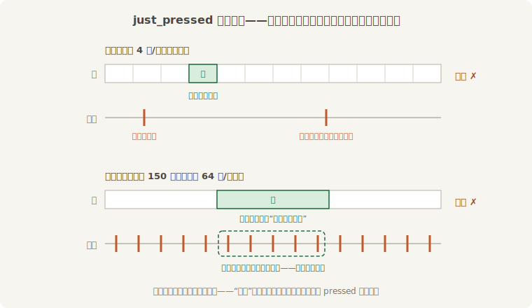
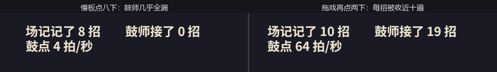

# 丢拍与重复：FixedUpdate 里的输入

第 17 章末尾欠了一句话的账：“`just_pressed` 以帧为粒度，而 `FixedUpdate` 和帧不是一对一——在那里面读它会丢拍或重拍。”机制现在凑齐了，先把案情推演一遍：

- 第 17 章说过，输入快照每帧在 `PreUpdate` 刷新一次，`just_pressed` 只在按下的**那一帧**为真，下一帧就翻篇；
- 上一节刚验过，`FixedUpdate` 每帧跑**零到多轮**。

两条规矩一碰头，病灶自现：`just_pressed` 为真的那一帧里恰好**没有鼓点**，这次按下就永远没人看见——**丢拍**；那一帧里塞了**好几拍**，每一拍读到的都是同一份“刚按下”的快照——同一招收好几遍，**重复**。



<span class="caption">Figure 18-8：快照按帧翻篇，鼓点不按帧落——没踩进那一帧就丢，踩进几次就重几次</span>

## 升堂对账

推演要当庭验证。让场记和鼓师记同一本账：两个系统问的是**一字不差的同一句话**，区别只有住址——场记在 `Update`（帧帧在看），鼓师在 `FixedUpdate`（只在鼓点上抬头）：

```rust
{{#include ../../code/ch18-time/examples/listing-18-08.rs:counts}}
```

<span class="caption">Listing 18-8（其一）：同一句 `just_pressed`，两个住址两本账（examples/listing-18-08.rs）</span>

案发现场要两处：**慢板**把鼓点拧到 4 拍/秒——鼓点比帧稀，专演丢拍；**拖戏**让鼓点回到默认的 64 拍/秒，但每帧硬卡 150 毫秒——帧比鼓点稀，专演重复。拖戏不是胡闹，它模拟的是任何机器都会遇到的卡顿帧和低配机器的常态：

```rust
{{#include ../../code/ch18-time/examples/listing-18-08.rs:scenes}}
```

<span class="caption">Listing 18-8（其二）：两个案发现场——慢板拧鼓点，拖戏拖帧</span>

```console
cargo run -p ch18-time --example listing-18-08
```

开场是慢板。攒足手速快快地点八下空格：

```text
老雷：验招——场记帧帧盯着，鼓师只在鼓点上抬头。都按空格记账。
场记：第 1 招。
鼓师：鼓点上接到第 1 招！
场记：第 2 招。
场记：第 3 招。
…
场记：第 8 招。
```

场记齐齐整整记了八招，鼓师只逮着一招——第一下就漏了，第二下才撞上运气。细看鼓师那行的位置：它插在第 1 招与第 2 招**之间**而不是第 2 招之后，这不是乱序——第 6 章的调度表里固定主循环跑在 `Update` **之前**，撞上鼓点的那一帧里鼓师先开口。能不能逮着全看按键那一瞬有没有鼓点路过：快照窗口只有一帧宽，每秒只来 4 拍，十有八九扑空——帧率越高，窗口越窄，漏得越狠。再按 2 切到拖戏，点两下：

```text
老雷：拖戏——鼓点恢复 64 拍/秒，每帧硬卡 150 毫秒。
鼓师：鼓点上接到第 2 招！
鼓师：鼓点上接到第 3 招！
…
鼓师：鼓点上接到第 11 招！
场记：第 9 招。
```

一招进账，鼓师连喊十声——150 毫秒的帧攒下约十拍，十拍读到的是同一份快照。两个现场合在一起，账面荒唐：



<span class="caption">Figure 18-9：同一个键，两本账——慢板几乎全漏，拖戏每招翻十倍</span>

把出剑、跳跃、换弹这类**瞬时动作**直接写进 `FixedUpdate`，上面就是玩家的真实体验：平时偶尔吞招，一卡顿就连发。坑的形状看清了，填法也就显然了。

## 接拍：把瞬时攒成意图

病根在“瞬时的真假与拍子对不上号”，药方就是**别让鼓师直接看快照**：找一个每帧必跑的系统把瞬时输入收集下来、攒进一个资源，鼓师在拍子上消费这份积攒，消费完清零。攒下的账不会翻篇——鼓点再稀也漏不掉；消费即清零——一帧再多拍也重不了。第 17 章的意图层在这里严丝合缝地对上了：那时为“多设备”立的中间层，正是为“跨调度”要的缓冲。

```rust
{{#include ../../code/ch18-time/examples/listing-18-09.rs:queue}}
```

<span class="caption">Listing 18-9（其一）：收招只记账，结账一笔清（examples/listing-18-09.rs）</span>

收招系统的住址有讲究。放 `Update` 行不行？行——但回看第 6 章的调度表：固定主循环排在 `Update` **前面**，本帧 `Update` 收的招要等**下一帧**的鼓点才被结算，平白慢一拍。官方惯用法是挂进 `RunFixedMainLoop` 调度的 **`RunFixedMainLoopSystems::BeforeFixedMainLoop`** 系统集——每帧必跑、又赶在本帧鼓点之前，输入当帧就能进账：

```rust
{{#include ../../code/ch18-time/examples/listing-18-09.rs:app}}
```

<span class="caption">Listing 18-9（其二）：收招站在鼓点前——`BeforeFixedMainLoop`，每帧恰好一次</span>

同样的两个现场再验一遍：

```text
老雷：再验一遍招——这回场记只管记账，鼓师按拍结账。
场记：记下第 1 招，候拍。
鼓师：这一拍结清 1 招——共接 1 招。
场记：记下第 2 招，候拍。
鼓师：这一拍结清 1 招——共接 2 招。
场记：记下第 3 招，候拍。
场记：记下第 4 招，候拍。
鼓师：这一拍结清 2 招——共接 4 招。
…
老雷：拖戏——鼓点恢复 64 拍/秒，每帧硬卡 150 毫秒。
场记：记下第 7 招，候拍。
鼓师：这一拍结清 1 招——共接 7 招。
场记：记下第 8 招，候拍。
鼓师：这一拍结清 1 招——共接 8 招。
```

慢板下两招攒在一起、一拍结清（“结清 2 招”那行就是证据）；拖戏下一帧十拍，第一拍消费、后九拍无账可结——两头的账都两清了。多提一句火候：这里攒的是**次数**，因为“出招八次”八次都该作数；如果攒的是“本帧按住的方向”这类**持续状态**，收集系统直接覆写就行，不用累加。

> **哪些输入要缓存，哪些不用**？只有 `just_pressed`／`just_released` 这类“瞬时事实”有帧粒度问题。**`pressed` 是持续状态**，按住期间帧帧为真，鼓点哪一拍来问都问得到，在 `FixedUpdate` 里直接读是安全的（丢不了，顶多迟零点几拍感知不到）。**`Message` 也是安全的**——第 7 章“FixedUpdate 的特殊照顾”说过，带 `TimePlugin` 的 App 会推迟消息清理，直到固定调度看过一眼，`MessageReader` 放在 `FixedUpdate` 里一条不丢。真正需要你动手缓冲的，就是快照上的瞬时三问。官方示例 `examples/movement/physics_in_fixed_timestep.rs` 里有这套模式的完整版（含“鼓点跑过之后才清账”的开关），值得通读。

输入的账清了。但鼓师还背着最后一桩公案——把**走位**搬上鼓点之后，台下看客说阿燕走路一顿一顿，像踩在棉花上。压轴的《赶月》，下一节开演。
