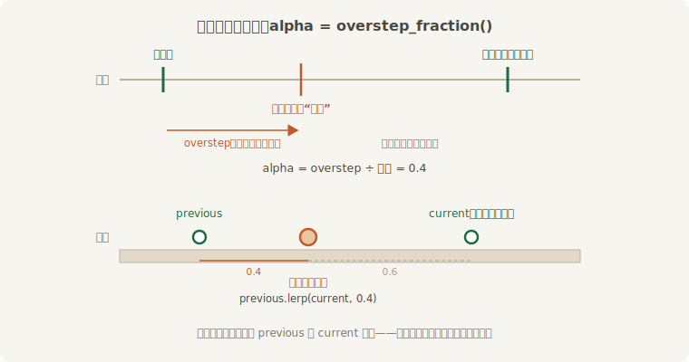
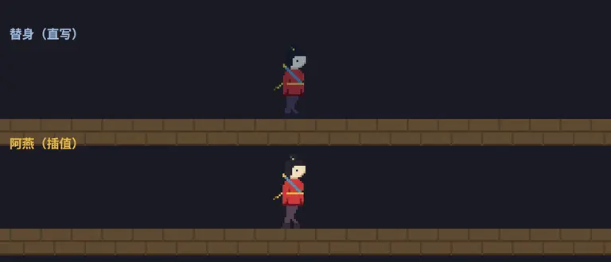

# 鼓点之间：渲染插值

上一节结案时落下的公案：老雷按 18.5 节的口诀把阿燕的走位结算搬上鼓点，排练时用慢板（4 拍/秒）看分解动作——结果台下齐声喊晕。先复现现场。走位逻辑本身无可指摘：速度乘 delta、到台口折返，在 `FixedUpdate` 里 `Res<Time>` 自动是固定钟，账目分毫不差：

```rust
{{#include ../../code/ch18-time/examples/listing-18-10.rs:advance}}
```

<span class="caption">Listing 18-10：账没错，观感错了——位置直接写进 Transform，一秒只挪四次（examples/listing-18-10.rs）</span>

```console
cargo run -p ch18-time --example listing-18-10
```

跑起来一看就明白看客在喊什么：阿燕的**腿**是顺的（帧动画在 `Update` 里照常拨片），**人**却一顿一顿地蹦——每秒整整齐齐四跳，每跳 45 个单位。病根上一节其实已经写在 Figure 18-8 里了：鼓点不和帧对齐。两拍之间往往隔着好几帧，这些帧里 `Transform` 纹丝不动；拍子一落，它瞬移一大步。把鼓点换回默认 64 Hz 毛病会变细，但不会变没——144 Hz 的屏幕上一秒 144 帧只有 64 次移动，挑剔的眼睛照样看得出抖。

退回 `Update`？那就把 18.5 节的两条命（稳定、确定）又交出去了。鱼与熊掌的正解是**分家**：**账本归鼓点，画面归帧**——物理位置按拍结算，屏幕上的位置每帧从账本里“估”出来。

## 两本账与一个零头

估的办法干净得出奇。让账本多记一笔：每拍结算时，先把“这一拍的位置”挪去“上一拍的位置”，再走新的一步——任何时刻账上都有**前后两拍**的位置：

```rust
{{#include ../../code/ch18-time/src/main.rs:components}}
```

<span class="caption">Listing 18-11（其一）：兵分两路——`StagePos` 是账本，`Transform` 从此只管画（src/main.rs）</span>

而“现在”走到两拍之间的几分几厘，鼓师的账本上早就有了——18.5 节那笔没花完的零头！`overstep` 除以步长就是进度比例，`Time<Fixed>` 直接给了现成方法 **`overstep_fraction()`**：零头刚清空时是 0（刚结算完一拍），快攒满下一拍时逼近 1。拿它在两本账之间做线性插值（lerp），就是本帧该画的位置：



<span class="caption">Figure 18-10：两拍之间找步子——alpha = overstep_fraction()，画面落在前后两拍的连线上</span>

压轴《赶月》把对照组直接摆上台：替身与阿燕共用同一套鼓点结算（同一个 `advance` 系统、同一份 `StagePos` 账本），只在“怎么画”上分道扬镳——替身把账面直接拍上 `Transform`，阿燕按零头插值：

```rust
{{#include ../../code/ch18-time/src/main.rs:advance}}
```

<span class="caption">Listing 18-11（其二）：三个系统讲完全部机制——结算、直写、插值</span>

各就各位是关键，三个住址对应三种节奏：

- **`advance` 在 `FixedUpdate`**——按拍结算账本，每秒恰好四次；
- **`snap_direct` 也在 `FixedUpdate`**——替身的画法，账变它才变；
- **`glide` 挂在 `RunFixedMainLoop` 的 `AfterFixedMainLoop` 系统集**——每帧恰好一次、又保证排在本帧所有鼓点**之后**，拿到的是最新账面和最新零头。上一节收输入用 `BeforeFixedMainLoop`，这一节铺画面用 `AfterFixedMainLoop`，一前一后正好把固定主循环夹在中间——这正是官方 `physics_in_fixed_timestep.rs` 示例的骨架。

完整代码如下，HUD 与中场/换挡沿用 18.2 节的零件：

```rust
{{#include ../../code/ch18-time/src/main.rs}}
```

<span class="caption">Listing 18-11（其三）：完整示例——《赶月》（src/main.rs）</span>

```console
cargo run -p ch18-time
```

```text
老雷：《赶月》走台——替身踩着鼓点挪，阿燕在鼓点之间找步子。
场记：空格中场/开戏，↑↓ 换挡。慢放时替身顿得更凶，阿燕照样丝滑。
场记：第 1 趟走完，折返。
老雷：中场——鼓也歇了，人也定了。
老雷：开戏。
鼓师：换挡——戏台钟 ×0.5。
鼓师：换挡——戏台钟 ×0.25。
```



<span class="caption">Figure 18-11：《赶月》——同一本账，替身按拍跳，阿燕每帧滑</span>

同一面鼓、同一本账，观感天差地别。两个旋钮值得亲手拧：**↓ 减到 ×0.25**——慢放让鼓点在真实时间里变成约一秒一拍，替身蹦得愈发不堪，阿燕依旧丝滑（零头照常按比例走，插值对变速浑然不觉）；**空格中场**——鼓停了（18.5 节的家规：固定钟跟着戏台钟），`AfterFixedMainLoop` 的 `glide` 倒是每帧照跑，但零头冻住不动，阿燕便定在原地，不漂不抖。

天下没有白吃的丝滑，这碗的价钱叫**滞后**：阿燕画的永远是 `previous` 到 `current` 之间的某处，也就是说画面比账本**慢零到一拍**（动图里细看，她始终比替身落后小半步）。4 拍/秒的教学鼓点下滞后最多 250 毫秒，肉眼可辨；默认 64 Hz 下最多 15.6 毫秒，绝大多数游戏无人察觉。在乎这十几毫秒的竞技场合有另一路解法——不插值（interpolation）而**外推**（extrapolation），按速度向前猜半拍，代价是猜错时会轻微回弹；官方示例的文档注释里有两派的权衡综述。还记得第 13 章镜头跟拍用的 `smooth_nudge` 吗？那是第三路：不求精确落点、只求指数逼近，跟拍这类“慢半拍才有手感”的场合最合适。

## 小结

- **delta 是公平的尺子**：帧的间隔天生不均匀，`Time` 每帧在 `First` 刷新、全帧一致；速度按“每秒多少”定义、乘 `delta_secs()`，快慢机器走出同样的戏。`elapsed_secs()` 做累计相位，长跑防精度磨损用 `_f64` 或 `_wrapped` 版
- **`Time` 是一族**：`Real` 是没有旋钮的怀表；`Virtual` 是可暂停（`pause`/`unpause`）、可变速（`set_relative_speed`）、有补时上限（`max_delta`，默认 250 毫秒，防瞬移与死亡螺旋）的戏台钟；`Fixed` 按整拍跟着 `Virtual` 走。通用 `Res<Time>` 是镜子：`Update` 里照出 `Virtual`，`FixedUpdate` 里照出 `Fixed`——玩法代码只管用它。拧旋钮要指名 `ResMut<Time<Virtual>>`，通用钟上没有 `pause`（E0599 当场拦截）
- **`Timer` 不喂不走**：`tick(delta)` 喂时间，喂哪只钟的 delta 它就过谁的日子（戏台钟版暂停即冻结，怀表版戏外照走）。`Once` 走完停表等 `reset`，做冷却配 `is_finished`/`remaining_secs`/`fraction`；`Repeating` 回绕不停，做节拍配 `just_finished`，一帧跨多轮要问 `times_finished_this_tick`。`on_timer`/`on_real_timer` 是包成 `run_if` 条件的循环表；`Stopwatch` 正着数没终点，按住才喂就是“只记按住的时长”
- **一锤子买卖交给驿站**：`commands.delayed().secs(x)` 拿到慢递版 `Commands`，spawn/despawn/insert_resource 照排；实体 ID 当场分配，可对未出生的实体预约后事。驿站对表用通用钟——中场冻结、变速同拉伸；到点后的第一个 `PreUpdate` 投递，粒度是帧。要过程、要反复、要撤单的计时仍归 `Timer`——延迟命令没有撤单机制
- **`FixedUpdate` 是水缸记账**：每帧把 `Virtual` 的 delta 倒进缸，够一个步长跑一拍、连跑到不够为止，零头存 `overstep`。拍内 `Res<Time>` 的 delta 恒等步长——稳定（参数行为处处一致）与确定（同输入同结果）皆系于此。步长配置 `Time::<Fixed>::from_hz/from_seconds`，默认 64 Hz（躲开 60 Hz 屏的拍频、且为 2 的幂）；中场暂停时鼓不响
- **瞬时输入过鼓点要缓存**：`just_pressed` 只真一帧，鼓点没踩进那帧就丢、踩进几拍就重几遍。解法：每帧必跑的系统攒成意图（次数累加、状态覆写），鼓点上消费清零；收集挂 `RunFixedMainLoopSystems::BeforeFixedMainLoop` 当帧生效。`pressed` 与 `Message` 不用缓存（消息有第 7 章的引擎兜底）
- **账本归鼓点，画面归帧**：固定步长移动直写 `Transform` 会一顿一顿。记 previous/current 两本账，每帧用 `overstep_fraction()` 在两拍之间 lerp，插值系统挂 `AfterFixedMainLoop`。代价是画面滞后至多一拍；竞技场合可换外推，跟拍手感用 `smooth_nudge`

## 练习

1. **赖招治理**：给《连珠箭》（Listing 18-4）加中场暂停（空格之外另设一键）。先什么都不改，验证暂停期间冷却确实冻结；再造一只“赖招版”冷却——`tick` 喂 `Time<Real>` 的 delta——亲眼看暂停回蓝有多破坏手感。体会“喂哪只钟”是设计决定。
2. **重箭蓄力**：把 Listing 18-5 的 `Stopwatch` 接进《连珠箭》：按住空格蓄力、松手出箭，蓄力时长换算成箭速（封顶 2 秒）。注意蓄力期间冷却表与秒表互不相干——两件家什各记各的账。
3. **持续与瞬时**：把 Listing 18-8 两个计数系统里的 `just_pressed` 都换成 `pressed`，慢板下**按住**空格两秒再松开。预测两本账各记多少，再运行对答案——体会“持续状态在 FixedUpdate 里直接读是安全的”这句话的确切含义。
4. **第三种走法**：给《赶月》添一位“外推替身”：不存 previous，每帧画 `current + velocity * overstep`（按速度向前猜）。直行时她与阿燕难分伯仲；盯住台口折返的瞬间——猜错的那一下回弹，就是外推的价钱。
5. **倒计时开锣**：用一只 3 秒的 `Once` 定时器给《赶月》加开场倒计时：台口 `Text2d` 用 `remaining_secs().ceil()` 报“3、2、1”，`just_finished` 那一帧打出“开锣”并放行两位演员（提示：演员的系统挂 `run_if`，条件读这只表——想想它该住在哪个资源里）。做完再用 18.4 节的延迟命令重写一遍，比较两版的代码量；再回答一个问题：哪一版能让台口的数字逐秒变化？为什么？
6. **不许赖账的引信**：给 Listing 18-6 的袖箭加“哑火”——出手时预约 1.5 秒后把还在飞的箭撤下（提示：把箭的 `Entity` 排进延迟命令；箭若早已中桩、实体已亡，想想该用 `despawn` 还是 `try_despawn`）。然后试着做“可取消的哑火”——你会发现单子排出去就收不回，说说这活为什么该换回 `Timer` 组件。
