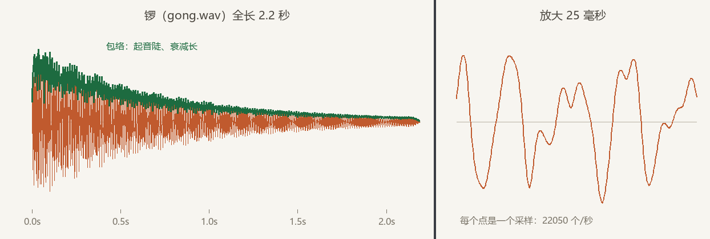

# 第一声

琴师进组头一件事：把《长风渡》序曲交给引擎奏出来。曲谱是一个 `.wav` 文件（`scripts/make_ch19_assets.py` 合成的，10 秒整），放在 `assets/music/` 下。让它出声要写的代码，少得让人起疑：

```rust
{{#include ../../code/ch19-audio/examples/listing-19-01.rs}}
```

<span class="caption">Listing 19-1：第一声——加载一个音频资产，spawn 一个会发声的实体（examples/listing-19-01.rs）</span>

没有“播放器对象”，没有“音频管理器”，连一句 `play()` 都没有。**发出一个声音，就是 spawn 一个带 `AudioPlayer` 的实体**——`AudioPlayer`（音频播放组件，里面装一张 `Handle<AudioSource>` 提货单）一落到实体上，引擎就接手了剩下的一切。

## 一记闷棍：UnrecognizedFormat

先别急着跑。如果你在自己的工程里照抄这段代码，而 `Cargo.toml` 写的是裸的 `bevy = "=0.18.1"`，第一声不会是音乐：

```console
cargo run -p ch19-audio --example listing-19-01
```

```text
琴师：曲谱递上去了——《长风渡》序曲，奏一遍。

thread 'Compute Task Pool (8)' (24284) panicked at C:\Users\94887\.cargo\registry\src\index.crates.io-1949cf8c6b5b557f\bevy_audio-0.18.1\src\audio_source.rs:102:56:
called `Result::unwrap()` on an `Err` value: UnrecognizedFormat
note: run with `RUST_BACKTRACE=1` environment variable to display a backtrace
Encountered a panic in system `<Enable the debug feature to see the name>`!
Encountered a panic in system `<Enable the debug feature to see the name>`!
```

`UnrecognizedFormat`——解码器不认识这个格式。Bevy 内置四种音频格式的解码：`.ogg`（feature 名 `vorbis`）、`.wav`、`.mp3`、`.flac`，但**默认特性里只开了 `vorbis`**。我们的 `.wav` 要过解码这一关，得在依赖上把闸打开——这就是本章 `Cargo.toml` 里那行 feature 的来历：

```toml
bevy = { workspace = true, features = ["wav"] }
```

这桩公案里最值得盯住的是**炸点的位置**。panic 不在加载，而在 `bevy_audio` 的解码——也就是说，文件被原原本本地加载进来了，直到引擎要开播、把字节递给解码器的那一刻才翻车。两个原因凑成了这口闷棍：其一，音频的 `AssetLoader`（第 14 章教库房认格式的那个接口）只负责把字节搬进内存，**不做解码**，解码推迟到每次播放时；其二，`AudioPlayer::new` 的参数类型把这次 `load` 锁定为 `load::<AudioSource>`，而库房按“资产类型”找装卸工时发现 `AudioSource` 只有一个 loader，直接拍板录用——**扩展名根本没被问到**。坏消息于是一路绿灯，憋到最后一站才爆。`bevy_audio` 的源码注释把这个结局明明白白写在了 `AudioSource` 的文档里：格式对应的 feature 没开，就会 panic 出一个 `UnrecognizedFormat`。

> 为什么默认只有 `vorbis`？`.ogg` 是游戏发行的主流选择：压缩率高、专利干净。`.wav` 无压缩、个头大，但合成与调试友好——本书的资产由脚本现场合成，标准库写 `.wav` 是一行 `wave` 模块的事，所以全章走 `wav` feature 这条路。真实项目发布时，把素材转成 `.ogg` 即可回到默认特性。

## 这一声背后的三件旧事

feature 开好，再跑一遍 Listing 19-1：窗口出来，序曲响起，十秒后安静——一遍，正是默认行为。回头看这五行代码，每一行都站着一位老相识：

- **`asset_server.load("music/changfeng-overture.wav")`**——第 14 章的开单流程原样适用：`load` 立刻返回提货单，文件在后台慢慢进货。音频对异步加载的处理写在 `AudioPlayer` 的文档行为里：**资产还没到货，就等到货那一刻再开播**，你不用自己盯加载状态；
- **`AudioPlayer` 是普通 Component**——所以“播放中的声音”天然是个实体，能查询、能加标记组件、能 despawn。第 3 章的 required components 也在场：`AudioPlayer` 声明了 `#[require(PlaybackSettings)]`，没写的播放设置会以默认值自动补上——默认值叫 `ONCE`，播一遍就完，下一节细说；
- **`Handle<AudioSource>` 参与引用计数**——单子销毁，曲谱资产照第 14 章的规矩回收。

那这个 `.wav` 文件里装的究竟是什么？**采样序列**——把声波的振幅按固定频率（本章资产是每秒 22050 次）量出来的一长串数。我们的锣是用五个不成整数比的正弦波叠出来、再套上“起音陡、衰减长”的包络合成的，把它的采样画出来，合成参数一目了然：



<span class="caption">Figure 19-1：锣（gong.wav）的真面目——一串每秒 22050 个的采样，左看包络，右看摆动</span>

## 让曲子循环

序曲只奏一遍可撑不起一台戏。播放行为归 `PlaybackSettings`（播放设置组件）管，它就是刚才被默认值偷偷补上的那位，显式写出来就能换档：

```rust
{{#include ../../code/ch19-audio/examples/listing-19-02.rs:setup}}
```

<span class="caption">Listing 19-2：循环 BGM——PlaybackSettings::LOOP，外加先压好的音量（examples/listing-19-02.rs）</span>

```console
cargo run -p ch19-audio --example listing-19-02
```

`PlaybackSettings::LOOP` 是预设常量：播完整段、立刻从头再来，循环点不插空隙——能不能听出接缝，全看素材首尾是否衔接。这支序曲是按循环设计的：4 小节恰好 10 秒，所有音符的包络都在循环点之前收零，末小节和声又落回宫音，接缝处只是乐句间自然的一口气。`with_volume(Volume::Linear(0.6))` 把音量压到六成——`Volume` 不在 prelude，得 `use bevy::audio::Volume;`，它的两把尺子是 19.4 节的正题，这里先记住 `Linear(1.0)` 等于“原样播放”。

> 顺带一提：不想动用文件的提示音，`bevy_audio` 还内置了 `Pitch` 资产——给频率和时长，现场合成一段正弦波，官方示例 `audio/pitch.rs` 是完整用法。

曲子循环上了，琴师收工。可武场的活不一样：锣鼓点是**一次性**的——cue 来一声敲一声，敲完就完。“播完就完”的声音该怎么管？敲十声锣是不是得 spawn 十个实体？它们播完之后呢？下一节请鼓师上场，把这笔账当场算给你看。
