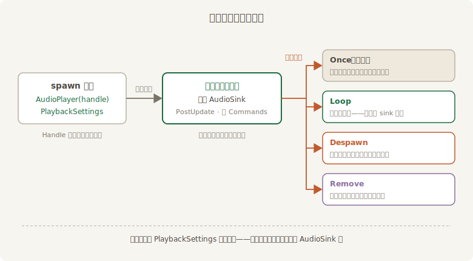
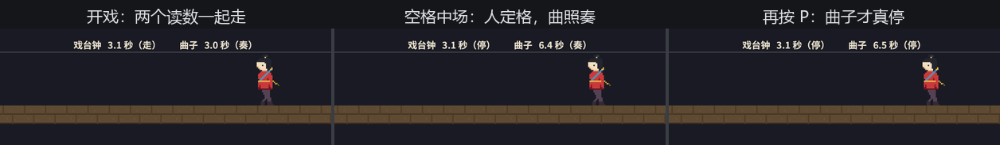

# AudioSink：播放中的缰绳

上一节末尾的扎心话再念一遍：开播之后改 `PlaybackSettings`，没有任何效果。它是**开播那一刻**的设定单，不是播放中的遥控器。遥控器另有其人——引擎接通声音时，会往实体上插一个 **`AudioSink`**（音频控制句柄组件，攥着正在响的那路声音的实时控制权）。`AudioPlayer` 的文档把交接写得很清楚：Bevy 开始播放时插入 `AudioSink`，此后播放中的一切控制走它。

“开播那一刻”究竟是哪一刻？这事关系到你的系统什么时候能查到 sink，值得让场记做一次精确的时序测量：

```rust
{{#include ../../code/ch19-audio/examples/listing-19-05.rs:watch}}
```

<span class="caption">Listing 19-5：场记的时序台账——递谱、到货、上岗各在第几帧（examples/listing-19-05.rs）</span>

```console
cargo run -p ch19-audio --example listing-19-05
```

```text
琴师：曲谱递上去了。场记，盯着后台，看引擎哪一帧把缰绳递过来。
场记：第 1 帧——查 AudioSink：还没有。
场记：第 2 帧——曲谱到货。
场记：第 3 帧——AudioSink 上岗。音量 Linear(1.0)，速度 ×1，暂停 false，进度 0.72 秒。
```

台账上有两个间隔。第一个在到货：`load` 是异步的（第 14 章），这支十秒的小曲子也要到第 2 帧才有库房广播 `LoadedWithDependencies`——装卸工得跟首帧赛跑，文件小到极致也未必赶得上当帧；换大文件或慢磁盘，还会再晚几帧。第二个间隔才是本节的正题：**到货那一帧照样查不到 sink**。引擎的开播系统住在 `PostUpdate`：它看到“有 `AudioPlayer`、资产已到货、还没有 sink”的实体，才创建声音通路、用 `Commands` 把 `AudioSink` 插上去——命令要到同步点才落账（第 6 章的规矩），所以 **sink 最早也得在到货的下一帧才查得到**。

末行还藏着一个数：sink 上岗被看见的那一刻，`position()` 已经走到 0.72 秒。开播发生在上一帧末的 `PostUpdate`，而启动初期渲染管线还在热身，第 2 帧到第 3 帧之间隔了小一秒的墙钟时间——声卡可不等渲染，先把曲子放出去了。声音一旦交出去就自顾自走，这个脾气本节后半场还要正面撞上一回。

这个时序决定了惯用写法：查 sink 的系统永远做好“它还不在”的准备——`Query` 加 `let Ok(sink) = q.single() else { return; }`，或者干脆用 `Single` 让系统在 sink 上岗前整个跳过（第 4 章讲过：`Single` 校验失败，系统静默歇班）。本章的例子两种都用。

至此一个发声实体的一生可以画全了——从 spawn 到上岗，再到播完后的四岔路：



<span class="caption">Figure 19-2：一个发声实体的一生——开播之后的一切控制都从 AudioSink 拧</span>

拿到 sink，操作面板就全亮了，方法定义在 `AudioSinkPlayback` 这个 trait 上（prelude 里有，不用额外引）：`pause()` 与 `play()` 一对、`toggle_playback()` 一键切换、`is_paused()` 查状态；`set_speed()` 播放中变速（连音高一起，上一节的脾气它全保留）；`position()` 报进度；`stop()` 是不可逆的终停；`empty()` 问“还有的播吗”；还有一套 `mute()`/`unmute()`/`toggle_mute()` 静音三件套——静音不忘音量，恢复时原样找回。

## 中场事故：戏停了，曲没停

操作面板最当用的场合是暂停。但“暂停”这个词，第 18 章已经埋了一桩悬案——当时说 `Time<Virtual>` 一停，凡读 `Res<Time>` 的系统拿到的 delta 都是零，整台戏应声定格。那音乐呢？老雷按老办法喊中场，琴师在一旁备着自己的开关，两人当场对质：

```rust
{{#include ../../code/ch19-audio/examples/listing-19-06.rs:two_pauses}}
```

<span class="caption">Listing 19-6（其一）：两个中场开关——老雷拧戏台钟，琴师拧 AudioSink（examples/listing-19-06.rs）</span>

读数牌把两本账并排亮出来，谁停谁走一目了然：

```rust
{{#include ../../code/ch19-audio/examples/listing-19-06.rs:hud}}
```

<span class="caption">Listing 19-6（其二）：读数牌——戏台钟的 elapsed 与曲子的 position 并排走</span>

```console
cargo run -p ch19-audio --example listing-19-06
```

空格按下去，台上的阿燕一步定住——可耳机里的序曲**照奏不误**。控制台与读数牌都对得上：

```text
老雷：空格中场。P 是琴师的活——两个开关，各管各的。
老雷：中场——台上都歇了。听听，琴怎么还在响？
老雷：开戏。
琴师：压弦。（sink.is_paused = true）
琴师：续上，进度一秒没丢。
```



<span class="caption">Figure 19-3：中场两停对照——戏台钟停在 3.1 秒，曲子的 position 自顾自走到 6.4 秒；按 P 才真停</span>

中间那幅是铁证：戏台钟定在 3.1 秒（停），曲子的 `position()` 涨到 6.4 秒（奏）。**暂停游戏不等于暂停音频**。道理不玄：`Time<Virtual>` 的暂停，本质是让“每帧读 delta 干活”的系统集体拿到零——可音频根本不是被你的系统一帧帧推着走的。开播那一刻，整段声音的供给线就交到了声卡一侧的音频线程手里，引擎这边的调度快慢、暂停与否，它一概不知。能拧动它的只有 sink 上的阀门。

所以暂停菜单的完整动作是两句话：`time.pause()` 定住台上的人，**再遍历 sink 把声音也按住**。第 18 章的暂停体系到这里才补上最后一块——本章压轴的《首演》会把这两句话写成一个系统。手感上还有一处细节值得按 P 体验：恢复播放时进度从 6.5 秒接着走，一毫秒没丢——`pause()` 是掐住供给线，不是掐断。

缰绳到手，下一个自然的念头是拧音量。`set_volume` 也在这块面板上，但它收的参数 `Volume` 自带一套单位学问，还牵出一道“拧了却不灵”的总闸——下一节专门算这笔账。
