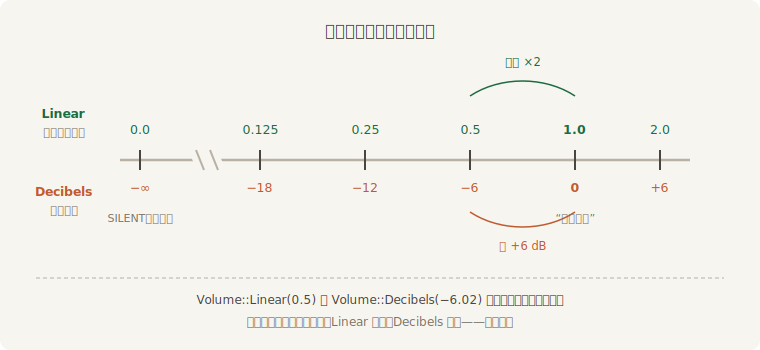

# 音量：两把尺子与一道总闸

19.1 节给 BGM 压音量时写过 `Volume::Linear(0.6)`，当时只说“先记住 1.0 是原样”。现在把这笔账算清。`Volume` 是个两变体的枚举——同一个音量，两种记法：

- **`Volume::Linear(f32)`**——线性尺：振幅的倍数。`1.0` 原样播放，`0.5` 振幅减半，`2.0` 加倍，`0.0` 静音（有现成常量 `Volume::SILENT`）；
- **`Volume::Decibels(f32)`**——分贝尺：对数刻度。`0.0` 原样播放，每 −6 dB 振幅约减半，每 +6 dB 约加倍，静音是负无穷。

两把尺子量的是同一根轴，`to_linear()` 与 `to_decibels()` 随时互换——`Linear(0.5)` 和 `Decibels(-6.02)` 是同一个音量：



<span class="caption">Figure 19-4：Linear 与 Decibels——等距的分贝就是等比的线性</span>

为什么要第二把尺？因为人耳对响度的感受更接近对数而不是线性：从 `Linear(1.0)` 拧到 `0.9` 几乎听不出，从 `0.1` 拧到 `0.0` 却是“有声”与“无声”之别。等距好使的场合——音量滑条、淡入淡出——用分贝尺步进，听感才均匀。而做乘除运算（比如叠上总闸）时线性尺直观：振幅倍数直接相乘。`Volume` 连乘法都替你定义好了：`Linear` 相乘与 `Decibels` 相加，结果相同。

## 琴师的旋钮

播放中调音量，照上一节的规矩走 sink。这里有个容易撞上的签名细节：`pause()`、`set_speed()` 这些方法收 `&self`，**`set_volume()` 却要 `&mut self`**——查询得写成 `Query<&mut AudioSink>`，借用规则照第 4 章的老规矩办：

```rust
{{#include ../../code/ch19-audio/examples/listing-19-07.rs:tune}}
```

<span class="caption">Listing 19-7（其一）：+/- 步进音量——increase_by_percentage 在线性域干活（examples/listing-19-07.rs）</span>

```console
cargo run -p ch19-audio --example listing-19-07
```

```text
老雷：合成开始——曲子的音量琴师管，全场的总闸我管。
琴师：拧到线性 1.25（+1.9 dB）。
琴师：拧到线性 0.94（-0.6 dB）。
```

`increase_by_percentage(25.0)` 按百分比步进，传负数就是回拧；两行台词同时报出两把尺子的读数，对照 Figure 19-4 正好对得上号。

## 老雷的总闸

单声的音量会拧了，全场呢？`bevy_audio` 提供了一个 **`GlobalVolume`**（全局音量资源）：每路声音开播时的实际音量，是 `PlaybackSettings.volume` 乘上它。初值可以在装插件时配（`AudioPlugin { global_volume, .. }`），运行时它就是个普通 Resource，`ResMut` 拿来就改。老雷大手一拧，把总闸砍到四分之一——然后撞上本节的坑：

```rust
{{#include ../../code/ch19-audio/examples/listing-19-07.rs:master}}
```

<span class="caption">Listing 19-7（其二）：拧总闸，顺手对照在播声音的 sink 读数</span>

```text
鼓师：哐——（开播音量 = 1.00 × 总闸 1.00 = 1.00）
老雷：总闸拧到 0.25。
场记：在播的曲子 sink.volume() 还是 0.94——总闸没碰它，只管下一声。
鼓师：哐——（开播音量 = 1.00 × 总闸 0.25 = 0.25）
```

听感与账面一致：总闸拧下去，**正在播的曲子纹丝不动**，之后敲的锣却轻了四分之三。`GlobalVolume` 的文档原话就一句：改它不影响已经在播的音频。源码里看得更直白——这个资源只在开播那一刻被乘进 sink 的初始音量，此后再无人问津。

所以“设置菜单里的主音量滑条”不能只改 `GlobalVolume` 完事，得自己补上对存量的处理：改完总闸，**遍历所有 `AudioSink`（与下一节的 `SpatialAudioSink`）把新值设进去**。一个监听 `GlobalVolume` 变更（第 5 章的 `resource_changed` 正合用）、按各自基准音量重算的系统就够。顺带一提，官方 `audio/soundtrack.rs` 示例演示的淡入淡出，用的也是同一思路：每帧拿 sink 拧一点，`Volume::fade_towards` 负责插值。

到这里，音量始终是“一个你亲手拧的数”。但戏台上有些轻重不该由人拧——巡夜的更声走远了自然轻，贴着耳边自然响，左边来的偏左响。把“拧音量”交给几何，就是下一节的空间音频。
