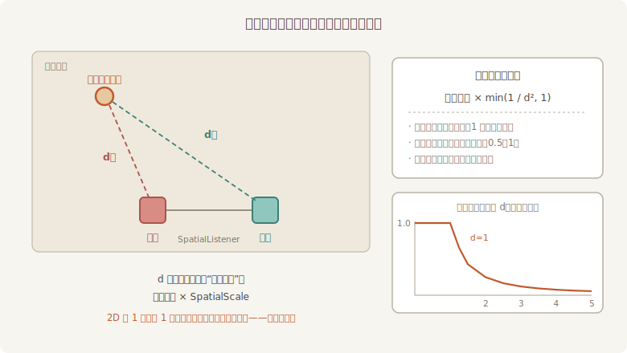

# 空间音频：远近与方位

《长风渡》有一场巡夜的重头戏：阿燕提着梆子绕台走，更声要**跟着人走**——人在左舷，声从左来；人走远了，声轻下去。到目前为止，所有声音都是“贴着耳朵响”的，没有远近，没有方位。把声音放进空间，要办两件事：给声源开**空间档**，给场上立**一对耳朵**：

```rust
{{#include ../../code/ch19-audio/examples/listing-19-08.rs:spatial_cast}}
```

<span class="caption">Listing 19-8（其一）：发声体与听者——with_spatial(true) 挂上会动的实体，SpatialListener 是一对耳朵（examples/listing-19-08.rs）</span>

声源侧只多了一个 `.with_spatial(true)`；梆子声照旧是 `LOOP`，挂在阿燕身上随她走。听者侧是新面孔 **`SpatialListener`**（空间听者组件）：它不是一个点，而是**一对耳朵**——`new(gap)` 指定双耳间距，沿自身 X 轴左右排开（它声明了 `#[require(Transform)]`，位置就是实体的位置）。我们给两只耳朵各配一块色板当可视化替身：左红右青。

## 第一坑：全程无声

按说这就齐活了。可要是就这么跑起来（不加任何别的配置），耳机里的梆子声小到近乎不存在。场记按公式把双耳增益算出来贴在台账上，全程是这样：

```text
场记：阿燕在左舷  180 像素处，左耳 0.00、右耳 0.00（sink 暂停 false）。
场记：阿燕在右舷   60 像素处，左耳 0.00、右耳 0.00（sink 暂停 false）。
```

哪儿都是 0.00。要破案得去衰减模型的源码里看一眼。Bevy 的空间音频由底层音频库 rodio 实现，模型很直白：先把声源**并成单声道**，再分给左右声道，每只耳朵的增益**各算各的**：



<span class="caption">Figure 19-5：每只耳朵各算各的账——声像系数 ×min(1/d², 1)</span>

- **衰减**按距离平方反比：`min(1/d², 1)`——一个单位以内不衰减，之后随 d² 跌落。“左边来的偏左响”主要靠它：近耳的 d 小，1/d² 大得多；
- **声像**看双耳距离差：范围 0.5 到 1，声源贴向哪只耳朵，哪只的系数越收向 0.5、对面那只越抬向 1.0。方向别读反了——这一项不是“近了更响”，而是给远耳兜底的配重，防止声像彻底偏死在一边；
- 两项相乘，就是这只耳朵实际听到的份额。

坑就藏在那个 **d** 里：它用的是**换算后的距离**，而默认换算比例是 1:1——在我们的 2D 戏台上，1 像素就是 1 个单位。阿燕离耳朵动辄两三百像素，d = 300 时衰减是 1/90000，比 −90 dB 还低——不是没声音，是衰没了。

## SpatialScale：自己定尺

修法是告诉引擎你的世界里多长算“1 个音频单位”。全局的尺配在 `AudioPlugin` 上（官方 2D 示例同款：100 像素折 1 单位）：

```rust
{{#include ../../code/ch19-audio/examples/listing-19-08.rs:app}}
```

<span class="caption">Listing 19-8（其二）：default_spatial_scale——100 像素折合 1 个音频单位</span>

`SpatialScale::new_2d` 只缩 X、Y（Z 置零，2D 里它不该参与算距离）；个别声源要用不同的尺，`PlaybackSettings` 上还有 `.with_spatial_scale(...)` 单独配。换算之后耳距 400 像素= 4 单位、巡台半径 420 像素 ≈ 4.2 单位，正好落在衰减曲线有戏的区间。

场记的台账系统按 rodio 的公式复算双耳增益——`SpatialAudioSink` 不提供增益读数接口，想看数就照源码自己算，这也顺便把公式钉进代码里：

```rust
{{#include ../../code/ch19-audio/examples/listing-19-08.rs:gains}}
```

<span class="caption">Listing 19-8（其三）：把 rodio 的衰减公式复算出来——声像 × min(1/d², 1)</span>

```rust
{{#include ../../code/ch19-audio/examples/listing-19-08.rs:report}}
```

<span class="caption">Listing 19-8（其四）：巡更台账——两秒一笔，方位、距离、双耳份额（注意查询的是 SpatialAudioSink）</span>

```console
cargo run -p ch19-audio --example listing-19-08
```

```text
老雷：熄灯，巡夜。阿燕打更，你们坐台中听远近。
场记：阿燕在左舷  180 像素处，左耳 0.53、右耳 0.07（sink 暂停 false）。
场记：阿燕在右舷   60 像素处，左耳 0.12、右耳 0.34（sink 暂停 false）。
场记：阿燕在右舷  300 像素处，左耳 0.04、右耳 0.48（sink 暂停 false）。
场记：阿燕在右舷  301 像素处，左耳 0.04、右耳 0.47（sink 暂停 false）。
场记：阿燕在右舷   61 像素处，左耳 0.12、右耳 0.34（sink 暂停 false）。
场记：阿燕在左舷  179 像素处，左耳 0.53、右耳 0.07（sink 暂停 false）。
场记：阿燕在左舷  419 像素处，左耳 0.10、右耳 0.03（sink 暂停 false）。
```

这回有远近也有方位了，七笔正好一个来回：阿燕贴近左耳时左 0.53、右 0.07，更声明明白白偏左；在右舷台口折返，连着两笔都停在三百像素上下；回程的数字原路镜像——增益只认几何位置，不认走向；最后到左舷尽头，两耳都只剩零头。耳机里听到的与台账一致——梆子声跟着她从左滑到右，远了轻、近了重。


<span class="caption">Figure 19-6：巡夜——贴着左耳与远在右舷尽头，HUD 报换算后的距离</span>

还有三处细则，都是源码里写明的脾气：

- **开播之后插上的控制句柄是 `SpatialAudioSink`**，不是 `AudioSink`——同一套 `AudioSinkPlayback` 面板（暂停、音量、变速都在），但它是另一个组件类型，查询要分开写。上一节“sink 要等开播才上岗”的时序它一并继承；
- **位置追踪是全自动的**。引擎在 `PostUpdate`（排在 Transform 传播之后，读的是第 12 章那本 `GlobalTransform` 总账）盯着声源与听者的位置变化，随时把新坐标递给声卡那侧——你只管挪 `Transform`。声卡侧以约 10 毫秒的粒度跟进，肉耳听不出迟滞；
- **听者全场只该有一个**。立了两个，引擎会发条警告然后只认第一个；声源那头若忘了给 `Transform`，也会得到一条警告并按原点处理。另外按文档的交底：Bevy 目前的空间音频就是“立体声声像 + 衰减”，不做 HRTF 这类高级头部建模——2D 游戏与多数 3D 场合够用，发烧需求得找第三方 crate。

文场有曲，武场有锣鼓，巡夜有了远近方位——零件齐了。下一节把它们装回同一台戏，给《长风渡》开演。
