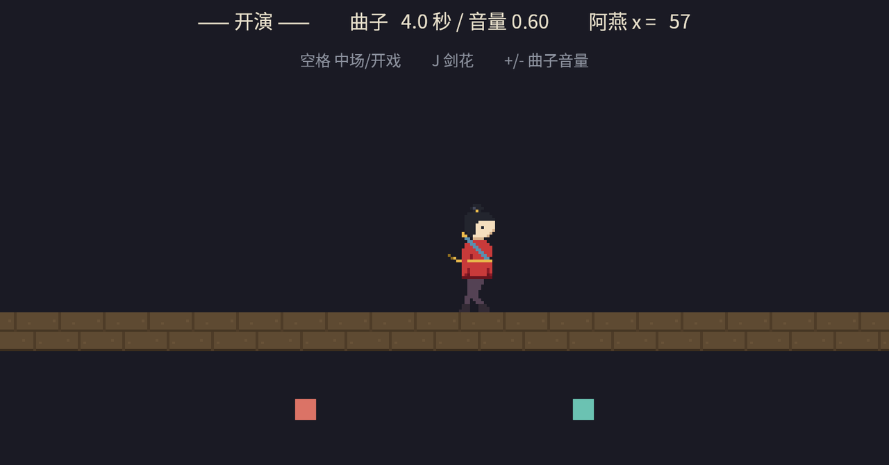

# 首演之夜

《长风渡》开演。这台戏把全章的零件装回一处，每个角色一个系统，分工与排期如下：

- **琴师**：循环序曲压音量起播（19.1），+/- 键走 sink 拧音量（19.4）；
- **武场**：只听 cue 消息敲家伙——锣与鼓都是 `DESPAWN` 的一次性实体（19.2）；
- **阿燕**：巡台演员兼发声体，梆子开着空间档随她走（19.5）；
- **老雷**：掌中场——这回吸取 19.3 的教训，戏台钟与全场声音一起停。

武场的戏单先立起来。谁需要锣鼓点，往通道里投一条消息——这正是第 7 章碰碰车场的解耦：DJ 当年喊“砰！”的那个位置，今天换成真锣真鼓，而**写读两端的代码形状一点没变**：

```rust
{{#include ../../code/ch19-audio/src/main.rs:cue}}
```

<span class="caption">Listing 19-9（其一）：cue 是消息——要什么家伙，类型自己说话（src/main.rs）</span>

```rust
{{#include ../../code/ch19-audio/src/main.rs:writers}}
```

<span class="caption">Listing 19-9（其二）：两个写者互不相识——台步折返发亮相 cue，键盘发剑花 cue；读者只有武场一个</span>

阿燕的台步系统根本不知道世上有锣；键盘系统也不知道。武场收到什么敲什么，一声一个 `DESPAWN` 实体，散场后台干干净净——第 7 章欠的音效，连本带利还上了。

中场是第二处点题。19.3 节的事故报告写明：戏台钟管不到声卡，暂停要两套开关一起拧。`AudioSink` 和 `SpatialAudioSink` 是两个组件，各查各的：

```rust
{{#include ../../code/ch19-audio/src/main.rs:intermission}}
```

<span class="caption">Listing 19-9（其三）：完整的中场——戏台钟、普通 sink、空间 sink，三把闸一起落</span>

完整代码如下，余下的零件（巡台、动画、读数牌）都是前几节与前几章的旧识：

```rust
{{#include ../../code/ch19-audio/src/main.rs}}
```

<span class="caption">Listing 19-9（其四）：完整示例——《长风渡》首演（src/main.rs）</span>

```console
cargo run -p ch19-audio
```

```text
老雷：《长风渡》首演。文场起曲，武场听 cue，阿燕巡台。
武场：台口亮相——哐！
武场：剑花——咚！
老雷：中场——这回连琴带梆子全歇。
老雷：开戏——钟、曲、更声一起回来。
琴师：曲子拧到线性 0.75。
武场：台口亮相——哐！
```



<span class="caption">Figure 19-7：《长风渡》首演——文场、武场、巡更、观众席的耳朵各就各位</span>

耳机里这台戏是立体的：序曲铺底，阿燕每到台口锣声应声而起，梆子的更声从左舷滑到右舷、近重远轻；空格一按，连钟带声一片寂静，再按一下整台戏原地接着演——曲子的进度一秒没丢。

## 小结

- **声音是资产，发声是实体**：`AudioPlayer(handle)` spawn 即播，资产没到货就等到货那刻开播。格式按 feature 开闸——默认只有 `vorbis`（.ogg），`wav`/`mp3`/`flac` 自取；没开 feature 的格式能加载（loader 按资产类型选中、只搬字节），到解码才 panic `UnrecognizedFormat`
- **`PlaybackSettings` 是开播设定单**：`AudioPlayer` 的 required component，默认 `ONCE`。四档 `PlaybackMode`——`Once` 播完留壳（不可复用，重播得拆装音频组件），`Loop` 不完，`Despawn` 连子实体拆台（一次性音效的标准答案），`Remove` 卸件留体。`speed` 快慢与音高绑定，一份素材多个音色
- **播放中的控制走 `AudioSink`**：引擎开播时在 `PostUpdate` 经 `Commands` 插上，最早下一帧可查——查询永远备好“还不在”的退路。面板：`pause`/`play`/`toggle_playback`、`set_volume`（要 `&mut`）、`set_speed`、`position`、`stop`、`empty`、`mute` 三件套
- **暂停游戏不等于暂停音频**：声音的供给线在声卡侧线程，`Time<Virtual>` 拧不动它。中场 = `time.pause()` 加遍历全部 sink `pause()`——两个组件类型都要遍历
- **`Volume` 有两把尺**：`Linear` 是振幅倍数（1.0 原样、`SILENT` 静音），`Decibels` 是对数刻度（0 原样、±6 dB 约一倍）；等距的分贝就是等比的线性，滑条与淡入淡出用分贝尺听感才匀。`GlobalVolume` 总闸只乘进**新开播**的声音，实时总闸要自己遍历 sink 补一遍
- **空间音频 = 声像 + 衰减**：声源 `.with_spatial(true)`，场上立一个 `SpatialListener`（一对耳朵，全场一个）；每只耳朵的份额 = 声像系数 × min(1/d², 1)，d 是 `SpatialScale` 换算后的“音频单位”——2D 像素世界必须自己定尺（如 1/100），否则全程衰没。位置追踪全自动，控制句柄是另一个组件 `SpatialAudioSink`

## 练习

1. **重播按钮**：给 Listing 19-3 加一个 R 键——对最早 spawn 的那具“空壳”执行 `commands.entity(e).remove::<AudioSink>()`，验证 19.2 节的偏方：锣真的从头再响。再连按两下 R 体会它的别扭处（每次都从头来、同一实体只有一路声音），想想为什么一次性音效还是 `DESPAWN` 省心。
2. **治本的总闸**：给《首演》接上真正的主音量——V 键改 `GlobalVolume`，再写一个 `run_if(resource_changed::<GlobalVolume>)`（第 5 章的零件）的系统遍历两种 sink 重设音量，验证这回在播的曲子也应声变轻。
3. **淡入淡出**：中场不要急刹——用一只 0.5 秒的 `Timer`（第 18 章）驱动 `Volume::fade_towards`，让曲子在中场时滑进寂静、开戏时滑回来。提示：淡出走完再 `pause()`，省得静音了还空转。
4. **慢动作的配乐难题**：把第 18 章的换挡（`set_relative_speed`）接进《首演》，台上慢放时让 BGM 的 `set_speed` 跟着同步。听一耳朵就明白代价——变速即变调，半速的序曲低了八度不止。想想商业游戏慢动作时 BGM 为什么通常不跟着慢，或者只把音效（而非音乐）交给变速。
5. **听者上路**：参考官方 `audio/spatial_audio_2d.rs`，把《首演》的听者改成方向键可控。阿燕站定不动，你提着耳朵走向她——验证声像与衰减只关心**相对**几何，谁动都一样。

## 下一章

到这一章为止，做一个 2D 游戏需要的零件全部到齐：ECS 的世界观（3～11 章）、画面与坐标（12～16 章）、输入（17 章）、时间（18 章）、声音（本章）。第 20 章不再发新零件——从一个空目录开始，把它们组装成一个完整的游戏：带菜单、计分、音效的 Breakout（打砖块）。你在本章学的每一手都会在那里再过一遍实战：碰撞消息驱动 `DESPAWN` 音效、暂停菜单里两套开关一起拧、音量滑条背着 `GlobalVolume` 的坑。开工见。
