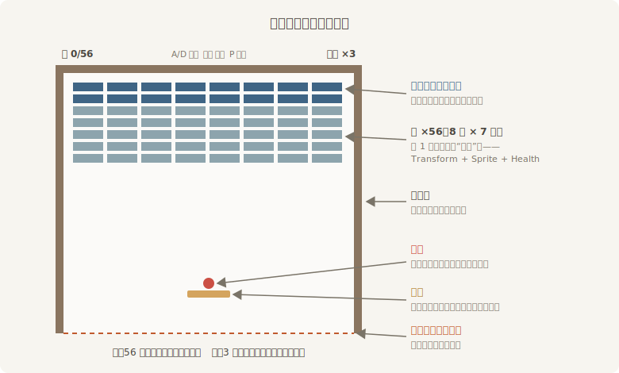

# 项目实战 I：完整的 2D 游戏

第 1 章建立 ECS 思维模型时，我们拿一张表举过例：挡板一行、球一行、砖块五十六行。当时说，这是“第 20 章我们要亲手实现的打砖块游戏”。账本翻到了这一页。

本章不教任何新概念——前十九章的积木已经齐了：ECS 的世界观与状态机（第 3～11 章），坐标、相机、资产、Sprite 与文字（第 12～16 章），输入（第 17 章）、时间（第 18 章）、声音（第 19 章）。本章只发一张图纸，从一个空空的 `main.rs` 出发，把它们组装成一个**完整的游戏**：有菜单，有计分，有音效，有胜负。体例向《The Rust Book》的实战章看齐：每一节结束，你手里都是一个能跑、且比上一节多点本事的程序。

游戏叫《打瓦》——夜戏散场，戏班的伙计们不肯散，在后台支起一条长凳，拿绣球砸瓦片玩。规则四句话说完：

- 一条**条凳**，左右推，是你唯一摸得着的东西；
- 一只**绣球**，碰墙碰凳反弹，碰瓦砸瓦；落进台口下的沟就没了，一局共三只；
- **五十六片瓦**，8 列 × 7 行，顶上两行是带釉的筒瓦，要砸两下；
- 瓦砸完是“满堂彩”，绣球用尽是“绣球散尽”。



<span class="caption">Figure 20-1：《打瓦》的台面与规矩——第 1 章那张表的施工图</span>

对照第 1 章那张表看这张图纸：砖块行的 `Health` 列将在本章兑现成一个真组件——筒瓦 2 点耐久、素瓦 1 点。施工与蓝图也有出入，这很正常：球最终用的是 `Mesh2d` 而不是 `Sprite`（第 15 章说过“几何形状用 Mesh2d”，打砖块两边都会用到——说的就是今天），而挡板那一列 `Velocity` 没有兑现——条凳的速度长在你手指上，不需要单独记账。

一路的施工顺序，也是本章的目录：

- **搭台**——场地、条凳，以及从第一天就立对的输入骨架（意图层 + 鼓点收集站）；
- **球与反弹**——球上场先穿墙给你看，然后用 `bevy_math` 的 bounding 模块亲手写碰撞；
- **瓦阵**——8 × 7 = 56 片，生成、击碎与耐久；
- **记分**——碰撞改发消息，记分牌只管听：第 7 章的解耦真正上岗；
- **开幕与闭幕**——`Menu / Playing / GameOver` 状态机、发球、绣球命数与胜负；
- **锣鼓与中场**——音效、BGM、暂停子状态：第 19 章预告的三笔账一并清偿；
- **拆台重组**——main.rs 膨胀到六百行之后，按领域拆成四个 Plugin：这是本章唯一的新课；
- **终场**——完整走一遍流程，盘点全书的脉络怎么收拢进这一个游戏。

配套 crate 是 `code/ch20-breakout`。`Cargo.toml` 与第 19 章同款——音效是脚本合成的 `.wav`，记得开 `wav` feature：

```toml
{{#include ../../code/ch20-breakout/Cargo.toml:deps}}
```

`assets/` 里的家当照旧全部脚本化：四个音效（弹响、瓦碎、胜负定音）由 `scripts/make_ch20_assets.py` 用 Python 标准库现场合成；BGM 与落沟的闷鼓直接复用第 19 章的合成产物，中文字体复用第 16 章的子集字体。`py -3.11 scripts/make_ch20_assets.py` 一键就位。

每个阶段版本都是 `examples/` 下一个自包含的完整程序（`listing-20-01.rs` 到 `listing-20-07.rs`），最终的多文件版本在 `src/`。想直接看成品：

```console
cargo run -p ch20-breakout
```

开工。
