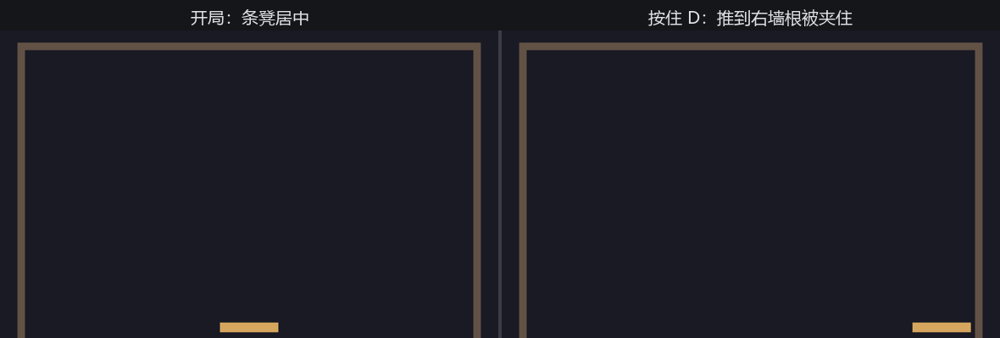

# 搭台：场地与条凳

万事从一个空 `main.rs` 开始。第一晚的目标很克制：把台面围出来，把条凳摆上去，让它听使唤。

## 常量先行

打砖块的场地是一堆“写死的几何”：墙在哪、凳多大、球多快。把它们全部提成常量、集中放在文件头上，是官方 `breakout.rs` 的做法，也是值得照搬的工程习惯——后面每一节都会回来改这几行，而不是满文件找魔法数字：

```rust
{{#include ../../code/ch20-breakout/examples/listing-20-01.rs:consts}}
```

<span class="caption">Listing 20-1（其一）：场地几何与配色——一处声明，处处引用（examples/listing-20-01.rs）</span>

坐标的语境是第 12、13 章定下的：默认 `Camera2d` 下原点在窗口正中、y 向上，1 个世界单位对应 1 逻辑像素。所以 `TOP_WALL = 250.0` 就是“顶墙中心线在窗口中心上方 250 像素”。注意 `ARENA_BOTTOM` 只是侧墙垂到的深度——**底边没有墙**。那道口子是沟，是这个游戏全部紧张感的来源，第 20.5 节它会开始吃球。

组件只有一个。条凳是场上唯一听玩家使唤的东西，给它一个标记（第 3 章的老手艺）：

```rust
{{#include ../../code/ch20-breakout/examples/listing-20-01.rs:paddle}}
```

<span class="caption">Listing 20-1（其二）：Paddle 标记组件</span>

## 输入骨架：第一天就立对

最偷懒的推凳写法是在系统里直接查 `ButtonInput<KeyCode>`。能跑，但第 17 章末尾的教训言犹在耳：设备代码和玩法代码一旦长在一起，撕开就要动刀。这个项目从第一行就按**意图层**的骨架搭——设备只负责翻译，玩法只认意图：

```rust
{{#include ../../code/ch20-breakout/examples/listing-20-01.rs:intent}}
```

<span class="caption">Listing 20-1（其三）：意图层——键盘的数字量与摇杆的模拟量殊途同归</span>

`Intent` 眼下只有一项 `steer`，每帧由 `collect_intent` 清账重写（第 17 章说的“瞬时意图”寿命规矩）。键盘贡献 ±1 的数字量，手柄的摇杆把模拟量原样递交（死区照第 17 章的账自己留），最后 `clamp` 进 [-1, 1]——家里有手柄的读者，此刻已经可以用摇杆推凳了，这就是意图层“加设备是纯增量”的甜头。

`collect_intent` 的住址有讲究。推凳是要参与碰撞的物理运动，第 18 章的口诀说它该住 `FixedUpdate`；而输入收集必须每帧跑、还得赶在本帧鼓点之前——第 18.6 节给过现成答案：`RunFixedMainLoopSystems::BeforeFixedMainLoop`。骨架立对了，等 20.5 节发球键（一个真正的瞬时输入）加进来时，一行缓冲代码都不用补。

## 推凳

```rust
{{#include ../../code/ch20-breakout/examples/listing-20-01.rs:move}}
```

<span class="caption">Listing 20-1（其四）：move_paddle——速度乘固定步长，两头让墙拦住</span>

`Single`（第 4 章）拿到唯一的条凳；`Res<Time>` 在 `FixedUpdate` 里自动照出固定钟（第 18.5 节的镜子），每拍恰好一个步长。`reach` 的算式值得读一遍：右墙中心线，减半个墙厚，减半个凳长，再留 `PADDLE_MARGIN` 的缝——凳子最远只能贴到墙根，`clamp` 一行钉死。

## 装配与开张

```rust
{{#include ../../code/ch20-breakout/examples/listing-20-01.rs:main}}
```

<span class="caption">Listing 20-1（其五）：App 装配——窗口标题、清屏色、两个调度里的三个系统</span>

`setup_court` 负责搭台。三面墙没有专门的组件——它们目前只是三张 `Sprite::from_color` 的色块（第 15 章），位置与尺寸从常量算出来，用一个数组循环生成：

```rust
{{#include ../../code/ch20-breakout/examples/listing-20-01.rs:setup}}
```

<span class="caption">Listing 20-1（其六）：搭台——三面墙、一条凳</span>

运行：

```console
cargo run -p ch20-breakout --example listing-20-01
```

```text
老雷：散场不散人——后台的《打瓦》摊子支起来了。
```



<span class="caption">Figure 20-2：搭台完成——条凳听键盘与摇杆使唤，推到头被墙夹住</span>

夜色幕布、木框台面、一条会跑的凳子。A/D 或方向键推一推，顶到墙根就停——`clamp` 在干活。台子有了，缺一只球。
