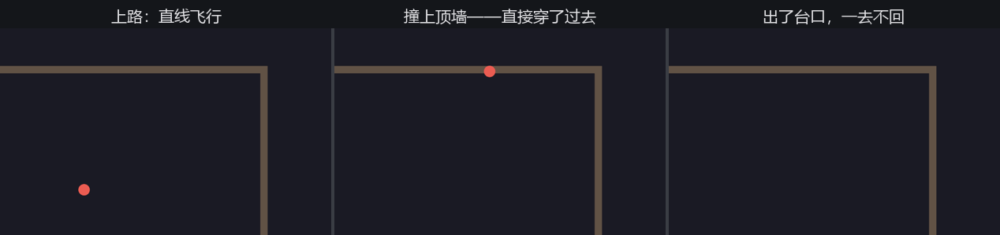
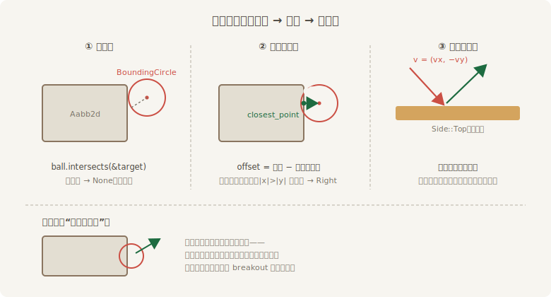

# 球与反弹

绣球上场。先让它动起来——动起来才会暴露问题。

## 放球

球要两样东西：一个身份，一个速度。速度做成独立组件而不是写死在某个系统里，是 ECS 的本能（第 1 章那张表里它就是一列）——谁挂上 `Velocity`，谁就归移动系统管：

```rust
{{#include ../../code/ch20-breakout/examples/listing-20-02.rs:ball}}
```

<span class="caption">Listing 20-2（其一）：Ball、Velocity 与物理第一课（examples/listing-20-02.rs）</span>

`#[derive(Deref, DerefMut)]` 让 `velocity.x` 直达内层 `Vec2`，官方 breakout 同款省字法。`apply_velocity` 与 `move_paddle` 同住 `FixedUpdate`、用 `.chain()` 排好先后——为什么物理坚持上鼓点而不是住 `Update`，第 18.4 节给过两条命一样的理由：**稳定**（步长钉死，碰撞参数处处一致）与**确定**（同样输入同样结果）。代价是画面每秒只更新 64 次而不是每帧——18.6 节的插值能治，本章 64 Hz 肉眼无感，按下不表（练习里有）。

球本身用 `Mesh2d` 铸形、`ColorMaterial` 上色——第 15 章“不用画的道具”，圆形归网格管：

```rust
{{#include ../../code/ch20-breakout/examples/listing-20-02.rs:spawn_ball}}
```

<span class="caption">Listing 20-2（其二）：绣球——圆网格加纯色材质</span>

出球点和方向暂时写死成两个“试运行”常量（正式的发球规矩 20.5 节才立）：

```rust
{{#include ../../code/ch20-breakout/examples/listing-20-02.rs:ball_consts}}
```

<span class="caption">Listing 20-2（其三）：试运行的出球参数</span>

运行：

```console
cargo run -p ch20-breakout --example listing-20-02
```

球从台心出发，斜着向右上飞——然后**笔直穿过顶墙**，出了台口，一去不回：



<span class="caption">Figure 20-3：放球第一课——画面上的墙拦不住任何东西</span>

这一幕值得记住。`Sprite` 只是**画**，`Transform` 只是**位置**——渲染器照单全画，但没有任何机制规定两张画不能重叠。穿墙不是 bug，是默认行为：**碰撞是逻辑，逻辑要自己写**。完整的物理引擎（碰撞形状、刚体、摩擦、约束求解）是大工程，生态里有 avian、bevy_rapier 这样的现成方案（附录 D 的候选）；但打砖块的碰撞只有“圆撞盒”一种，亲手写一遍，二十行，值得。

## bounding：数学工具箱的最后一格抽屉

第 12 章逛 `bevy_math` 工具箱时，有一格抽屉一直没开：`bevy::math::bounding`——**包围体**（bounding volume）模块。它提供几种把物体“近似成简单几何”的形状，以及它们之间的相交判定：

- **`Aabb2d`**——轴对齐包围盒（Axis-Aligned Bounding Box）：一个不旋转的矩形。`Aabb2d::new(center, half_size)` 用**中心加半尺寸**构造——注意是半宽半高，不是 min/max 角点，传错尺寸碰撞范围就大一倍；
- **`BoundingCircle`**——包围圆：`new(center, radius)`；
- **`IntersectsVolume`** trait——`a.intersects(&b)`，一句话判交。

墙、凳、瓦全是不旋转的矩形，球是圆——`Aabb2d` 配 `BoundingCircle`，正好。先给碰撞参与者发登记证：

```rust
{{#include ../../code/ch20-breakout/examples/listing-20-03.rs:collider}}
```

<span class="caption">Listing 20-3（其一）：Collider——登记自己外接盒的尺寸（examples/listing-20-03.rs）</span>

为什么要登记尺寸，而不是现场从 `Sprite` 里读？因为“画多大”和“撞多大”是两件事——它们今天恰好相等，明天加个受击闪烁特效就不等了。数据各管各的，是第 3 章组件建模的本分。墙和凳的 spawn 各补一行 `Collider { size }`：

```rust
{{#include ../../code/ch20-breakout/examples/listing-20-03.rs:spawn_with_collider}}
```

<span class="caption">Listing 20-3（其二）：墙与凳领证</span>

## 撞上哪一面

光知道“撞了”不够——反弹要知道**撞的是哪一面**：撞顶面该翻转垂直速度，撞侧面该翻转水平速度。判面的算法来自官方 breakout，三步走：

```rust
{{#include ../../code/ch20-breakout/examples/listing-20-03.rs:hit_side}}
```

<span class="caption">Listing 20-3（其三）：hit_side——圆撞盒，由“盒上最近点”判面</span>



<span class="caption">Figure 20-4：圆撞盒三步——判交、判面、翻速度</span>

`closest_point` 把圆心“夹”到盒面上，得到盒上离圆心最近的点；圆心减去它，得到的 `offset` 指向圆心所在的那一侧。**哪根轴的分量长，就是撞了哪个朝向的面**：`offset.x` 占主导且为正，球在盒子右边——撞的是右面。第 12 章的向量算术，在这里赚回学费。

碰撞系统拿球逐个对照所有登记过的盒子：

```rust
{{#include ../../code/ch20-breakout/examples/listing-20-03.rs:check_collisions}}
```

<span class="caption">Listing 20-3（其四）：check_collisions——迎面才反弹</span>

两处细节：

- **借用分得开**：球用 `Single` 拿 `&mut Velocity` 加 `&Transform`，盒子们用 `Query` 拿 `&Transform` 加 `&Collider`——可写的只有 `Velocity`，与盒子们的只读访问互不相犯，第 4 章的借用规则一次过；
- **“迎面才反弹”不是洁癖**。`match` 里每个分支都多问了一句速度方向：只有球迎着撞面飞才翻号。少了这一问，球在贴边滑行时会被反复拍回盒子里，贴着墙面抽搐——Figure 20-4 底部画了这个事故。官方 breakout 注释里管这叫“防止球卡进板子”。

调度照旧 `.chain()`：先推凳，再走球，再查碰撞——固定的结算顺序是第 6 章排序工具的日常应用：

```rust
{{#include ../../code/ch20-breakout/examples/listing-20-03.rs:main}}
```

<span class="caption">Listing 20-3（其五）：三个系统在鼓点上排成一队</span>

```console
cargo run -p ch20-breakout --example listing-20-03
```

这一版**可以玩了**：球在三面墙之间弹来弹去，凳子接得住就一直接。亲手验证一下反弹的手感——顶墙弹下来、右墙折回去，每一下都是刚才那二十行的功劳。接不住呢？球落进沟里，一去不回，游戏静悄悄地“结束”了——没有提示，没有重来，只能关窗重开。沟眼下只是个出口，规则要等 20.5 节才立；先去造点可砸的东西。
