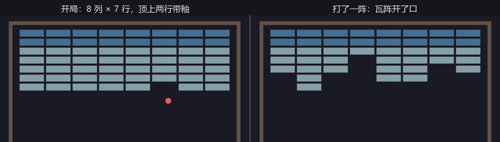

# 瓦阵

球在空台子上弹得再欢也不是游戏。该铺瓦了——8 列 × 7 行，整整五十六片，第 1 章那张表说好的数。

## Health：那一列终于兑现

第 1 章的表给砖块留了一列 `Health`，当时它只是示意。现在它是一个真组件：

```rust
{{#include ../../code/ch20-breakout/examples/listing-20-04.rs:health}}
```

<span class="caption">Listing 20-4（其一）：Health——瓦的耐久（examples/listing-20-04.rs）</span>

注意瓦**没有**专门的 `Brick` 标记组件。在这个游戏里，“瓦”的身份就是“有耐久的碰撞体”——`Health` 这一列本身就定义了它。第 1 章那张表没骗你：砖块行恰好就是 `Transform + Sprite + Health`（外加一张碰撞登记证）。

瓦阵的几何照旧常量先行，配色分两档：

```rust
{{#include ../../code/ch20-breakout/examples/listing-20-04.rs:brick_consts}}
```

```rust
{{#include ../../code/ch20-breakout/examples/listing-20-04.rs:brick_colors}}
```

<span class="caption">Listing 20-4（其二）：瓦阵常量——8 × 7 = 56，顶上两行带釉</span>

## 铺瓦

生成是一个双层循环，唯一要动笔算的是**第一片瓦的圆心**在哪。整阵宽度 = 列数 × (瓦宽 + 缝) − 最后多算的一条缝；左移半个阵宽、再右移半片瓦宽，就是第 0 列的中心——Bevy 的 `translation` 指的是中心点而不是左上角（第 12 章），网格计算都得带着这半片的修正：

```rust
{{#include ../../code/ch20-breakout/examples/listing-20-04.rs:spawn_bricks}}
```

<span class="caption">Listing 20-4（其三）：铺瓦——行号定耐久与配色，列号定位置</span>

自上而下数，前 `GLAZED_ROWS` 行是筒瓦：2 点耐久、釉色更深。五十六个实体一个循环出齐——第 3 章 `Commands` 排队生成的日常。

## 碎瓦

碰撞系统的盒子查询多带一项 `Option<(&mut Sprite, &mut Health)>`（第 4 章的可选查询组合）：墙和凳没有 `Health`，拿到 `None`，只反弹；瓦拿到 `Some`，先反弹，再扣耐久：

```rust
{{#include ../../code/ch20-breakout/examples/listing-20-04.rs:check_collisions}}
```

<span class="caption">Listing 20-4（其四）：碰撞的瓦分支——扣到零就 despawn，没扣完就掉釉</span>

`Option<(A, B)>` 这个写法要求两个组件**都在**才给 `Some`——墙上有 `Sprite` 没 `Health`，照样走 `None` 分支，正合适。掉釉的表现很直接：把 `sprite.color` 改成素瓦色——筒瓦挨第一下，釉面剥落、颜色变浅，玩家一眼读懂“这片还要再来一下”。碎瓦则是 `commands.entity(entity).despawn()`，第 3 章的延迟语义在这里是安全网：despawn 排队到同步点统一落地，本拍内这片瓦还能继续参与判定，不会出现“循环到一半实体消失”的尴尬。

运行：

```console
cargo run -p ch20-breakout --example listing-20-04
```



<span class="caption">Figure 20-5：瓦阵——开局满铺，打一阵就开口子</span>

绣球撞上瓦阵，“砸瓦”这个游戏成立了：球弹上去，瓦应声而碎，缺口越打越大；运气好打到顶排，还能看见筒瓦掉釉变色、第二下才碎。但它还是一台**哑巴游戏**——砸了多少片？没人记。砸碎的那一声脆响？没有。砸完了会怎样？什么也不会发生。下一节先把账记上。
