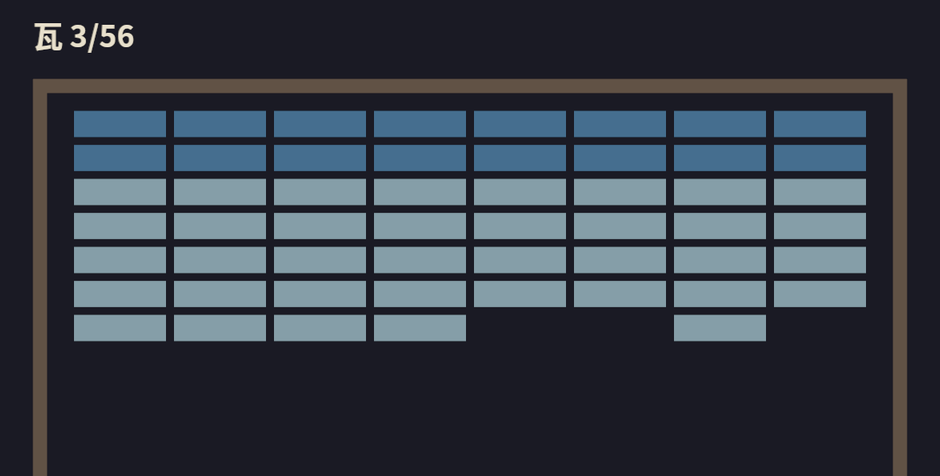

# 记分：让台上的事传出去

记分最顺手的写法，是给 `check_collisions` 再塞一个 `ResMut<Score>`，碎瓦处 `+1`。能跑。但往后看一节就知道这条路的尽头：碎瓦还要响一声脆的（下下节的音效），里程碑还要上台词，闭幕还要清点战果——全走这条路，碰撞系统就得认识记分牌、认识音响、认识结算屏，一个物理系统长成了总调度。

第 7 章碰碰车场给过答案：**车手报告事实，DJ 和记分员各取所需**。碰撞系统只负责把“发生了什么”喊出去，谁爱听谁听。当年 DJ 喊的是一行 `println!`，今天换成真账本、真锣鼓，而写读两端的代码形状一点没变。

## Knock：台上的动静

```rust
{{#include ../../code/ch20-breakout/examples/listing-20-05.rs:knock}}
```

<span class="caption">Listing 20-5（其一）：Knock 消息与 Score 资源（examples/listing-20-05.rs）</span>

变体的措辞值得停一秒：是 `Shatter`（瓦碎了），不是 `AddScore` 或 `PlaySound`。**消息说事实，不下指令**——写消息的人不预设有几个读者、各自要干什么，这正是解耦能成立的全部前提。眼下四种动静，20.5 节沟开始吃球时会添第五种。

## 碰撞系统瘦身

```rust
{{#include ../../code/ch20-breakout/examples/listing-20-05.rs:check_collisions}}
```

<span class="caption">Listing 20-5（其二）：check_collisions 只剩本职——反弹、扣耐久、报信</span>

`Has<Paddle>`（第 4 章）区分凳与墙，`MessageWriter`（第 7 章）把每一声动静投进通道。留意一个跨调度细节：消息写在 `FixedUpdate`，读者住 `Update`——第 7 章讲双缓冲时说过，带 `TimePlugin` 的 App 会对固定调度“特殊照顾”，消息保证一条不丢。

## 记分牌

读者侧两个系统，一个记账、一个写牌：

```rust
{{#include ../../code/ch20-breakout/examples/listing-20-05.rs:scoreboard}}
```

<span class="caption">Listing 20-5（其三）：tally 记账、refresh 写牌——闸门是 resource_changed</span>

`tally` 只认 `Shatter`，顺手在里程碑处开口——场记的台词从本节起退居二线，只在节点出声。`refresh_scoreboard` 挂着 `run_if(resource_changed::<Score>)`（第 5 章的资源变更检测）：第 16 章警告过“改字就重排版”，没人碎瓦的那几百帧，这个系统连门都不进。注册时两者 `.chain()`，记完账立刻写牌，同帧见数。

牌子本身是一行 `Text2d`，锚点 `CENTER_LEFT` 钉在顶墙左上方（第 16 章的字、第 15 章的锚点语义）：

```rust
{{#include ../../code/ch20-breakout/examples/listing-20-05.rs:rig_scoreboard}}
```

<span class="caption">Listing 20-5（其四）：记分牌——字模资产来自第 16 章的家当</span>

字体用 `asset_server.load` 按路径取——第 14 章说过 `AssetServer` 按路径去重，后面菜单、结算屏处处要字，尽管放心重复 `load`，仓库里只有一份。

```rust
{{#include ../../code/ch20-breakout/examples/listing-20-05.rs:main}}
```

<span class="caption">Listing 20-5（其五）：注册——add_message、init_resource，与 Update 里的记分二人组</span>

运行：

```console
cargo run -p ch20-breakout --example listing-20-05
```

```text
老雷：散场不散人——后台的《打瓦》摊子支起来了。
场记：头一片，开张。
```



<span class="caption">Figure 20-6：记分牌与瓦阵对账——缺几片，牌上就记几片</span>

对照 Figure 20-6 数一数：缺口三个，牌上写 3。碰撞系统不认识这块牌子，牌子也不知道瓦长什么样，中间只隔着一条消息通道——下下节音响接进来的时候，你会再次体会这条通道的好处。

不过球一掉，这一切就僵住了：分数停在原地，台上空无一球，程序还活着，游戏却“没了”。它缺的不是哪个系统，而是**阶段**——开局、进行、收场。该立状态机了。
