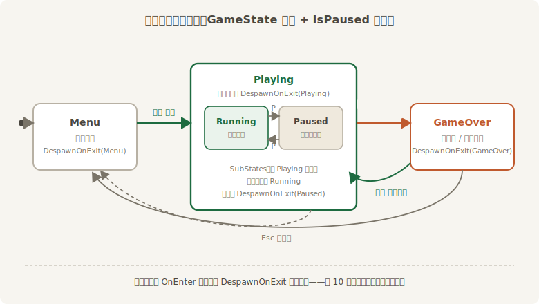
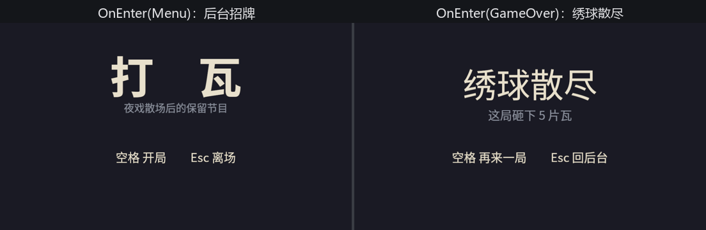

# 开幕与闭幕

现在的程序一开窗就开打，球丢完就装死。真实的游戏有**全局阶段**——第 10 章街机厅末尾立过字据：“第 20 章的 Breakout 用的就是本章这套骨架：`Menu / Playing / GameOver` 三态加暂停子状态，菜单 UI 与局内实体各挂各的 `DespawnOnExit`。”兑现的时候到了。暂停子状态留给下一节（它得和声音一起拧），本节先立三态，把“一局”这个概念造出来。

## 三态与战果

```rust
{{#include ../../code/ch20-breakout/examples/listing-20-06.rs:states}}
```

<span class="caption">Listing 20-6（其一）：GameState 三态与 Outcome 战果（examples/listing-20-06.rs）</span>

`#[derive(States)]` 的全家桶、`#[default]` 的起点，都是第 10 章的熟面孔。`Outcome` 是个普通资源：闭幕的**那一瞬**由判定系统写下，结算屏（和下一节的锣鼓）只看它的脸色。也可以把战果塞进状态本身（`GameOver { won: bool }`——第 10 章见过带数据的状态），但那样 `OnEnter` 就得按值写两份；一份资源配一个干净的 `GameOver`，注册少一半。

## 搭台拆台：DespawnOnExit 全员挂牌

`setup_court` 从 `Startup` 搬家到 `OnEnter(GameState::Playing)`，函数体几乎没动——只是每个 spawn 多挂一行 `DespawnOnExit(GameState::Playing)`：墙、凳、瓦、球、字牌，一个不漏。这正是第 10.3 节的标准搭配：**OnEnter 搭台，DespawnOnExit 挂牌**，离开 `Playing` 的那一次转换里，引擎替你把台拆得干干净净；“再来一局”就是再进一次 `Playing`，搭的是全新的台。

球的生成单独立了个小铺面，因为往后它不止开局用一次：

```rust
{{#include ../../code/ch20-breakout/examples/listing-20-06.rs:glued}}
```

<span class="caption">Listing 20-6（其二）：Glued、Lives 与球的铸模</span>

`BallStock` 存着球的网格与材质的提货单——第 14 章说过 `clone` 提货单只加计数不复制货，落沟补球时直接克隆，不必再开模。新球带着 `Glued` 出生：趴在凳上，速度为零，等一声令下。

## 发球：瞬时输入过鼓点

发球键是这个项目第一个**瞬时**输入——`just_pressed` 只真一帧，而消费它的系统住在 `FixedUpdate`。第 18.5 节开堂审过这桩案子：直接在鼓点里读快照，会丢拍或重拍。药方当时就抓好了：每帧必跑的收集系统把瞬时攒进意图，鼓点上消费、消费即清零。我们的收集站从 20.1 节就立在 `BeforeFixedMainLoop`，现在只是给 `Intent` 添一项：

```rust
{{#include ../../code/ch20-breakout/examples/listing-20-06.rs:intent}}
```

<span class="caption">Listing 20-6（其三）：serve 入账——攒着，等鼓点来收</span>

消费端两件事：贴着凳走，听令出发。

```rust
{{#include ../../code/ch20-breakout/examples/listing-20-06.rs:serve}}
```

<span class="caption">Listing 20-6（其四）：follow_paddle 与 serve_ball——mem::take 消费即清零</span>

`std::mem::take` 把 `serve` 读出来的同时归零——**不管有没有球可发**。这是有意的：球在半空时按下的空格不该被记账，否则下一只球一出生就被一拍旧令发射出去。`follow_paddle` 的查询里那个 `Without<Paddle>`（第 4 章）让两个 `Transform` 借用井水不犯河水。

## 沟与胜负

底边那道口子，现在开始吃球：

```rust
{{#include ../../code/ch20-breakout/examples/listing-20-06.rs:settle}}
```

<span class="caption">Listing 20-6（其五）：watch_gutter 与 check_cleared——两位裁判</span>

`watch_gutter` 是第五种动静 `Knock::Gutter` 的写者：球过线，收走、记账、看命数——还有绣球就补一只新的（克隆铸模），没有就写下 `Outcome::Spilled`、申请闭幕。`check_cleared` 盯着另一头：场上再无 `Health`，就是满堂彩。两个细节：

- **球被收走之后呢**？接下来的几拍里 `Single<…, With<Ball>>` 匹配数为零——第 4 章说过 `Single` 失配时系统**静默跳过**。碰撞、落沟两个系统自动歇业，新球落地它们自动复工，一行专门的代码都不用写；
- **最后一片瓦碎在哪一拍，哪一拍就能宣布满堂彩**。`despawn` 是 `Commands`，但第 6.5 节讲过：链上有排序约束时，调度器会自动插同步点——`check_collisions` 排在 `check_cleared` 前面，命令在两者之间落地，胜利不会迟到一拍。还有个边角：最后一片瓦和最后一只球同拍出事时，`check_cleared` 后跑、覆盖掉 `Spilled`——清完即胜，规则书写在系统顺序里。

## 两块幕布

菜单和结算屏是两棵 `Text2d` 小树：根实体只有 `Transform` 加 `Visibility`，文字都是子实体（`children!`，第 9 章），`DespawnOnExit` 挂在根上——第 10.3 节说过，despawn 带着整棵子树走，一张牌托管全家：

```rust
{{#include ../../code/ch20-breakout/examples/listing-20-06.rs:screens}}
```

<span class="caption">Listing 20-6（其六）：后台招牌与结算屏——OnEnter 搭，DespawnOnExit 拆</span>

`show_curtain` 读 `Outcome` 定标题、读 `Score` 报战果——记住这两个参数，20.7 节它们要当一回案件主角。开关状态机的钥匙不多，三把：

```rust
{{#include ../../code/ch20-breakout/examples/listing-20-06.rs:keys}}
```

<span class="caption">Listing 20-6（其七）：menu_keys 与 curtain_keys——NextState 申请单与 AppExit 谢幕</span>

`NextState::set` 填申请单、下一帧帧首生效，`AppExit` 用消息谢幕——第 10 章与第 7.5 节的原样复用。装配全景：

```rust
{{#include ../../code/ch20-breakout/examples/listing-20-06.rs:main}}
```

<span class="caption">Listing 20-6（其八）：注册全景——三个 OnEnter 搭台，run_if(in_state) 把守两个调度</span>

读这段注册时盯住两类挂载点的分工（第 10 章的总纲）：**换幕瞬间**的活（搭台）全在 `OnEnter`；**逐帧**的活（物理、按键、记分）全靠 `run_if` 把门——`collect_intent` 和整条固定调度链挂 `in_state(GameState::Playing)`，菜单里没有物理；`menu_keys` 和 `curtain_keys` 各守各的状态。相机搬去了 `Startup`：它不属于任何一局，全场只此一台。



<span class="caption">Figure 20-7：状态机全图——子状态那一半下一节点亮</span>

## 开张试营业

```console
cargo run -p ch20-breakout --example listing-20-06
```

```text
老雷：夜戏散了，伙计们后台耍一局《打瓦》——空格开局。
场记：开台——56 片瓦，3 只绣球。
场记：头一片，开张。
场记：一只绣球喂了沟——还剩 2 只。
场记：一只绣球喂了沟——还剩 1 只。
场记：绣球散尽——这局砸下 5 片瓦。
场记：开台——56 片瓦，3 只绣球。
```



<span class="caption">Figure 20-8：开幕与闭幕——两块幕布都是 OnEnter 搭的台</span>

亲手把流程走一遍：空格开局，球乖乖趴在凳上随你走；再按空格，球离凳上天。三只绣球都喂了沟，结算屏落下来报战果；空格再来一局——上一局的残瓦、旧球、字牌全无踪影，台是新的，账也是新的（上面那段输出正是这么跑出来的：散尽之后再开台）。Esc 回后台，后台再 Esc，散伙。

状态机闭环了。还差两笔账：球撞了半天，一声不吭；玩到一半想去倒杯水，没有暂停。第 19 章欠的三件套，下一节连本带利。
