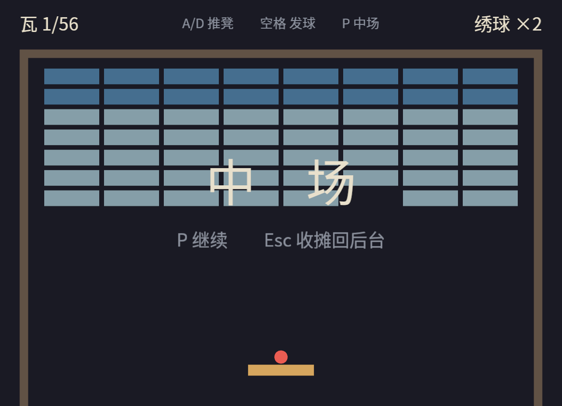

# 锣鼓与中场

第 19 章结尾立过三张欠条：碰撞消息驱动 `DESPAWN` 音效、暂停时两套开关一起拧、`GlobalVolume` 总闸只管新声的坑。本节连本带利，顺手把暂停也装上——它们必须一起装：暂停的另一半本来就是“声音也得停”。

## 中场：子状态，不是第四个状态

给 `GameState` 添一个平级的 `Paused`？第 10.4 节开场就审过这个方案的死刑理由：在三平级的世界里，`Playing → Paused` 和 `Playing → Menu` 都是“离开 Playing”——上一节刚给全场实体挂的 `DespawnOnExit(GameState::Playing)` 不会区分这两者，**按一下暂停，整个台子被引擎当场拆光**。暂停的真实形状是“只在局中才存在的小状态机”：

```rust
{{#include ../../code/ch20-breakout/examples/listing-20-07.rs:paused}}
```

<span class="caption">Listing 20-7（其一）：IsPaused——随 Playing 而生灭的子状态（examples/listing-20-07.rs）</span>

注册用 `add_sub_state::<IsPaused>()`；随父而生、每局重置回 `Running`、随父而亡，三条契约第 10.4 节都验过货。钥匙与两道闸：

```rust
{{#include ../../code/ch20-breakout/examples/listing-20-07.rs:pause_keys}}
```

<span class="caption">Listing 20-7（其二）：P 切中场，Esc 弃局，钟跟着停</span>

中场要拧的闸不止一道，分工读仔细：

- **规则的闸**：固定调度那串系统和 `collect_intent` 的 `run_if` 从 `in_state(GameState::Playing)` 换成 `in_state(IsPaused::Running)`——第 10.4 节的原话：“一个条件同时表达两层”，`Running` 成立的前提就是 `Playing`；
- **时间的闸**：`hold_clock` 按停 `Time<Virtual>`（第 18.2 节的戏台钟）。规则已经被 `run_if` 拦了，钟为什么还要停？因为钟管着所有**没被拦的**时间用户——眼下没有，但哪天你加一只飘字定时器、一团粒子，它们都喝虚拟钟的水，这道闸替未来把门；
- **声音的闸**：马上就到。19.3 节的事故报告写得明白——**戏台钟管不到声卡**。

中场幕布照旧一棵 `DespawnOnExit(IsPaused::Paused)` 的文字树，进 `Paused` 搭、出 `Paused` 引擎拆，连“弃局退菜单时幕布谁收”都不用操心——子状态随父而亡时，`OnExit(Paused)` 与清场照样跑（第 10.4 节验过的“死得体面”）。

## 武场进驻

声音三步走，全是第 19 章的熟路。第一步，备家伙——音效的提货单收进一个资源，BGM 循环起播：

```rust
{{#include ../../code/ch20-breakout/examples/listing-20-07.rs:sound_bank}}
```

<span class="caption">Listing 20-7（其三）：SoundBank 与 BGM——《长风渡》序曲接着奏</span>

第二步，听动静敲家伙。第一张欠条在此兑现——`Knock` 消息流早就在那里，武场只是第**三**个读者（记分员是第二个）：

```rust
{{#include ../../code/ch20-breakout/examples/listing-20-07.rs:play_knocks}}
```

<span class="caption">Listing 20-7（其四）：play_knocks——一声动静一个 DESPAWN 实体</span>

每声锣鼓都是 spawn 一个一次性实体，`PlaybackSettings::DESPAWN` 播完连壳带子实体自动拆台（19.2 节的标准答案）。再看 `clack` 那三行：墙、凳、裂瓦用的是**同一份素材**，只换 `with_speed`——19.2 节说过变速即变调，一块木头敲出三种音高：凳清脆（1.3）、墙平实（1.0）、筒瓦掉釉发闷（0.6）。`verdict_sting` 给闭幕定音：进 `GameOver` 的瞬间读 `Outcome`，满堂彩上行琶音，绣球散尽下行三叹。

第三步，两道欠条一起还——声卡侧的闸，和总闸的坑：

```rust
{{#include ../../code/ch20-breakout/examples/listing-20-07.rs:sinks_and_dial}}
```

<span class="caption">Listing 20-7（其五）：hold_sinks/release_sinks 与 GlobalVolume 总闸</span>

`hold_sinks` 挂在 `OnEnter(IsPaused::Paused)`，把场上每只 `AudioSink` 逐个按停——这就是 19.3 节那句“暂停要两套开关一起拧”的落地：钟一道、声卡一道（本游戏没开空间音频，不然 `SpatialAudioSink` 还得再扫一遍，19.5 节的账）。总闸那两个系统则是 19.4 节的坑的标准填法：`master_dial` 拧 `GlobalVolume`，新开播的锣鼓自动吃到新值；但**已经在播的** BGM 引擎不管，`apply_master` 挂着 `run_if(resource_changed::<GlobalVolume>)`（又是第 5 章的闸门）手动补一遍——基准音量乘总闸，`Volume` 实现了乘法，一行算完。

```rust
{{#include ../../code/ch20-breakout/examples/listing-20-07.rs:main}}
```

<span class="caption">Listing 20-7（其六）：注册全景——OnEnter(Paused) 三件套，OnExit 两件套</span>

## 有声开张

```console
cargo run -p ch20-breakout --example listing-20-07
```

```text
老雷：夜戏散了，伙计们后台耍一局《打瓦》——空格开局。
场记：开台——56 片瓦，3 只绣球。
场记：头一片，开张。
场记：一只绣球喂了沟——还剩 2 只。
老雷：总闸拧到 0.9。
老雷：总闸拧到 1.0。
场记：这局不打了，瓦留给明儿个。
```

这回耳朵有事干了：序曲循环铺底，球每撞一下凳是清脆的“哒”、撞墙低半截，瓦碎是一声噼啦的脆响，筒瓦掉釉发出闷闷的一磕；球落沟，一记堂鼓。按 P——**整个世界一起停**：球钉在半空，曲子停在半拍，幕布压上画面；再按 P，从停下的那一拍接着演，曲子的进度一秒没丢（sink 的 `pause` 是暂停不是停止，19.3 节的细则）。中场里按 -/=，总闸的台词照走——`Update` 里没挂 `run_if(Running)` 的系统不归中场管，这是故意的：音量这种“元操作”就该随时能拧。



<span class="caption">Figure 20-9：中场——画面定格、钟停声歇，三道闸各拧各的</span>

游戏全须全尾了：菜单、计分、音效、暂停、胜负，一样不缺。代价也摆在眼前——`wc -l` 报告，这个单文件已经 **817 行**。改记分牌要从碰撞代码旁边路过，调音量得先翻过状态机，`main()` 里那张注册大清单快要一屏放不下。游戏写完了，工程才开始——下一节拆。
